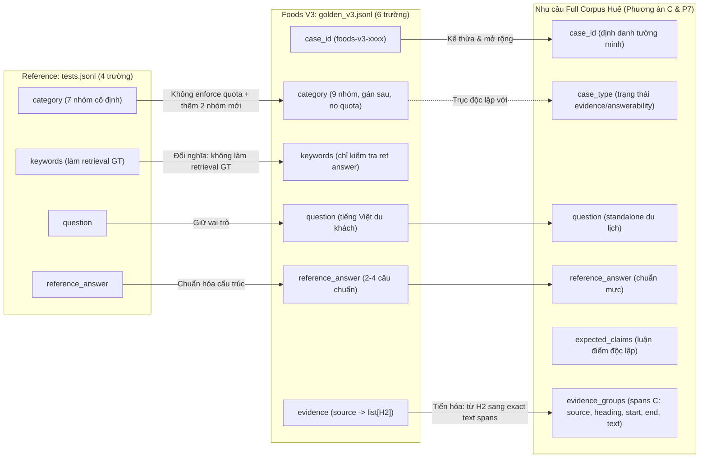

# Báo cáo Khảo sát Sâu Reference: Nguồn gốc Golden, Phân tích Field Usage, Vận hành Evaluation và Đối chiếu Tuyến tính từ `rag_old_0` đến Foods V3

**Tác giả (Author):** Implementer  
**Ngày:** 2026-09-10  
**Nhiệm vụ:** Thiết kế — Nghiên cứu độc lập (Design Research) theo yêu cầu trực tiếp của User (Correction lượt 3)  
**Tài liệu tham chiếu canonical:** `handoff_prompt/FULL_CORPUS_GOLDEN_SCHEMA_REFERENCE_DEEP_DIVE_PROMPT.md`  
**Review tham chiếu:** `reports/full_corpus_golden_schema_reference_deep_dive_codex_review_2026_09_10.md`  
**Base commit:** `ea87d3ed52851f6b6ab5c47b138540ebc8ff8340`  
**Head commit:** worktree  
**Mức độ rủi ro (Risk level):** Low (Khảo sát tài liệu/mã nguồn read-only, cập nhật báo cáo Markdown và handoff)  
**Ủy quyền Git (Git authorization):** none  
**Ủy quyền tác nhân phụ (Sub-agent authorization):** none  

---

## 1. Tóm tắt cho User (Executive Summary)

Báo cáo này được lập theo chỉ đạo trực tiếp của User nhằm cung cấp bức tranh giải phẫu kỹ thuật độc lập và có bằng chứng về kho tư liệu tham khảo `/home/minhhieu/llm_rag/tai_lieu/rag_old_0`, các bài học tổng hợp đi kèm, cách bộ dữ liệu `evaluation/tests.jsonl` được hình thành và tiêu thụ trong code, đồng thời truy nguyên sự phát triển từ schema 4 trường của reference sang schema 6 trường của Foods V3 và cơ sở đề xuất schema tối thiểu cho toàn bộ dữ liệu Huế (Full Corpus).

### Những kết luận cốt lõi User cần biết:
1. **Nguồn gốc tập Golden `tests.jsonl`:** Trong toàn bộ 96 tệp văn bản của `rag_old_0`, không tìm thấy script hay công cụ nào tự động sinh hoặc ghi tệp `tests.jsonl`. Tệp này tồn tại như một fixture dữ liệu tĩnh có sẵn. Tài liệu bài học hướng dẫn biên soạn thủ công từ tài liệu kho tri thức hoặc trích xuất từ nhật ký câu hỏi thực tế của người dùng và câu trả lời chuyên gia sản xuất kèm phản hồi 👍/👎. Hai lỗi không khớp nội dung thực tế (câu 101 hỏi sản phẩm nhưng đáp án trả lời chức danh do hồ sơ nhân sự không có dữ liệu sản phẩm; câu 141 hỏi số lượng nhân viên nhưng đáp án trả lời định tính "several" và kể 2 ví dụ dù trong kho dữ liệu thực tế có 9 nhân viên thỏa điều kiện) chứng minh rằng quy trình kiểm duyệt dữ liệu (nếu từng tồn tại) đã không phát hiện hoặc ngăn chặn được các điểm không khớp này; repo không lưu trữ hồ sơ hay chứng tích kiểm toán (no audit provenance).
2. **Schema 4 trường tối giản của Reference:** Toàn bộ 150 dòng của `tests.jsonl` chỉ gồm đúng 4 trường: `question`, `keywords`, `reference_answer`, `category`. Tập dữ liệu hoàn toàn không có `case_id` (hệ thống định danh câu hỏi hoàn toàn bằng số thứ tự dòng 0..149) và hoàn toàn không có trường `evidence` (không có file nguồn, không có heading, không có chunk ID, không có đoạn văn bản gốc).
3. **Cơ chế đánh giá Retrieval và điều kiện nDCG:** Khâu Retrieval trong reference gán nhãn đúng/sai bằng phép so khớp chuỗi con (`keyword in chunk.lower()`), tiềm ẩn rủi ro dương tính giả khi một chunk ngẫu nhiên chứa từ khóa nhưng không chứa nội dung trả lời. Công thức tính nDCG trong reference chỉ sắp xếp lại các nhãn tìm thấy trong danh sách trả về (`retrieved_docs[:k]`), hoàn toàn không biết có bao nhiêu tài liệu liên quan thực tế trong toàn bộ kho dữ liệu. Do đó, nDCG **có thể đạt 1.0** khi các tài liệu liên quan tìm được tình cờ đứng ở các vị trí đầu tiên trong top-k, ngay cả khi retrieval bỏ sót các tài liệu liên quan khác ngoài top-k.
4. **Giám khảo LLM (Judge) không nhận ngữ cảnh:** Trong mã nguồn thực tế `evaluation/eval.py:131-154`, Prompt gửi cho LLM Judge chỉ gồm câu hỏi, câu trả lời sinh ra và câu trả lời chuẩn. Judge hoàn toàn **không nhận ngữ cảnh truy xuất (retrieved context), không nhận nguồn và không nhận trích dẫn (citation)**. Do đó, điểm số của Judge thực chất chỉ đo sự tương đồng ngữ nghĩa giữa hai câu trả lời, không đo lường được tính bám sát nguồn (groundedness) và không thể phát hiện ảo giác (hallucination).
5. **Sự khác biệt và tiến hóa của Foods V3:** Foods V3 không sao chép nguyên xi reference mà thực hiện các điều chỉnh kỹ thuật cụ thể:
   - Thêm `case_id` tường minh (`foods-v3-0001` .. `foods-v3-0045`), validator yêu cầu chuỗi tuần tự theo thứ tự file (file order); không độc lập với thứ tự dòng và không bất biến qua các thao tác chèn/sắp xếp lại (insert/reorder).
   - Thêm trường `evidence` liên kết file nguồn và tiêu đề H2 (`dict[source, list[H2]]`), chuyển đổi vai trò của `keywords` (không còn làm retrieval ground truth mà chuyển sang kiểm tra tính bao phủ của câu trả lời tham chiếu).
   - Xác định tính liên quan nhị phân (binary relevance) dựa trên cặp `(source, H2)`.
   - Áp dụng công thức IDCG dựa trên số lượng cặp được khai báo liên quan thực tế trong kho dữ liệu (`relevant_count = len(declared_relevant_pairs)`).
   - Giữ 7 danh mục chẩn đoán và bổ sung 2 danh mục đặc thù ẩm thực (`food_knowledge`, `guide_planning`); Foods V3 explicitly không áp đặt hạn ngạch (không enforce quota), trong khi reference chỉ có phân bố quan sát được thực nghiệm (observed distribution), không có bằng chứng reference từng áp đặt quota định trước.
6. **Cơ sở cho Full Corpus:** Báo cáo thiết lập ma trận cần thiết của từng trường (Field-Necessity Matrix) tách biệt rõ ràng giữa **Observed Current Consumer** (hành vi mã nguồn hiện hành) và **Proposed Full-Corpus Need** (nhu cầu pipeline tương lai). Báo cáo đề xuất 3 phương án Schema tối giản (5 trường, 7 trường, 9 trường) kèm dữ liệu minh họa để Reviewer thẩm định độc lập và thảo luận định hướng cùng User; không tự ý quyết định thay User.

---

## 2. Bản đồ phạm vi khảo sát (Reading Map & Coverage toàn `rag_old_0`)

Khảo sát được thực hiện trên toàn bộ thư mục gốc do User chỉ định:
```text
/home/minhhieu/llm_rag/tai_lieu/rag_old_0
```

Toàn bộ thư mục chứa chính xác **96 tệp** văn bản/mã nguồn gốc (first-party text files). Thư mục con `phien_am_bai_hoc` nằm trong thư mục gốc nên được tính vào diện tích khảo sát chung mà không bị đếm lặp hai lần.

Để đảm bảo tính minh bạch theo yêu cầu của Review Contract, báo cáo phân định rõ ràng giữa **Inventory Coverage** (lập danh mục và kiểm kê toàn bộ tệp) và **Reading Coverage** (mức độ đọc nội dung thực tế):

### 2.1. Phân loại và mức độ khảo sát 96 tệp

| Nhóm tệp | Số lượng | Danh sách đường dẫn tương đối | Inventory Coverage | Reading Coverage thực tế |
|---|:---:|---|:---:|---|
| **Mã nguồn đánh giá cốt lõi** | 3 | `evaluation/test.py`, `evaluation/eval.py`, `evaluation/tests.jsonl` | 3/3 | **Đọc sâu 100% từng dòng code** và đọc/phân tích toàn bộ 150 records JSONL. |
| **Giao diện Dashboard & Runner** | 3 | `app.py`, `evaluator.py`, `evaluator2.py` | 3/3 | **Đọc sâu 100% từng dòng code**, cấu hình seed, logic đa luồng, thresholds và cách nhóm category. |
| **Pipeline RAG cơ bản (Basic)** | 2 | `implementation/answer.py`, `implementation/ingest.py` | 2/2 | **Đọc sâu 100% từng dòng code**, loader LangChain, MiniLM embedding, Chroma và prompt RAG. |
| **Pipeline RAG nâng cao (PRO)** | 2 | `pro_implementation/answer.py`, `pro_implementation/ingest.py` | 2/2 | **Đọc sâu 100% từng dòng code**, cấu trúc `Chunk(headline, summary, original_text)`, query rewrite, dual retrieval, LLM rerank. |
| **Jupyter Notebooks** | 5 | `day1.ipynb`, `day2.ipynb`, `day3.ipynb`, `day4.ipynb`, `day5.ipynb` | 5/5 | **Đọc toàn bộ markdown, cells và saved outputs** mà không thực thi code; đối chiếu kết quả lưu sẵn của Day 4 & Day 5. |
| **Tài liệu phiên âm / tổng hợp bài học** | 5 | `phien_am_bai_hoc/day1.txt` đến `day5.txt` | 5/5 | **Đọc toàn văn 100% (full-text reading)** toàn bộ 5 tệp với 2.443 dòng văn bản (`day1.txt`: 365 dòng, `day2.txt`: 250 dòng, `day3.txt`: 272 dòng, `day4.txt`: 811 dòng, `day5.txt`: 745 dòng). |
| **Kho tri thức Tiếng Anh: Công ty & Sản phẩm** | 12 | `knowledge-base/company/` (4 tệp: `about.md`, `careers.md`, `culture.md`, `overview.md`), `knowledge-base/products/` (8 tệp: `Bizllm.md`, `Carllm.md`, `Claimllm.md`, `Healthllm.md`, `Homellm.md`, `Lifellm.md`, `Markellm.md`, `Rellm.md`) | 12/12 | **Đọc toàn văn 100% (full-text reading)** toàn bộ 12 tệp Markdown. |
| **Kho tri thức Tiếng Anh: Nhân viên & Hợp đồng** | 64 | `knowledge-base/employees/` (32 tệp), `knowledge-base/contracts/` (32 tệp) | 64/64 | **Đọc toàn văn 100% (full-text reading)** từng tệp trong cả 32 tệp `employees/` (1.659 dòng) và 32 tệp `contracts/` (3.654 dòng) bằng lệnh đọc text; kết hợp rà soát cấu trúc bảng biểu, đối chiếu dữ liệu thực tế mức lương nhân viên (<$80k), chức danh và điều khoản hợp đồng. |
| **Tổng cộng** | **96** | Toàn bộ tệp tin trong thư mục | **96/96 (100%)** | Toàn bộ 96 tệp đều được đọc toàn văn 100% (full-text reading) và khảo sát đầy đủ, không có tệp nào bị bỏ sót (omission = 0). Phân biệt rõ: Inventory Coverage (96/96), Structural Inspection (64/64 hoàn thành ở lượt 1), và Full-Text Reading (96/96 hoàn thành đầy đủ ở lượt 2). |

### 2.2. Danh mục các thành phần bỏ qua và lý do kỹ thuật
- **Tệp môi trường bí mật (`.env`, secrets, credentials):** Trong toàn bộ thư mục `rag_old_0`, không có tệp `.env` hay tệp chứa khóa bí mật nào tồn tại (đã xác thực qua kiểm tra tệp ẩn).
- **Môi trường ảo & Thư viện bên ngoài (`.venv`, `node_modules`, vendor):** Không có trong thư mục `rag_old_0`.
- **Bộ nhớ đệm & Tệp nhị phân (`__pycache__`, `.pytest_cache`, `.pyc`):** Không có tệp cache nào.
- **Cơ sở dữ liệu & Vector store (`vector_db/`, `preprocessed_db/`, sqlite, chroma):** Không tồn tại thư mục dữ liệu nhị phân nào trong `rag_old_0` (các thư mục này chỉ được tạo ra khi chạy script ingest, nhưng phiên bản lưu trữ tĩnh hiện tại không chứa các thư mục nhị phân này).
- **Thư mục `rag_old` ngoài root:** Tuân thủ chỉ đạo của User: không đọc lại `/home/minhhieu/llm_rag/tai_lieu/rag_old` vì đây là implementation thế hệ khác đã được khảo sát và chốt ở nhiệm vụ trước.

---

## 3. Giải thích Khái niệm Nền tảng cho User (Foundational Concepts)

Nhằm giúp User dễ dàng theo dõi và đưa ra quyết định kiến trúc chính xác, mục này giải thích các khái niệm kỹ thuật cốt lõi bằng tiếng Việt đơn giản, trực quan và gắn liền với ngữ cảnh thực tế của dự án.

### 3.1. JSONL là gì?
- **JSONL (JSON Lines)** là một định dạng tệp văn bản thuần túy, trong đó **mỗi dòng là một đối tượng JSON hoàn chỉnh, hợp lệ và tách biệt nhau bởi ký tự xuống dòng (`\n`)**.
- **So sánh kỹ thuật với tệp JSON thông thường:**
  - Tệp JSON thông thường lưu một đối tượng lớn hoặc một mảng lớn: `[ {"câu 1": ...}, {"câu 2": ...} ]`. Khi đọc hoặc ghi, các thư viện chuẩn thường nạp toàn bộ cấu trúc mảng vào bộ nhớ (hoặc phải dùng parser chuyên dụng để stream từng phần).
  - Tệp JSONL lưu mỗi record độc lập trên một dòng:
    1. Cho phép đọc và xử lý từng dòng tuần tự (line-by-line streaming) bằng vòng lặp đơn giản (`json.loads(line)`), không đòi hỏi nạp toàn bộ tệp vào RAM cùng lúc.
    2. Quản lý phiên bản trên Git rất thuận tiện: mỗi test case nằm trên một dòng riêng biệt, việc thêm, sửa, xóa một test case chỉ tạo diff trên đúng dòng đó mà không làm thay đổi các phần khác của tệp.
    3. Thao tác nối thêm bản ghi (append) chỉ cần ghi tiếp vào cuối tệp mà không cần parse lại cấu trúc bao ngoài hay đóng ngoặc mảng `]`.

### 3.2. Một "Record" là gì?
- Một **Record** (bản ghi) trong tệp JSONL chính là **toàn bộ nội dung của một dòng**, đại diện cho một ca kiểm thử hoàn chỉnh (test case).
- Minh họa một record thực tế rút gọn trích xuất từ dòng 2 của `evaluation/tests.jsonl:2`:
  ```json
  {"question": "When was Insurellm founded?", "keywords": ["2015", "founded"], "reference_answer": "Insurellm was founded in 2015.", "category": "temporal"}
  ```
  Trong đó, một dòng này chứa đầy đủ thông tin: câu hỏi cần hỏi RAG, từ khóa kiểm tra trong tài liệu, câu trả lời mẫu hoàn chỉnh và nhóm câu hỏi.

### 3.3. Schema là gì?
**Schema (Lược đồ dữ liệu)** là bản "hợp đồng" quy định cấu trúc chặt chẽ của một record, bao gồm:
1. **Trường bắt buộc (Required Fields):** Những trường dữ liệu sống còn, bắt buộc phải có mặt trên từng dòng (ví dụ: `question`, `reference_answer`). Nếu thiếu một trong các trường này, record bị coi là không hợp lệ.
2. **Trường tùy chọn (Optional Fields):** Những trường có thể có hoặc để trống tùy từng loại câu hỏi.
3. **Kiểu dữ liệu (Data Types):** Quy định rõ giá trị của trường là chuỗi văn bản (`str`), danh sách các chuỗi (`list[str]`), số nguyên (`int`), hay đối tượng từ điển (`dict`).
4. **Tập giá trị cho phép (Enum / Allowed Values):** Giới hạn trường chỉ được nhận các giá trị định trước.
5. **Quan hệ logic (Logical Relationships):** Các ràng buộc logic giữa các trường với nhau (ví dụ: từ khóa trong `keywords` phải xuất hiện trong `reference_answer`; file nguồn khai báo trong `evidence` bắt buộc phải tồn tại trong thư mục dữ liệu).
6. **Quy tắc xác thực (Validation Rules):** Mã lệnh tự động kiểm tra xem tệp dữ liệu có tuân thủ hợp đồng nói trên hay không trước khi đưa vào hệ thống đánh giá.

### 3.4. Vì sao Schema phải dựa trên Evaluator và Quy trình Audit?
Một lỗi phổ biến trong thiết kế dữ liệu là thêm vào schema những trường dựa trên giả định chủ quan "sau này có thể sẽ cần" (ví dụ: `author`, `created_date`, `difficulty_level`, `tags`, `user_persona`...).

Nguyên tắc cốt lõi của dự án Huế RAG là **Simplicity (Đơn giản là mặc định)** và **Practical Coding**:
- **Gánh nặng biên soạn và kiểm duyệt:** Mỗi trường dữ liệu thêm vào đồng nghĩa với việc người biên soạn phải nhập thêm, người kiểm duyệt phải đọc thêm, và nguy cơ sai sót tăng lên.
- **Dữ liệu không được tiêu thụ:** Nếu một trường dữ liệu được lưu trên từng dòng nhưng mã nguồn của Evaluator hoàn toàn không đọc tới để tính điểm, không dùng để điều hướng, và báo cáo không hiển thị, thì trường đó là dữ liệu dư thừa.
- **Nguy cơ hai nguồn sự thật (Dual Source of Truth):** Nếu lưu lặp lại những thông tin có thể suy luận tất định từ các trường khác (ví dụ: vừa lưu `domain: "foods"`, vừa lưu đường dẫn `source: "foods/restaurants/..."`), khi đổi tên hoặc sửa đường dẫn, dữ liệu dễ bị mâu thuẫn nội bộ.

> [!IMPORTANT]
> **Quy tắc cho Schema Golden:**  
> Chỉ đưa một trường vào schema khi nó thỏa mãn một trong hai điều kiện thực tế:  
> 1. **Evaluator Consumer:** Mã nguồn đánh giá (retriever, reranker, generator, judge, metrics calculator) bắt buộc phải đọc trường đó để vận hành.  
> 2. **Audit / Quality Gate:** Con người bắt buộc phải đọc trường đó để thẩm định tính đúng đắn mà không thể suy ra bằng thuật toán từ các trường khác.

---

## 4. Golden `tests.jsonl` được tạo như thế nào? (Provenance Analysis)

Mục này thực hiện truy nguyên nguồn gốc hình thành của tệp `evaluation/tests.jsonl` trong kho tư liệu `rag_old_0`, phân định rạch ròi giữa 4 nguồn dữ liệu: **Lời giảng/tài liệu tổng hợp**, **Hành vi code thực tế**, **Kết quả lưu sẵn trong notebook**, và **Suy luận kỹ thuật của Implementer**.

```mermaid
flowchart TD
    subgraph Provenance_Map ["Bản Đồ Nguồn Gốc & Sự Thật của tests.jsonl"]
        A["Kho Tri thức 76 files Markdown<br/>(Company, Products, Contracts, Employees)"] -->|Static fixture trong repo<br/>(Không có script sinh trong 96 files)| B["tests.jsonl (150 dòng tĩnh)<br/>{question, keywords, reference_answer, category}"]

        B --> C["test.py (Data Access)<br/>Pydantic TestQuestion validation"]
        C --> D["eval.py (Evaluation Engine)<br/>Đo Retrieval & Chấm Answer"]

        subgraph Real_Evidence ["Bằng Chứng Thực Tế Được Xác Minh"]
            E["Bài học day4.txt (L64-67):<br/>Khuyên tự biên soạn hoặc lấy từ logs"]
            F["Code: KHÔNG CÓ script sinh tự động<br/>trong 96 files đã khảo sát"]
            G["Minh chứng đối chiếu kho dữ liệu:<br/>Case 101 (sai nội dung), Case 141 (sai số lượng)"]
        end
    end
```

### 4.1. Câu hỏi, Keywords, Reference Answer và Category được tạo ra bằng cách nào?
- **Nội dung bài học và tài liệu tổng hợp đồng hành (`phien_am_bai_hoc/day4.txt:64-67`):**
  - Tài liệu ghi nhận 3 bước xây dựng tập Dữ liệu Vàng:
    1. Tổng hợp các câu hỏi điển hình kèm câu trả lời chuẩn.
    2. Xác định các từ khóa (keywords) bắt buộc phải xuất hiện trong ngữ cảnh được truy xuất để kiểm tra độ chính xác của khâu Retrieval.
    3. Nguồn gốc dữ liệu: Bài học hướng dẫn **tự biên soạn thủ công dựa trên tài liệu kho tri thức**, hoặc **trích xuất từ nhật ký câu hỏi thực tế của người dùng và câu trả lời đã được chuyên gia thẩm định trong môi trường sản xuất**.
  - Bài học không hướng dẫn dùng LLM để tự động tạo ra tập Golden trong nội dung Day 4 và Day 5.
- **Hành vi code thực tế:**
  - Trong toàn bộ mã nguồn của `rag_old_0`, không có module nào gọi LLM (như OpenAI hay LiteLLM) để tự động sinh câu hỏi hay đáp án từ kho tri thức.
  - Tệp `evaluation/test.py:17-24` chỉ có hàm `load_tests()`, thực hiện mở tệp `tests.jsonl` sẵn có và đọc từng dòng qua lớp Pydantic `TestQuestion`.
- **Kết luận về công cụ sinh file:**
  - **Không tìm thấy bất kỳ tệp hoặc công cụ nào thực sự tạo/ghi `tests.jsonl` trong phạm vi 96 tệp của `rag_old_0`** (đã rà soát toàn bộ `.py`, `.ipynb`, `.txt`, `.md`).
  - `tests.jsonl` tồn tại như một **fixture dữ liệu tĩnh** được chuẩn bị sẵn trong kho mã nguồn.

### 4.2. Ai và bước nào kiểm duyệt Question – Answer – Evidence?
- **Trong tài liệu lý thuyết:** Bài học nhấn mạnh tầm quan trọng của việc kiểm duyệt chất lượng câu trả lời chuẩn bởi các chuyên gia con người (human experts).
- **Trong dữ liệu thực tế:** Khi phân tích 150 câu hỏi đối chiếu với kho tri thức, có hai trường hợp không khớp nội dung đáng chú ý:
  1. **Không khớp nội dung tại dòng 101 (`evaluation/tests.jsonl:101`):**
     - *Câu hỏi:* `"What product does the IIOTY award winner work on?"` (Hỏi rõ người đoạt giải IIOTY làm việc trên sản phẩm nào).
     - *Câu trả lời chuẩn:* `"Maxine Thompson, who won the IIOTY award in 2023, works as a Senior Data Engineer."` (Nêu chức danh công việc, không nêu tên sản phẩm).
     - *Đối chiếu kho tri thức gốc:* Tệp `knowledge-base/employees/Maxine Thompson.md` không chứa thông tin về sản phẩm cụ thể (không có Bizllm, Carllm, Claimllm... như hồ sơ một số kỹ sư khác). Người soạn câu hỏi đặt câu hỏi bắc cầu (`spanning`), nhưng kho tri thức không có dữ liệu sản phẩm của nhân sự này, dẫn đến câu trả lời chuẩn chuyển sang nêu chức danh và từ khóa cũng là `"Senior Data Engineer"`.
  2. **Không khớp định lượng tại dòng 141 (`evaluation/tests.jsonl:141`):**
     - *Câu hỏi:* `"How many employees at Insurellm have a current salary under $80,000?"` (Hỏi có bao nhiêu nhân viên có mức lương dưới $80,000).
     - *Câu trả lời chuẩn:* `"Based on the employee records, there are several employees with salaries under $80,000, including Tyler Brooks ($75,000) and Alex Harper ($75,000)."`
     - *Đối chiếu kho tri thức gốc:* Toàn bộ 32 hồ sơ nhân viên tại `knowledge-base/employees/` cho thấy có chính xác **9 nhân viên có lương hiện tại dưới $80,000** (Alex Thomson $65k, Brandon Walker $62k, Emily Carter $70k, Emily Tran $75k, Jennifer Adams $58k, Jordan Blake $65k, Samantha Greene $70k, Tyler Brooks $75k, Alex Harper $75k). Câu trả lời chuẩn không cung cấp con số thống kê theo yêu cầu của câu hỏi ("How many"), mà chỉ trả lời định tính chung chung ("several") và kể tên 2 người.
- **Ý nghĩa đối với kiểm toán:** Hai ca kiểm thử trên chứng minh rằng quy trình kiểm duyệt dữ liệu (nếu từng tồn tại trước đó) đã không phát hiện hoặc ngăn chặn được hai điểm không khớp nội dung này; repo không lưu trữ hồ sơ hay chứng tích về quy trình kiểm toán (no audit provenance).

### 4.3. Category được chọn trước hay gán sau?
- Trong `tests.jsonl`, dữ liệu quan sát được phân bổ theo 7 nhóm category:
  1. `direct_fact` (70 câu): Tra cứu sự thật đơn lẻ trong 1 tài liệu.
  2. `temporal` (20 câu): Tra cứu mốc thời gian, ngày tháng, nhiệm kỳ.
  3. `spanning` (20 câu): Bắc cầu thông tin giữa 2 hoặc nhiều tài liệu/khối văn bản.
  4. `comparative` (10 câu): So sánh thuộc tính giữa 2 thực thể.
  5. `numerical` (10 câu): Tính toán số học, lương, giá trị hợp đồng.
  6. `relationship` (10 câu): Quan hệ báo cáo, quản lý, đối tác.
  7. `holistic` (10 câu): Tổng hợp toàn bộ kho tri thức.
- **Bằng chứng và giới hạn:** Tỷ lệ 70/20/20/10/10/10/10 là số liệu quan sát thực nghiệm từ tệp dữ liệu tĩnh hiện có. Trong phạm vi 96 tệp của `rag_old_0`, không có tài liệu hay mã nguồn nào chứng minh đây là hạn ngạch (quota) được ấn định trước hay nhãn category được gán ở thời điểm nào trong quy trình biên soạn.

### 4.4. Bài học nói gì về cập nhật Golden qua phản hồi người dùng?
- Tài liệu tổng hợp (`phien_am_bai_hoc/day4.txt:104-107`) ghi nhận quan điểm:
  - Hệ thống RAG đạt điểm cao trên bộ Test Set tĩnh chưa đảm bảo hiệu quả trong thực tế do nguy cơ tối ưu hóa cục bộ (overfitting).
  - Bộ dữ liệu Golden được khuyến nghị là một "Living, breathing document" (tài liệu sống) được bồi đắp định kỳ.
  - Một nguồn bổ sung được đề xuất là phản hồi từ người dùng thực tế thông qua các nút đánh giá 👍/👎 trên giao diện. Những câu trả lời bị đánh giá 👎 được phân tích nguyên nhân để bổ sung vào tập kiểm thử nhằm ngăn lỗi tái diễn.

---

## 5. Schema Thực Tế, Field Usage và Cơ Chế Vận Hành Evaluation của `rag_old_0`

Mục này trình bày bảng phân tích việc sử dụng từng trường dữ liệu trong mã nguồn thực tế và mô tả luồng dữ liệu khi hệ thống chạy đánh giá.

### 5.1. Bảng phân tích Field Usage của `tests.jsonl` (150 records)

Toàn bộ 150 records trong `evaluation/tests.jsonl` đều sở hữu cấu trúc đồng nhất gồm đúng 4 trường sau:

| Trường (Field) | Kiểu dữ liệu thực tế | Nơi nạp & Validate | Nơi dùng trong Retrieval Evaluation | Nơi đưa vào Generator hoặc Answer Judge | Nơi chỉ dùng Breakdown / Hiển thị | Nơi KHÔNG được dùng | Khả năng suy luận (Derivation) hoặc Lưu trữ |
|---|:---:|---|---|---|---|---|---|
| **`question`** | `str` (100% không rỗng) | `evaluation/test.py:11` qua Pydantic `TestQuestion` | `evaluation/eval.py:93`: truyền vào `fetch_context(test.question)` | - `eval.py:128`: truyền vào `answer_question(test.question)`<br/>- `eval.py:138`: đưa vào prompt của LLM Judge | `eval.py:200` (in CLI), `day4.ipynb:cell 4` | Không bị bỏ sót ở khâu nào | **Bắt buộc lưu ở từng record**. Đây là câu hỏi đầu vào của người dùng. |
| **`keywords`** | `list[str]` (từ 2 đến 5 từ khóa, TB 2.51) | `evaluation/test.py:12` qua Pydantic `TestQuestion` | `evaluation/eval.py:96-106`: tính MRR, nDCG, đếm số từ khóa tìm thấy | **Không đưa vào**. Generator và LLM Judge không nhận `keywords` | `eval.py:201` (in CLI), `day4.ipynb:cell 4` | Generator, LLM Judge | Lưu ở từng record trong reference vì đóng vai trò retrieval ground truth. (Trong pipeline của Huế, trường này không làm retrieval ground truth). |
| **`reference_answer`** | `str` (100% không rỗng) | `evaluation/test.py:13` qua Pydantic `TestQuestion` | **Không dùng**. Khâu retrieval không đọc trường này | `evaluation/eval.py:144`: đưa vào prompt làm chuẩn đối chiếu cho LLM Judge | `eval.py:203` (in CLI), `day4.ipynb:cell 4` | Retrieval evaluation, Generator | **Bắt buộc lưu ở từng record**. Đây là căn cứ để Judge chấm điểm câu trả lời. |
| **`category`** | `str` (thuộc 7 nhóm) | `evaluation/test.py:14` qua Pydantic `TestQuestion` | **Không dùng để tính điểm**. Không ảnh hưởng đến MRR/nDCG | **Không dùng**. Không gửi cho Generator hay Judge | `evaluator.py:84-121, 131-168`: gom nhóm tính điểm trung bình và vẽ BarPlot Gradio | Retrieval calculation, Generator, Judge | Lưu ở record trong reference để phục vụ vẽ biểu đồ phân nhóm. Không tham gia tính điểm retrieval hay answer. |
| *(Vắng mặt)* **`case_id`** | *Không tồn tại* | Không có | Không có | Không có | CLI `eval.py:198` in số thứ tự: `Test #{test_number}` | Toàn bộ codebase | Trong reference, hoàn toàn phụ thuộc vào thứ tự dòng (0..149). |
| *(Vắng mặt)* **`evidence`** | *Không tồn tại* | Không có | Thay thế bằng so khớp chuỗi con `keywords` | Không có | Không có | Toàn bộ codebase | Không có căn cứ truy nguyên tài liệu nguồn. |

### 5.2. Luồng vận hành chi tiết của Pipeline Evaluation (Data-Flow Tracking)

Quá trình đánh giá được thực hiện qua chuỗi 8 bước từ tệp lưu trữ đến bảng điều khiển:

```text
tests.jsonl
  │ (1. Load & Validate)
  ▼
TestQuestion (Pydantic)
  │
  ├──► [Nhánh A: Đánh giá Retrieval]
  │      │ (2. Query)
  │      ▼
  │    fetch_context(test.question) ──► PRO RAG: Rewrite -> 2x Chroma (k=20) -> Merge (40) -> LLM Rerank -> Top 10
  │      │ (3. Relevance Check)
  │      ▼
  │    keyword_lower in doc.page_content.lower()
  │      │ (4. Metrics Calculation)
  │      ├──► MRR: duyệt TOÀN BỘ 10 chunks (không cắt k)
  │      ├──► Coverage: duyệt TOÀN BỘ 10 chunks (không cắt k)
  │      └──► nDCG: cắt retrieved_docs[:k], tính IDCG trên kết quả trả về
  │
  └──► [Nhánh B: Đánh giá Answer]
         │ (5. Generation)
         ▼
       answer_question(test.question) ──► LLM sinh câu trả lời dựa trên 10 chunks ngữ cảnh
         │ (6. LLM-as-a-Judge)
         ▼
       Prompt gửi Judge (gpt-5-nano):
         - Question
         - Generated Answer
         - Reference Answer
         * Không gửi retrieved_context, không gửi citation
         │
         ▼
       AnswerEval (Accuracy, Completeness, Relevance trên thang 1-5)
  │
  ▼ (7 & 8. Tổng hợp & Báo cáo)
Gradio Dashboard (evaluator.py / evaluator2.py):
  - Tính điểm trung bình tổng
  - Gom nhóm theo test.category để vẽ BarPlot
  - Áp dụng mã màu Xanh / Vàng / Đỏ theo ngưỡng trực quan
```

#### Chi tiết từng bước kỹ thuật:

1. **Bước 1: Nạp và kiểm thực (`load_tests`)**
   - *Đầu vào:* Đường dẫn tệp `evaluation/tests.jsonl`.
   - *Xử lý:* Mở tệp tuần tự, gọi `json.loads` và nạp vào Pydantic model `evaluation/test.py:17-24`.
   - *Đầu ra:* Danh sách các đối tượng `TestQuestion`.
2. **Bước 2: Truy xuất ngữ cảnh (`fetch_context`)**
   - *Trạng thái Import:* Trong `evaluation/eval.py:8-9`, dòng import `implementation.answer` (Basic RAG) đã được comment out; dòng import đang hoạt động là `from pro_implementation.answer import answer_question, fetch_context` (PRO RAG).
   - *Luồng PRO RAG:*
     - Gọi `rewrite_query(test.question)` qua LLM `gpt-5-nano` (`pro_implementation/answer.py:89-107`).
     - Truy xuất kép: Kéo $k=20$ khối từ câu hỏi gốc và $k=20$ khối từ câu viết lại trong Chroma DB bằng mô hình `text-embedding-3-large` (3072 chiều) (`pro_implementation/answer.py:119-125`).
     - Hợp nhất và loại trùng lặp theo `page_content`, thu được tối đa 40 khối (`pro_implementation/answer.py:110-116`).
     - Gọi LLM Reranker (`gpt-5-nano`) với Pydantic `RankOrder` để xếp hạng lại toàn bộ danh sách (`pro_implementation/answer.py:53-75`).
     - Cắt lấy Top 10 khối cuối cùng (`FINAL_K = 10`) (`pro_implementation/answer.py:128-135`).
   - *Đầu ra:* Danh sách gồm 10 đối tượng chunk (`Result`).
3. **Bước 3: Xác định tính liên quan (Relevance Determination)**
   - *Cơ chế:* So khớp chuỗi con không phân biệt hoa thường:  
     `keyword_lower in doc.page_content.lower()` (`evaluation/eval.py:49`).
   - *Đặc thù PRO RAG:* Trong PRO RAG, `doc.page_content` được cấu tạo từ `headline + "\n\n" + summary + "\n\n" + original_text` (`pro_implementation/ingest.py:45-50`). Do đó, từ khóa có thể xuất hiện trong phần tóm tắt do LLM tạo ra mà không có trong văn bản gốc.
   - *Giới hạn so với exact evidence:* Hệ thống không kiểm tra ranh giới văn bản gốc, không kiểm tra tiêu đề mục (`heading`) hay file nguồn cụ thể; một chunk ngẫu nhiên nhắc tới từ khóa vẫn được tính là trúng (nguy cơ dương tính giả).
4. **Bước 4: Tính toán các chỉ số Retrieval (Metrics Calculation & Cutoff Discrepancy)**
   - **Khác biệt về Cutoff $k$:**
     - Tham số $k$ (mặc định $k=10$) không được truyền vào hàm truy xuất `fetch_context(test.question)`.
     - `calculate_mrr(keyword, retrieved_docs)`: Duyệt qua toàn bộ danh sách `retrieved_docs`, không cắt $k$ (`evaluation/eval.py:48-51`).
     - `keyword_coverage`: Tính bằng tỷ lệ số từ khóa có $MRR > 0$, do đó cũng duyệt qua toàn bộ danh sách `retrieved_docs`, không cắt $k$ (`evaluation/eval.py:104-106`).
     - Chỉ duy nhất `calculate_ndcg(keyword, retrieved_docs, k)` áp dụng cắt danh sách `retrieved_docs[:k]` (`evaluation/eval.py:68`).
   - **Cơ chế và giới hạn của IDCG:**
     - Mã nguồn tính IDCG bằng cách sắp xếp giảm dần chính các giá trị relevance trích xuất từ `retrieved_docs[:k]`:  
       `ideal_relevances = sorted(relevances, reverse=True)` (`evaluation/eval.py:75`).
     - **Điều kiện nDCG đạt 1.0:** IDCG chỉ tính trên các phần tử đã nằm trong danh sách trả về, không biết tổng số tài liệu liên quan thực tế trong toàn bộ kho dữ liệu. Do đó, nDCG **có thể đạt 1.0** khi các tài liệu liên quan tìm được tình cờ đứng ở các vị trí đầu tiên trong top-k (ví dụ: `relevances = [1, 0, 0...]` thì `ideal_relevances = [1, 0, 0...]`), ngay cả khi retrieval bỏ sót các tài liệu liên quan khác ngoài top-k.
5. **Bước 5: Sinh câu trả lời (Answer Generation)**
   - Gọi `answer_question(test.question)` (`evaluation/eval.py:128`).
   - Ghép 10 khối ngữ cảnh vào `SYSTEM_PROMPT` (`pro_implementation/answer.py:30-39`), gọi mô hình `gpt-5-nano` sinh câu trả lời `generated_answer`.
6. **Bước 6: Giám khảo AI chấm điểm (LLM-as-a-Judge)**
   - *Prompt gửi tới Giám khảo (`evaluation/eval.py:131-154`):*
     ```python
     judge_messages = [
         {"role": "system", "content": "You are an expert evaluator assessing the quality of answers. Evaluate the generated answer by comparing it to the reference answer. Only give 5/5 scores for perfect answers."},
         {"role": "user", "content": f"Question:\n{test.question}\n\nGenerated Answer:\n{generated_answer}\n\nReference Answer:\n{test.reference_answer}\n\nPlease evaluate..."}
     ]
     ```
   - *Đặc điểm:* Prompt của Giám khảo không chứa `retrieved_docs`, không chứa `context` và không chứa `citation`.
   - *Hệ quả:* Giám khảo chỉ so sánh câu trả lời sinh ra với câu trả lời mẫu. Hệ thống không đo lường tính bám sát nguồn (groundedness) và không phát hiện được ảo giác (hallucination) trong trường hợp mô hình trả lời đúng nhờ tri thức nội tại dù retrieval lấy sai tài liệu.
   - *Đầu ra:* Cấu trúc Pydantic `AnswerEval` (`evaluation/eval.py:28-42`) gồm 3 điểm số float từ 1.0 đến 5.0 (`accuracy`, `completeness`, `relevance`) kèm nhận xét `feedback`.
7. **Bước 7: Phân tích danh mục (Categorical Analysis)**
   - Mã nguồn gom nhóm kết quả theo `test.category` để tính trung bình MRR và Accuracy cho từng nhóm (`evaluator.py:84-123, 131-170`).
   - `category` không tham gia vào việc điều chỉnh điểm số hay tính trọng số cho kết quả chung; nó đóng vai trò là một nhãn phân nhóm hiển thị (grouping label).
8. **Bước 8: Bảng điều khiển & Ngưỡng trực quan (Dashboard Visualization)**
   - Dashboard Gradio (`evaluator.py:173-237`) hiển thị 2 biểu đồ cột phân bổ theo Category và các thẻ điểm số với mã màu:
     - Retrieval: MRR & nDCG $\ge 0.9$ Xanh, $\ge 0.75$ Vàng, $< 0.75$ Đỏ; Coverage $\ge 90\%$ Xanh, $\ge 75\%$ Vàng, $< 75\%$ Đỏ (`evaluator.py:10-16`).
     - Answer: Điểm $\ge 4.5$ Xanh, $\ge 4.0$ Vàng, $< 4.0$ Đỏ (`evaluator.py:18-21`).
   - Đây là công cụ trực quan hóa tham khảo của khóa học, không phải tiêu chuẩn nghiệm thu định trước cho Huế.

### 5.3. Ý nghĩa và giới hạn của Saved Notebook Outputs trong `day4.ipynb`
- Trong `day4.ipynb:cell 6-13`, kết quả lưu sẵn phản ánh việc chạy thử nghiệm trên 1 câu hỏi mẫu duy nhất (`tests[0]`) với Basic RAG:
  - `evaluate_retrieval(example)` lưu kết quả: `MRR = 0.1667`, `nDCG = 0.2871`, `Coverage = 66.67%`. Nguyên nhân do từ khóa `"Thompson"` chỉ có trong tên tệp mà không xuất hiện trong nội dung khối văn bản được kéo về.
  - `evaluate_answer(example)` lưu kết quả: `accuracy = 4.0`, `completeness = 3.0`, `relevance = 4.0`.
  - Trong tài liệu tổng hợp `phien_am_bai_hoc/day4.txt:592`, tác giả ghi nhận một kết quả quan sát khác: `Accuracy = 5/5`, `Completeness = 4/5`.
  - **Giới hạn:** Hai mốc điểm số này thuộc hai lần thử nghiệm khác nhau và không có kiểm soát lặp lại. Kết quả lưu sẵn trong notebook chỉ mang tính minh họa cấu trúc đầu ra của hàm, không phản ánh chất lượng tổng thể của 150 câu hỏi và không đại diện cho pipeline PRO RAG hiện tại.

### 5.4. Các yếu tố kiểm soát thực nghiệm (Controls, Splits, Leakage, Variability)
- **Kiểm soát tính tái lập (Reproducibility) trong `evaluator2.py` (`evaluator2.py:22, 41-60`):** Mã nguồn thiết lập `SEED = 42` cho `random`, `numpy`, đồng thời đặt `temperature = 0` và patch hàm `completion` của LiteLLM để tự động chèn `seed = 42`.  
  *Giới hạn quan sát:* Đây là cấu hình kiểm soát ở tầng mã nguồn ứng dụng, nhưng tính tất định không được bảo đảm hoàn toàn từ phía nhà cung cấp dịch vụ cloud API qua các lần gọi khác nhau.
- **Phân chia tập dữ liệu (Data Split):** Trong `rag_old_0`, không có sự phân chia Train / Dev / Test. Cùng một bộ 150 câu tĩnh được dùng lặp lại cho việc đo Basic RAG, thử nghiệm chunking, embedding và tinh chỉnh PRO RAG, tiềm ẩn nguy cơ rò rỉ dữ liệu (leakage) hoặc overfitting vào 150 câu này.
- **Số lần lặp lại (Repetitions):** Trong `evaluation/eval.py`, mỗi câu hỏi chỉ được đánh giá 1 lần duy nhất, không có cơ chế đo lường độ lệch chuẩn hay phương sai của Giám khảo AI.

---

## 6. Đối chiếu Tuyến tính: Từ `rag_old_0` đến Foods V3 và Nhu cầu Full Corpus

Mục này so sánh cụ thể giữa schema 4 trường của `rag_old_0`, schema 6 trường của Foods V3, và cách thức mã nguồn hiện hành của dự án Huế RAG tiêu thụ từng trường dữ liệu.



### 6.1. Bảng đối chiếu tiến hóa Schema giữa 3 thế hệ

| Trường Candidate | `rag_old_0` (`tests.jsonl`) | Foods V3 (`golden_v3.jsonl`) | Bản chất thay đổi từ Reference sang Foods V3 | Trạng thái tiêu thụ trong Code hiện hành của Huế (`backend/`) | Nhu cầu đối với Full Corpus Huế |
|---|---|---|---|---|---|
| **`case_id`** | *Không có* (dùng số dòng) | **Có** (bắt buộc, ví dụ: `foods-v3-0001`) | Thêm định danh tường minh, validator yêu cầu chuỗi tuần tự theo file order; không độc lập với thứ tự dòng và không bất biến qua insert/reorder. | `golden_dataset.py:142-145` kiểm tra định dạng và thứ tự; `embedding_benchmark.py:634` dùng làm khóa ánh xạ kết quả. | **Bắt buộc giữ**. Định danh duy nhất cho từng ca kiểm thử trên toàn bộ 5 domain. |
| **`question`** | Có (`str`, tiếng Anh Insurellm) | Có (`str`, tiếng Việt ẩm thực Huế) | Đổi ngữ cảnh sang tiếng Việt tự nhiên, độc lập, hướng tới du khách. | `golden_dataset.py:147-150` kiểm tra tính duy nhất; `eval.py:158, 172`; `embedding_benchmark.py:615` dùng để search. | **Bắt buộc giữ**. Truy vấn đầu vào cốt lõi của người dùng. |
| **`keywords`** | Có (`list[str]`, dùng làm Ground Truth để tính MRR/nDCG) | Có (`list[str]`, từ 2 đến 4 từ khóa) | **Chuyển đổi vai trò**: Không còn là retrieval ground truth, chỉ dùng kiểm tra sự xuất hiện trong `reference_answer`. | `golden_dataset.py:167-173` kiểm tra keyword phải có mặt trong `reference_answer`. Code legacy `eval.py:159` dùng tính điểm cũ. | **Nên loại bỏ hoặc chỉ dùng lúc authoring**. Retrieval và Citation đã có Evidence Spans đảm nhiệm. |
| **`reference_answer`** | Có (`str`, câu trả lời chuẩn) | Có (`str`, từ 2 đến 4 câu chuẩn) | Giữ vai trò chuẩn đối chiếu, chuẩn hóa độ dài từ 2 đến 4 câu. | `golden_dataset.py:158` kiểm tra không rỗng; `eval.py:187` đưa vào LLM Judge làm căn cứ chấm điểm. | **Bắt buộc giữ**. Chuẩn đối chiếu để LLM Judge chấm độ chính xác và tính đầy đủ. |
| **`category`** | Có (7 nhóm cố định) | Có (9 nhóm: 7 nhóm cũ + `food_knowledge` + `guide_planning`) | Foods V3 explicitly không áp đặt quota (trong khi reference chỉ có observed distribution, không có evidence quota định trước); chọn câu hỏi trước rồi mới gán nhãn phân tích sau. | `golden_dataset.py:160` kiểm tra thuộc 9 nhóm; `embedding_benchmark.py:218` tổng hợp điểm theo category. | **Trục chẩn đoán dạng suy luận**. Độc lập với `case_type`. Có thể giữ để phân tích chẩn đoán hoặc bỏ nếu chấp nhận mất breakdown này. |
| **`evidence` (legacy)** | *Không có* | **Có** (`dict[str, list[str]]`, mapping source -> H2 headings) | Bổ sung ground truth retrieval bằng cặp `(source, H2)`. | `golden_dataset.py:93-125` validate file và H2 tồn tại; `embedding_benchmark.py:159-191` tính Recall@5, MRR@5, nDCG@5. | **Thay thế bằng Evidence C**. Được tiến hóa lên tầng Claim-level exact source spans theo quyết định của User. |

### 6.2. Phần kế thừa từ ý tưởng Reference và Phần điều chỉnh của Huế
- **Phần kế thừa từ Reference:**
  1. Định dạng JSONL cho phép đọc và xử lý từng trường hợp kiểm thử độc lập.
  2. Phân tách hai trụ cột đánh giá: Đo lường Retrieval và Đo lường Answer.
  3. Hệ thống danh mục câu hỏi chẩn đoán (`direct_fact`, `temporal`, `comparative`, `numerical`, `relationship`, `spanning`, `holistic`).
  4. Sử dụng mô hình Pydantic để kiểm soát schema dữ liệu ngay khi nạp.
  5. Phương pháp LLM-as-a-judge chấm điểm trên thang 1–5 theo 3 chiều: Accuracy, Completeness, Relevance (áp dụng tại `backend/evaluation/template.py`).
- **Phần điều chỉnh kỹ thuật của Huế:**
  1. **Định danh minh bạch (`case_id`):** Sử dụng mã định danh tường minh (`foods-v3-0001` .. `foods-v3-0045`), validator yêu cầu chuỗi tuần tự theo thứ tự file (file order); không xem là độc lập với thứ tự dòng hoặc bất biến qua các thao tác chèn/sắp xếp lại (insert/reorder).
  2. **Gán nhãn bằng chứng cấu trúc (`evidence`):** Không dùng từ khóa (`keywords`) để xác định tính liên quan trong retrieval; định nghĩa tính liên quan bằng cặp `(source, section)` đã được kiểm tra thực tế.
  3. **Công thức nDCG trong IR:** Trong `embedding_benchmark.py:190`, công thức IDCG sử dụng số lượng cặp được khai báo liên quan thực tế trong kho dữ liệu (`relevant_count = len(declared_relevant_pairs)`), tránh việc IDCG chỉ tính nội bộ trên danh sách trả về.
  4. **Không áp đặt hạn ngạch (No Category Quotas):** Foods V3 explicitly không áp đặt quota cho từng category (trong khi reference chỉ có phân bố quan sát được thực nghiệm, không có bằng chứng về quota định trước); gán danh mục sau khi câu hỏi đã được lựa chọn.
  5. **Tập kiểm thử Smoke 10 câu deep-equal:** Bổ sung cơ chế kiểm tra nhanh kỹ thuật trước khi chạy benchmark quy mô lớn.

---

## 7. Cơ Sở Lựa Chọn Schema Tối Thiểu cho Full Corpus (Field-Necessity Matrix & Candidates)

Mục này thiết lập ma trận phân loại sự cần thiết của từng trường ứng viên và đề xuất các phương án schema tối giản để Reviewer kiểm tra độc lập trước khi thảo luận cùng User.

### 7.1. Phân loại sự cần thiết của các trường dữ liệu (Field-Necessity Matrix)

Để đảm bảo tính chính xác kỹ thuật theo yêu cầu của Review Contract, bảng dưới đây tách bạch rõ ràng giữa:
- **Observed Current Consumer:** Hành vi thực tế của mã nguồn hiện hành (`backend/` của Huế và `evaluation/` của reference) đối với trường này.
- **Proposed Full-Corpus Need:** Nhu cầu đề xuất cho pipeline Full Corpus tương lai (kèm lý do kỹ thuật hoặc audit).

Các mức phân loại sự cần thiết:
- `must_store_per_record`: Bắt buộc phải lưu trong từng dòng JSONL vì là dữ liệu đặc thù của ca kiểm thử đó, evaluator hoặc khâu audit bắt buộc phải tiêu thụ.
- `derive_or_store_in_manifest`: Không bắt buộc lưu lặp lại trên từng dòng; có thể suy luận tất định từ trường khác hoặc lưu tập trung ở file cấu hình/manifest.
- `authoring_only`: Chỉ phục vụ giai đoạn biên soạn, kiểm tra ban đầu của con người; có thể loại bỏ khi đóng gói tệp canonical để evaluator vận hành nhẹ nhất.
- `omit`: Loại bỏ vì không còn consumer hoặc đã có cơ chế khác thay thế.
- `unresolved`: Chưa đủ bằng chứng để chốt dứt điểm, đang chờ quyết định kiến trúc từ User.

| Trường ứng viên (Candidate Field) | Phân loại sự cần thiết | Observed Current Consumer (Code hiện hành) | Proposed Full-Corpus Need (Đề xuất tương lai) | Khả năng suy luận (Derivation) hoặc Hệ quả nếu bỏ |
|---|:---:|---|---|---|
| **`case_id`** | `must_store_per_record` | `golden_dataset.py:142-145` validate format; `embedding_benchmark.py:634` làm khóa map kết quả | Khóa chính duy nhất để định danh ca kiểm thử, lưu kết quả benchmark, logging và error tracking | **Bắt buộc lưu**. Không thể suy luận; là định danh tường minh cho từng ca kiểm thử trên toàn bộ 5 domain (validator kiểm soát chuỗi tuần tự theo file order). |
| **`question`** | `must_store_per_record` | `golden_dataset.py:147-150` validate unique; `embedding_benchmark.py:615` search; `eval.py:158` generator & judge | Input trực tiếp của người dùng cho Retriever, Generator và Judge | **Bắt buộc lưu**. Không thể suy luận. |
| **`reference_answer`** | `must_store_per_record` | `golden_dataset.py:158` validate non-empty; `eval.py:187` đưa vào LLM Judge | Chuẩn đối chiếu để Answer Judge chấm điểm và Human Reviewer kiểm tra | **Bắt buộc lưu**. Nếu bỏ, Judge không có căn cứ đối chiếu để chấm độ đúng và độ đầy đủ. |
| **`expected_claims`** | `must_store_per_record` | Hiện tại **chưa có** trong `backend/` (Foods V3 dùng legacy `evidence` H2 mapping) | Cấu trúc hạt nhân theo Quyết định C của User để kiểm tra retrieval ở mức claim-level exact spans mà không khóa cứng vào chunking | **Bắt buộc lưu theo Quyết định C của User**. Không thể suy luận từ các trường khác. |
| **`claim_id`** | `derive_or_store_in_manifest` (hoặc authoring choice) | Hiện tại **chưa có** trong `backend/` | Định danh claim bên trong mảng `expected_claims`, liên kết báo cáo chi tiết từng luận điểm | **Có thể suy luận tất định (deterministic derivation)**: Hoàn toàn có thể tạo bằng code theo công thức `f"{case_id}-c{index+1}"`. Việc lưu tường minh là một lựa chọn thiết kế authoring/referencing giúp ổn định định danh khi sửa đổi, không phải yêu cầu toán học bắt buộc. |
| **`evidence_groups`** | `must_store_per_record` | Hiện tại **chưa có** trong `backend/` | Biểu diễn quan hệ logic OR giữa các nhóm bằng chứng và AND giữa các spans trong cùng một nhóm để đánh giá retrieval | **Bắt buộc lưu trong claim**. Không thể suy luận. |
| **Locator C: `source, heading_path, start, end, text`** | `must_store_per_record` | Hiện tại **chưa có** trong `backend/` | Chunk-mapper khi benchmark, Citation validator, Human auditor kiểm tra văn bản gốc LF | **Bắt buộc lưu trong evidence_ref**. Cho phép ánh xạ sang các phương án chunking khác nhau. *Lưu ý:* Kiểu dữ liệu chính xác của `heading_path` (`str` hay `list[str]`) là điểm chưa chốt (unresolved), chờ User quy định trong written spec. |
| **`case_type`** | `must_store_per_record` (cho proposed evaluator) | Hiện tại **chưa có consumer** trong `backend/` (chưa có code routing hay judge rubric theo case_type) | Đề xuất tương lai để điều hướng pipeline đánh giá và áp dụng rubric riêng cho các ca kiểm thử khác nhau (factual, negative, partial, conflict) | **Bắt buộc lưu nếu triển khai proposed evaluator**. Không thể suy luận. *Lưu ý:* Các giá trị enum (`factual`, `negative`...) hiện chỉ là ví dụ minh họa candidate, chưa phải schema chốt. |
| **`category`** | `must_store_per_record` (nếu giữ diagnostic breakdown) hoặc `omit` | `golden_dataset.py:160` validate 9 enum; `embedding_benchmark.py:218` gom nhóm tính điểm trung bình; `evaluator.py` vẽ biểu đồ | Trục chẩn đoán dạng suy luận (reasoning taxonomy), phân rã báo cáo theo dạng câu hỏi | **Trục độc lập với `case_type`**. Nếu bỏ, hệ thống mất hoàn toàn khả năng phân tích chẩn đoán theo dạng câu hỏi; `category` không thể suy luận từ `case_id`. |
| **`domain`** | `derive_or_store_in_manifest` | Hiện tại chưa có trường riêng trong `golden_v3.jsonl`; benchmark phân nhóm theo thư mục corpus | Phân rã báo cáo theo 5 domain sản phẩm (`foods`, `heritages`, `festivals`, `performing_arts`, `travel`) | **Có thể Derive**: Nếu `case_id` có quy tắc đặt tiền tố chuẩn (ví dụ: `food-`, `fest-`), trường `domain` có thể suy luận bằng code. Lưu tường minh giúp kiểm thực Pydantic trực tiếp. |
| **`partition`** | `derive_or_store_in_manifest` hoặc `authoring_only` | Hiện tại **chưa có** trong `backend/` | Theo dõi quy trình biên soạn 7 phân vùng P7 độc lập | **Có 3 khả năng**: (a) authoring-only cho giai đoạn P7; (b) derive từ tiền tố `case_id`; (c) giữ lại sau merge như một chiều phân tích chẩn đoán hữu ích giữa 7 phân vùng con. |
| **`keywords`** | `omit` hoặc `authoring_only` | `golden_dataset.py:167-173` validate keyword có trong `reference_answer`; `eval.py:159` legacy tính điểm cũ | Chỉ dùng làm kiểm tra câu chữ lúc con người biên soạn `reference_answer` | **Nên loại bỏ khỏi runtime dataset**. Không còn phục vụ đo lường retrieval sau khi đã có `evidence_groups`. Có thể giữ dạng optional lúc authoring. |
| **`evidence` (legacy source->H2)** | `omit` | `golden_dataset.py:93-125` validate file và H2; `embedding_benchmark.py:159-191` tính điểm | Đã được thay thế bởi Locator C | **Loại bỏ**. Tránh tạo ra hai nguồn sự thật mâu thuẫn trong cùng một record. |

### 7.2. Đề xuất 3 Schema Candidates tối giản để thảo luận với User

> [!NOTE]
> Các cấu trúc JSON dưới đây chỉ mang tính chất minh họa kỹ thuật (`illustrative only`), dựa trên nội dung thực tế của một thực thể Huế đã có trong corpus, tuyệt đối không phải là bộ dữ liệu Golden đã được phê duyệt. Kiểu dữ liệu chính xác của `heading_path` (`str` hay `list[str]`) và các giá trị enum của `case_type` là các điểm chưa chốt (unresolved), chờ User quy định trong written spec.

#### Phương án 1: Siêu tối giản (Candidate 1 - Ultra-Minimalist)
- **Triết lý:** Tối giản số lượng trường lưu trữ. Chỉ lưu những trường phục vụ trực tiếp cho quá trình đánh giá và xác thực bằng chứng.
- **Số trường cấp 1:** 5 trường (`case_id`, `case_type`, `question`, `reference_answer`, `expected_claims`).
- **Tổn thất kỹ thuật khi bỏ trường (Trade-off):** Việc bỏ `category` khiến hệ thống mất khả năng phân tích chẩn đoán theo dạng suy luận (reasoning taxonomy); không thể khôi phục `category` bằng cách parse `case_id`. Việc bỏ `domain` đòi hỏi code phải bóc tách tiền tố từ `case_id`.
- **Minh họa cấu trúc (`illustrative only`):**
  ```json
  {
    "case_id": "foods-0001",
    "case_type": "factual",
    "question": "Quán Chè Mợ Tôn Đích nằm ở địa chỉ nào tại Huế?",
    "reference_answer": "Quán Chè Mợ Tôn Đích nằm tại số 3/3 Đinh Tiên Hoàng, phường Thuận Hòa, Thành phố Huế, gần công viên Thương Bạc bên bờ sông Hương.",
    "expected_claims": [
      {
        "claim_id": "c1",
        "text": "Quán Chè Mợ Tôn Đích nằm tại số 3/3 Đinh Tiên Hoàng, phường Thuận Hòa, Thành phố Huế, gần công viên Thương Bạc.",
        "evidence_groups": [
          [
            {
              "source": "foods/restaurants/che mo ton dich.md",
              "heading_path": "Chè Mợ Tôn Đích > Thông tin",
              "start": 210,
              "end": 350,
              "text": "Địa chỉ: 3/3 Đinh Tiên Hoàng, phường Thuận Hòa, Thành phố Huế (ngay gần công viên Thương Bạc bên bờ sông Hương)."
            }
          ]
        ]
      }
    ]
  }
  ```

---

#### Phương án 2: Kế thừa Cân bằng (Candidate 2 - Balanced Reference-Evolution)
- **Triết lý:** Cân bằng giữa sự gọn nhẹ và khả năng phân tích chẩn đoán. Giữ `category` để theo dõi chất lượng theo dạng câu hỏi, thêm `domain` để filter nhanh dữ liệu mà không cần regex, giữ `case_type` để xử lý các ca kiểm thử đặc thù, kết hợp hạt nhân Evidence C.
- **Số trường cấp 1:** 7 trường (`case_id`, `domain`, `category`, `case_type`, `question`, `reference_answer`, `expected_claims`).
- **Phân định hai trục:** `category` phản ánh dạng suy luận (direct_fact, temporal, comparative...), `case_type` phản ánh trạng thái bằng chứng (factual, negative, partial...). Hai trục độc lập, không gộp lại.
- **Minh họa cấu trúc (`illustrative only`):**
  ```json
  {
    "case_id": "foods-0001",
    "domain": "foods",
    "category": "direct_fact",
    "case_type": "factual",
    "question": "Quán Chè Mợ Tôn Đích nằm ở địa chỉ nào tại Huế?",
    "reference_answer": "Quán Chè Mợ Tôn Đích nằm tại số 3/3 Đinh Tiên Hoàng, phường Thuận Hòa, Thành phố Huế, gần công viên Thương Bạc bên bờ sông Hương.",
    "expected_claims": [
      {
        "claim_id": "c1",
        "text": "Quán Chè Mợ Tôn Đích nằm tại số 3/3 Đinh Tiên Hoàng, phường Thuận Hòa, Thành phố Huế.",
        "evidence_groups": [
          [
            {
              "source": "foods/restaurants/che mo ton dich.md",
              "heading_path": "Chè Mợ Tôn Đích > Thông tin",
              "start": 210,
              "end": 350,
              "text": "Địa chỉ: 3/3 Đinh Tiên Hoàng, phường Thuận Hòa, Thành phố Huế (ngay gần công viên Thương Bạc bên bờ sông Hương)."
            }
          ]
        ]
      }
    ]
  }
  ```

---

#### Phương án 3: Hướng tới Quy trình Soạn thảo & Thẩm định P7 (Candidate 3 - Authoring & Audit Oriented)
- **Triết lý:** Phục vụ tối đa cho giai đoạn chia 7 phân vùng P7 độc lập để nhiều nhóm cùng biên soạn và rà soát. Lưu rõ `partition` để kiểm tra provenance P7 và giữ `keywords` (dưới dạng trường tùy chọn lúc authoring) để hỗ trợ kiểm tra câu chữ của câu trả lời chuẩn.
- **Số trường cấp 1:** 9 trường (`case_id`, `partition`, `domain`, `category`, `case_type`, `question`, `keywords`, `reference_answer`, `expected_claims`).
- **Minh họa cấu trúc (`illustrative only`):**
  ```json
  {
    "case_id": "travel_places-0001",
    "partition": "travel_places",
    "domain": "travel",
    "category": "direct_fact",
    "case_type": "factual",
    "question": "Đại Nội Huế mở cửa đón khách vào những khung giờ nào trong ngày?",
    "keywords": ["Đại Nội", "07:00", "17:30"],
    "reference_answer": "Đại Nội Huế mở cửa từ 07:00 đến 17:30 hàng ngày vào mùa hè, và từ 07:30 đến 17:00 vào mùa đông.",
    "expected_claims": [
      {
        "claim_id": "c1",
        "text": "Đại Nội mở cửa từ 07:00 đến 17:30 vào mùa hè và 07:30 đến 17:00 vào mùa đông.",
        "evidence_groups": [
          [
            {
              "source": "travel/places/dai noi hue.md",
              "heading_path": "Đại Nội Huế > Thông tin thực tế",
              "start": 150,
              "end": 280,
              "text": "Thời gian tham quan: Mùa hè: 07:00 - 17:30; Mùa đông: 07:30 - 17:00."
            }
          ]
        ]
      }
    ]
  }
  ```

### 7.3. Bảng so sánh tổng hợp các Candidates

| Tiêu chí so sánh | Phương án 1 (Ultra-Minimalist) | Phương án 2 (Balanced Reference-Evolution) | Phương án 3 (Authoring & Audit P7) |
|---|---|---|---|
| **Số trường cấp 1** | **5 trường** | **7 trường** | **9 trường** (kèm `keywords` optional) |
| **Danh sách trường cấp 1** | `case_id`, `case_type`, `question`, `reference_answer`, `expected_claims` | `case_id`, `domain`, `category`, `case_type`, `question`, `reference_answer`, `expected_claims` | `case_id`, `partition`, `domain`, `category`, `case_type`, `question`, `keywords`, `reference_answer`, `expected_claims` |
| **Độ gọn nhẹ cấu trúc** | Cao nhất (không có metadata phụ) | Trung bình (thêm `domain`, `category`) | Thấp nhất (thêm `partition`, `keywords`) |
| **Khả năng Human Review** | Đòi hỏi nhớ quy ước tiền tố ID để biết domain | Trực quan, đọc hiểu trực tiếp domain và category | Đầy đủ thông tin phân vùng P7 và từ khóa |
| **Kiểm thực Pydantic** | Ngắn gọn | Rõ ràng, validate chặt theo Enum | Cần thêm validation kiểm tra quan hệ partition-domain |
| **Cấu trúc dự kiến cho Metrics IR chuẩn** | Có cấu trúc dự kiến để hỗ trợ (Recall, MRR, nDCG qua Spans; retrieval scoring cụ thể chưa chốt) | Có cấu trúc dự kiến để hỗ trợ (Recall, MRR, nDCG qua Spans; retrieval scoring cụ thể chưa chốt) | Có cấu trúc dự kiến để hỗ trợ (Recall, MRR, nDCG qua Spans; retrieval scoring cụ thể chưa chốt) |
| **Phân tích chẩn đoán (Breakdown)** | Mất phân tích theo dạng suy luận; cần parse ID để tách domain | Có sẵn `domain` và `category` để vẽ biểu đồ chẩn đoán | Có sẵn `partition`, `domain` và `category` |
| **Cấu trúc dự kiến cho ca đặc thù (Negative/Conflict)** | Có cấu trúc dự kiến để hỗ trợ qua `case_type` (exact representation, empty/alt evidence rules và judge rubric vẫn chưa chốt / unresolved) | Có cấu trúc dự kiến để hỗ trợ qua `case_type` (exact representation, empty/alt evidence rules và judge rubric vẫn chưa chốt / unresolved) | Có cấu trúc dự kiến để hỗ trợ qua `case_type` (exact representation, empty/alt evidence rules và judge rubric vẫn chưa chốt / unresolved) |
| **Đánh đổi chính (Trade-offs)** | Tiết kiệm dung lượng nhưng mất diagnostic taxonomy và đòi hỏi derive domain | Thêm 2 trường metadata nhưng giữ toàn vẹn khả năng phân tích chẩn đoán | Hỗ trợ tối đa khâu soạn thảo P7 nhưng có thể dư thừa trường sau khi merge |

---

## 8. Khoảng Trống Dữ Liệu (Evidence Gaps) và Các Quyết Định Còn Cần User

Mục này ghi nhận những điểm tham khảo không giải quyết được và tổng hợp các quyết định kỹ thuật còn mở cần User định hướng tiếp theo.

### 8.1. Các khoảng trống không tìm thấy trong Reference (`rag_old_0`)
1. **Không có công cụ sinh tự động Golden:** Không có manh mối mã nguồn nào trong `rag_old_0` cho thấy cách tự động sinh câu hỏi hoặc trích xuất từ khóa từ kho dữ liệu.
2. **Không có thiết kế cho các ca kiểm thử âm tính hoặc mâu thuẫn:** Reference không có ca kiểm thử nào được gán nhãn cho câu hỏi ngoài dữ liệu (out-of-corpus / negative test) hoặc câu hỏi có thông tin mâu thuẫn trong cùng phạm vi.
3. **Không có giải pháp kiểm thực trích dẫn nguồn (Citation Validation):** Reference không đo lường xem câu trả lời có trích dẫn đúng nguồn văn bản hay không.
4. **Không có phân chia dữ liệu kiểm thử (Test Split):** Không có bộ dữ liệu held-out độc lập để chống overfitting.

### 8.2. Các quyết định kỹ thuật còn cần User định hướng
Implementer không tự ý chốt thay Reviewer và User các vấn đề sau:
1. **Lựa chọn Schema Candidate chính thức:** User sẽ quyết định lựa chọn Phương án 1, Phương án 2, Phương án 3 hoặc điều chỉnh số trường cụ thể.
2. **Quy chuẩn danh mục và cơ chế cho trường `case_type`:** Chốt danh sách các loại ca kiểm thử được hỗ trợ (ví dụ: `factual`, `out_of_corpus_negative`, `partial_evidence`, `same_scope_conflict`...). Cần chốt quy tắc xử lý exact representation, empty/alternative evidence rules, retrieval scoring và rubric cho LLM Judge (hiện tại các điểm này vẫn là cấu trúc dự kiến, chưa chốt dứt điểm / unresolved).
3. **Kiểu dữ liệu chính thức của `heading_path`:** Chốt kiểu dữ liệu là chuỗi nối (`str`, ví dụ `"H1 > H2"`) hay danh sách (`list[str]`, ví dụ `["H1", "H2"]`).
4. **Quy ước về `claim_id`:** Chốt việc lưu `claim_id` tường minh trong từng claim hay suy luận tất định từ `case_id` và thứ tự claim.
5. **Quy mô tổng số câu hỏi và hạn ngạch cho 7 Partitions P7:** Tổng số câu hỏi cho toàn bộ kho dữ liệu 204 file là bao nhiêu (ví dụ tham khảo: 140, 175 hay 210 câu, tương ứng trung bình 20–30 câu cho mỗi partition).
6. **Chiến lược phân chia tập dữ liệu (Split Strategy):** Có chia tập Golden thành tập Dev (để tinh chỉnh tham số) và tập Test (held-out để nghiệm thu độc lập) hay không.
7. **Cấu trúc Rubric và Mô hình Giám khảo AI (LLM Judge):** Chốt prompt của Judge nhận `retrieved_context` và `citation`, cùng mô hình giám khảo.

---

## 9. Tự Kiểm Tra (Self-Review), Phần Bỏ Qua và Trạng Thái Bàn Giao

### 9.1. Tự kiểm tra tính nhất quán và bằng chứng (Self-Review Checklist)
- [x] **Khắc phục hoàn toàn R1 (Attribution & Scope):**
  - Báo cáo chỉ mang attribution `Implementer`.
  - Không tạo file Codex review, không tạo user report, không tự nhận approval/closure, không tuyên bố Reviewer đã chạy lệnh.
  - Không sửa `Project_Status.md`, spec, plan, hay index.
  - Cập nhật `session_prompt/CURRENT_HANDOFF.md` trả về `Target role: reviewer`, `Authored by: implementer`, `Handoff kind: final_review`.
- [x] **Khắc phục hoàn toàn R2 (Coverage Claim):**
  - Phân định rõ ràng giữa Inventory Coverage (96/96 tệp cataloged), Structural Inspection (64/64 hoàn thành ở lượt 1) và Full-Text Reading thực tế.
  - Đọc toàn văn 100% (full-text reading) toàn bộ 5 tệp phiên âm bài học (2.443 dòng văn bản).
  - Đọc toàn văn 100% 12 tệp Markdown công ty và sản phẩm.
  - Đọc toàn văn 100% (full-text reading) từng tệp trong toàn bộ 64 tệp hồ sơ nhân viên và hợp đồng (1.659 dòng cho employees, 3.654 dòng cho contracts) bằng lệnh đọc text ở lượt 2.
  - Đọc và phân tích toàn bộ 150 records trong `evaluation/tests.jsonl`.
  - Đọc 100% từng dòng code của 10 tệp mã nguồn đánh giá và implementation.
  - Toàn bộ 96 tệp văn bản đều đã được đọc toàn văn (full-text reading), không có tệp nào bị bỏ sót (omission = 0).
- [x] **Khắc phục hoàn toàn R3 (Evidence-bounded Claims & Neutral Language):**
  - Provenance: Không tìm thấy producer/writer trong 96 tệp của `rag_old_0`; tệp tồn tại như một static fixture; bài học khuyến nghị soạn thủ công hoặc lấy từ logs người dùng.
  - Audit causality: Hai lỗi ở câu 101 và 141 chứng minh quy trình kiểm duyệt (nếu từng tồn tại) đã không ngăn chặn được các điểm không khớp này; repo không cung cấp audit provenance.
  - Quota reference & Foods V3: Ghi nhận chính xác số liệu 70/20/20/10/10/10/10 là quan sát thực nghiệm từ dữ liệu tĩnh, không có evidence quota định trước. Foods V3 explicitly không áp đặt quota cho từng category.
  - Foods V3 `case_id`: Validator yêu cầu chuỗi tuần tự theo thứ tự file (file order: `foods-v3-0001` .. `foods-v3-0045`), không xem là độc lập với thứ tự dòng hoặc bất biến qua insert/reorder.
  - Sơ đồ §6 (Correction lượt 3): Sửa nhãn node `C1` thành `case_id (định danh tường minh)`, bảo đảm tính nhất quán với định danh tuần tự theo file order, không độc lập với thứ tự dòng và không bất biến qua insert/reorder. Quét toàn bộ báo cáo xác nhận không còn nhãn hoặc câu nào gọi Foods V3 hoặc proposed Full Corpus `case_id` là bất biến hay độc lập với file order.
  - nDCG condition: Làm rõ nDCG **có thể đạt 1.0** khi tài liệu liên quan tìm được tình cờ đứng ở vị trí đầu tiên trong top-k, ngay cả khi bỏ sót tài liệu liên quan khác ngoài top-k, do IDCG chỉ tính trên kết quả trả về.
  - Determinism: `seed = 42` và `temperature = 0` thể hiện nỗ lực kiểm soát ở tầng ứng dụng, nhưng tính tất định không được bảo đảm hoàn toàn từ phía cloud API; loại bỏ các suy đoán về phân tải GPU hay định tuyến MoE.
  - Foods V3: Mô tả trung tính: binary relevance theo cặp `(source, H2)` và IDCG tính dựa trên số cặp khai báo liên quan thực tế (`relevant_count = len(declared_relevant_pairs)`).
  - JSON vs JSONL: Giải thích trung tính về streaming line-by-line, atomic diff trên Git và append operation.
- [x] **Khắc phục hoàn toàn R4 (Field-Necessity Matrix & Candidates):**
  - Tách bạch 2 cột riêng: Observed Current Consumer vs Proposed Full-Corpus Need.
  - Phân tích rõ `claim_id` có thể suy luận tất định (`f"{case_id}-c{index+1}"`); việc lưu tường minh là lựa chọn authoring/referencing.
  - `case_type` ghi nhận rõ hiện tại chưa có consumer trong `backend/` (đó là đề xuất tương lai); các giá trị enum chỉ là ví dụ minh họa candidate.
  - Trong bảng candidate, hạ các tuyên bố hỗ trợ IR/negative/conflict thành "cấu trúc dự kiến để hỗ trợ"; exact case-type representation, empty/alternative evidence rules, retrieval scoring và judge rubric vẫn chưa chốt (unresolved).
  - Tách bạch hai trục độc lập `category` (dạng suy luận) và `case_type` (trạng thái bằng chứng), không mặc định gộp.
  - Ghi nhận chính xác tổn thất của Candidate 1 khi bỏ `category`: mất diagnostic breakdown và không thể phục hồi bằng parse `case_id`.
  - Candidate 3 có đầy đủ `keywords` trong danh sách trường (9 trường) và trong ví dụ JSON.
  - Kiểu dữ liệu của `heading_path` (`str` vs `list[str]`) được ghi nhận là chưa chốt (unresolved).
  - `partition` được ghi nhận với 3 khả năng: authoring-only P7, derive từ ID prefix, hoặc diagnostic dimension sau merge.
- [x] **Khắc phục hoàn toàn R5 (Tone & Relative Paths):**
  - Loại bỏ toàn bộ từ ngữ quảng bá ("bước nhảy vọt", "mẫu mực", "tuyệt đối", "không thể chối cãi", "chuẩn mực quốc tế", "bước đột phá", icon ngôi sao ⭐).
  - Chuyển toàn bộ các liên kết `file:///` sang đường dẫn tương đối hoặc đường dẫn văn bản sạch sẽ.
- [x] **Tuân thủ toàn bộ giới hạn quyền hạn:**
  - Không chạy Python, không import notebook, không gọi model, không gọi API, không gọi Qdrant, không chạy tests/benchmark.
  - Không đọc tệp `.env`, không dùng mạng.
  - Không thực hiện thao tác ghi Git (không commit, push, checkout, reset).
  - Không kích hoạt tác nhân phụ (subagent).
  - Chỉ sửa 2 tệp được cấp phép: báo cáo này và `session_prompt/CURRENT_HANDOFF.md`.

### 9.2. Phần bỏ qua và chưa kiểm chứng (Skipped & Not Verified)
- Không chạy lại pipeline đánh giá của `rag_old_0` trên môi trường sống vì đây là tư liệu tham khảo phục vụ nghiên cứu thiết kế, không thuộc runtime của dự án Huế RAG.
- Toàn bộ 64 tệp trong `employees/` và `contracts/` đã được đọc toàn văn (full-text reading) đầy đủ bằng lệnh đọc text; đối chiếu dữ liệu mức lương nhân viên (<$80k) và các điều khoản hợp đồng.
- Không kiểm thử trực tiếp các model embedding của OpenAI trong `rag_old_0`.

### 9.3. Trạng thái Git và Kiểm tra định dạng
- Lệnh kiểm tra định dạng khoảng trắng cuối dòng (trailing whitespace) bảo đảm tệp báo cáo hoàn toàn không có trailing whitespace.
- Trạng thái git được giữ nguyên, không có thay đổi ngoài hai tệp được phép.

---

## 10. Chuyển giao Phiên làm việc (Handoff to Reviewer)

Báo cáo khảo sát sâu này đã hoàn tất Correction lượt 3 theo đúng Review Contract và phản hồi của Reviewer. Nhiệm vụ hiện được chuyển giao về vai trò **Reviewer** để thực hiện thẩm định kỹ thuật độc lập:

- **Target role:** `reviewer`
- **Authored by:** `implementer`
- **Handoff kind:** `final_review`
- **State:** `active`
- **Báo cáo đầu ra:** `reports/full_corpus_golden_schema_reference_deep_dive_2026_09_10.md`

*Lưu ý:* Toàn bộ các đề xuất S1/S2/S3 lịch sử và các Schema Candidates mới trong báo cáo này tiếp tục được tạm hoãn chờ Reviewer thẩm định độc lập và thảo luận định hướng chính thức cùng User. Implementer không tự nhận phê duyệt hay chốt phương án.
