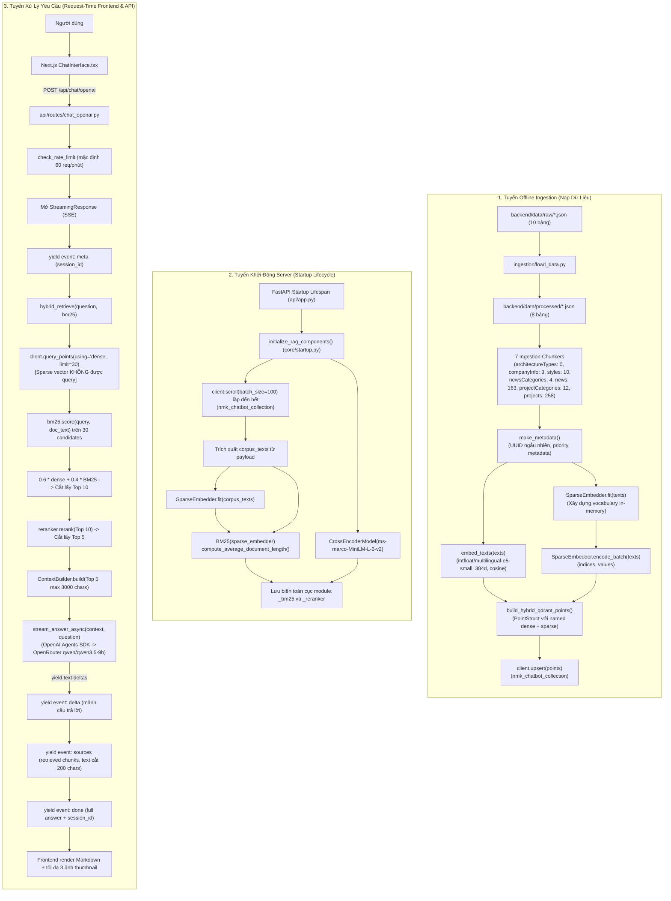

# Báo Cáo Khảo Sát Toàn Diện Kiến Trúc Dự Án Tham Chiếu llm_rag (Hiệu Chỉnh Lượt 4)

> **Ngày thực hiện**: 2026-09-11  
> **Người thực hiện**: Implementer ([`/home/minhhieu/hue_rag`](file:///home/minhhieu/hue_rag))  
> **Phiên bản**: Correction lượt 4 (Hiệu chỉnh theo Codex Review §8 của `reports/llm_rag_full_project_reference_survey_codex_review_2026_09_11.md`, xử lý các finding RR9–RR10)  
> **Mục tiêu**: Khảo sát read-only toàn diện kiến trúc, mã nguồn, cấu hình, dữ liệu, tài liệu và kiểm thử của dự án tham chiếu [`/home/minhhieu/llm_rag`](file:///home/minhhieu/llm_rag), rút ra bài học chuyển giao, cạm bẫy cần tránh và luận cứ kỹ thuật cho quá trình thiết kế/triển khai Full Corpus RAG tại [`/home/minhhieu/hue_rag`](file:///home/minhhieu/hue_rag).  
> **Trạng thái**: Đã thực hiện hiệu chỉnh lượt 4 — Bàn giao cho Reviewer để re-review theo contract.

---

## 1. Executive Summary cho User

### 1.1. Bản Chất Hệ Thống `llm_rag`
`llm_rag` là hệ thống RAG chatbot 2 tầng gồm backend FastAPI và frontend Next.js 15, được thiết kế cho dữ liệu công ty kiến trúc NMK.
- **Ngữ liệu đầu vào**: CSDL Supabase xuất dạng JSON gồm 10 bảng (2 tệp raw export 371.837 bytes có cùng SHA-256), tiền xử lý thành 8 tệp JSON processed.
- **Kết quả chạy lịch sử đã ghi nhận** (`[Documented historical result]`): Pipeline tạo ra **450 chunks**, huấn luyện `SparseEmbedder` với từ vựng in-memory **1.486 từ**, độ dài tài liệu trung bình **48,84 tokens** và nạp vào Qdrant (`[Not verified]` đối với live runtime).

### 1.2. Sơ Đồ Luồng Dữ Liệu (Ba Tuyến Độc Lập)



### 1.3. Kết Luận Trọng Tâm Về Qdrant Collection & Ranh Giới Thiết Kế Hue
1. `llm_rag` tham chiếu **một configured Qdrant collection** (`nmk_chatbot_collection` theo mặc định), chứa đồng thời named dense vector `dense` (384d, cosine) và named sparse vector `sparse` (`SparseVectorParams()`).
2. **Phát hiện then chốt về runtime retrieval**: Điểm vector thưa trong Qdrant **hoàn toàn không được truy vấn** tại runtime search (`using="dense"` duy nhất trong [`backend/retrieval/hybrid_retriever.py:41`](file:///home/minhhieu/llm_rag/backend/retrieval/hybrid_retriever.py#L41)). BM25 và CrossEncoder reranker chạy in-memory trong RAM và không cần Qdrant collection riêng.
3. **Ý nghĩa cho Hue RAG**: Quyết định của Hue giữ nguyên **3 candidate collections độc lập** cho baseline (và tối đa 6 collections cho thử nghiệm A/B Representation đồng thời). Đây là quyết định thiết kế kiến trúc (architectural design choice) phục vụ cách ly benchmark, độc lập schema và an toàn cutover/lifecycle, không phải giới hạn kỹ thuật tuyệt đối của Qdrant.
4. **Hợp đồng giao tiếp phản hồi**: Khác với mô hình Server-Sent Events (SSE) streaming của `llm_rag`, Hue RAG đã có quyết định canonical (`[Canonical Hue decision]`): **trả câu trả lời hoàn chỉnh cùng danh sách nguồn một lần (one-shot, non-streaming)** trong phiên bản MVP; không áp dụng streaming cho pipeline phản hồi của Hue.

---

## 2. Reference Snapshot, Method và Giới Hạn

### 2.1. Thông Tin Môi Trường & Git Metadata
- **Repository tham chiếu**: [`/home/minhhieu/llm_rag`](file:///home/minhhieu/llm_rag)
  - **Git HEAD commit**: `920c5798e855b67fc073b3c8b117db65c61df6b6`
  - **Git Branch**: `UpdateV2`
  - **Trạng thái working tree**: Dirty
    - Đã xóa tracked files: `docs/superpowers/plans/2026-08-04-backend-layout-refactor-plan.md`, `docs/superpowers/specs/2026-08-04-backend-layout-refactor-design.md`
    - Untracked directories: `.playwright-mcp/`, `khoi_phuc_moi_truong/`, `skills/`
- **Repository làm việc (Target)**: [`/home/minhhieu/hue_rag`](file:///home/minhhieu/hue_rag)
  - **Base commit**: `ea87d3ed52851f6b6ab5c47b138540ebc8ff8340`
  - **Working branch**: `worktree`

### 2.2. Phương Pháp & Ranh Giới Khảo Sát
- Khảo sát tĩnh tuyệt đối (Read-only static analysis): Không chạy/import bất kỳ mã nguồn Python/Node.js nào, không khởi động server, không gọi API LLM, không chạy container Qdrant, không build frontend, không chạy benchmark hay test runner.
- Tuyệt đối không đọc, in hoặc tóm tắt tệp `.env` hay bất kỳ bí mật (secret/credential) nào.
- Giữ nguyên trạng thái working tree của cả hai repository; không thực hiện thao tác Git write nào (`git_authorization: none`). Không tạo subagent (`subagent_authorization: none`).

### 2.3. Hệ Thống Nhãn Bằng Chứng (Evidence Labeling System)
Mọi luận điểm và số liệu trong báo cáo bắt buộc tuân thủ hệ thống nhãn sau:
- `[Observed in llm_rag]`: Sự thật kỹ thuật được quan sát trực tiếp trong mã nguồn hoặc tệp cấu hình thực tế của `llm_rag`.
- `[Documented intent]`: Mục tiêu hoặc thiết kế được ghi nhận trong tài liệu (`tai_lieu/`, `report/`, `README_*.md`), có thể khớp hoặc không khớp với mã nguồn thực tế.
- `[Documented historical result]`: Kết quả chạy trong quá khứ được lưu lại trong tài liệu hoặc log snapshot, không phải kết quả runtime sinh ra từ phiên làm việc hiện tại.
- `[Inference]`: Suy luận logic và kỹ thuật dựa trên phân tích mã nguồn và tài liệu.
- `[Candidate lesson for Hue]`: Đề xuất kiến trúc, bài học hoặc khuyến nghị kỹ thuật dành cho `hue_rag`.
- `[Not verified]`: Các yếu tố chưa thể kiểm chứng thông qua khảo sát tĩnh không chạy mã nguồn.
- `[Canonical Hue decision]`: Quyết định thiết kế kiến trúc canonical đã được User chính thức thông qua tại `hue_rag`.

### 2.4. Giới Hạn Cốt Lõi Của Khảo Sát Tĩnh
Toàn bộ kết quả trong báo cáo này được rút ra hoàn toàn từ việc phân tích mã nguồn tĩnh, tệp cấu hình và tài liệu lưu trữ; không thực hiện chạy mã nguồn, không chạy test, không gọi API LLM và không truy vấn container Qdrant. Các số liệu lịch sử (450 chunks, 1.486 từ vựng, 48,84 tokens trung bình) được ghi nhận nguyên văn từ tài liệu snapshot và không đại diện cho trạng thái live runtime hiện tại.

---

## 3. Coverage Map & Auditable Inventory

### 3.1. Bảng Kiểm Kê Tổng Quan Theo Nhóm (Audit Overview Table)

| Nhóm tệp tin | Số lượng tệp | Danh sách tệp tiêu biểu / Đường dẫn | Trạng thái đọc | Ghi chú & Ranh giới kiểm chứng |
| :--- | :---: | :--- | :---: | :--- |
| **Backend Source Python** | **53** | `backend/api/` (6), `backend/core/` (5), `backend/embedding/` (4), `backend/ingestion/` (14), `backend/llm/` (4), `backend/reranking/` (5), `backend/retrieval/` (4), `backend/scoring/` (2), `backend/vectorstore/` (5), `backend/tests/` (4) | `Full-read` | Đọc toàn bộ **40 tệp mã nguồn/test** và **13 tệp `__init__.py`** package marker. |
| **Backend Configs** | **2** | [`backend/config/settings.yaml`](file:///home/minhhieu/llm_rag/backend/config/settings.yaml), [`backend/config/logging.yaml`](file:///home/minhhieu/llm_rag/backend/config/logging.yaml) | `Full-read` | Đọc trọn vẹn 100% dòng cấu hình. |
| **Backend Documentation** | **20** | 20 tệp `backend/**/README*.md` nằm tại thư mục gốc backend và từng thư mục con | `Full-read` | Đọc trọn vẹn để đối chiếu intent với mã nguồn thực tế. |
| **Backend Processed Data** | **8** | [`backend/data/processed/*.json`](file:///home/minhhieu/llm_rag/backend/data/processed) | `Inventory + Sampled` | Kiểm kê toàn bộ 8 tệp (kích thước, record count); đọc trọn vẹn 100% bản ghi của 5 tệp (`companyInfo`, `architectureTypes`, `interiorStyles`, `newsCategories`, `projectCategories`); lấy mẫu cấu trúc 3 tệp (`heroSlides`, `projects`, `news`). |
| **Backend Raw Data** | **2** | [`backend/data/raw/*.json`](file:///home/minhhieu/llm_rag/backend/data/raw) | `Inventory + Sampled` | Kiểm kê 2 tệp (371.837 bytes mỗi tệp, 10 bảng); xác nhận SHA-256 trùng khớp. |
| **Backend Runtime Logs** | **1** | `backend/logs/application.log` | `Skipped/Excluded` | Tệp log runtime tự sinh; loại trừ không đọc theo nguyên tắc bảo vệ bí mật/PII và phạm vi khảo sát tĩnh. |
| **Frontend Source (TS/TSX/CSS)** | **7** | `frontend/app/` (`globals.css`, `layout.tsx`, `page.tsx`), `frontend/components/ChatInterface.tsx`, `frontend/lib/api.ts`, `frontend/global.d.ts`, `frontend/next-env.d.ts` | `Full-read` | Đọc trọn vẹn 100% mã nguồn giao diện và API client. |
| **Frontend Configs & Manifests** | **7** | `package.json`, `package-lock.json`, `tsconfig.json`, `next.config.ts`, `tailwind.config.ts`, `postcss.config.mjs`, `.gitignore` | `Full-read` | Đọc toàn bộ cấu hình build và dependency manifest. |
| **Frontend Documentation** | **5** | `README.md`, `README_frontend.md`, `app/README_app.md`, `components/README_components.md`, `lib/README_lib.md` | `Full-read` | Đọc trọn vẹn đối chiếu tài liệu frontend. |
| **Root First-Party Files** | **9** | `README.md`, `README_codegraph.md`, `README_docker.md`, `RUN_GUIDE.md`, `brainstorming.md`, `docker-compose.yml`, `pyproject.toml`, `uv.lock`, `.gitignore` | `Full-read` | Đọc trọn vẹn 100% tệp gốc thuộc dự án. |
| **Root Secret File** | **1** | `.env` | `Skipped/Excluded` | Tệp chứa biến môi trường và bí mật; tuyệt đối không mở theo quy định an toàn. |
| **Report & Session Context** | **3** | `report/Project_status.md`, `report/README_report.md`, `report/Agent_session_prompt.md` | `Full-read` | Đọc trọn vẹn snapshot và prompt hướng dẫn coding agent. |
| **Reference Documents** | **4** | `tai_lieu/README_tai_lieu.md`, `tai_lieu/rag_system_pipeline_deep_dive.md`, `tai_lieu/rag_agent_handoff_current_repo.md`, `tai_lieu/workflow_backend_frontend.md` | `Full-read` | Đọc trọn vẹn để kiểm tra luồng lý thuyết và phân tích sâu. |
| **Generated / Binary State** | N/A | `qdrant_storage/`, `frontend/node_modules/`, `frontend/.next/`, `.venv/`, `.pytest_cache/`, `tai_lieu/rag_old_0/` | `Skipped/Excluded` | Không mở/đọc dữ liệu nhị phân local storage hoặc thư mục mã nguồn lịch sử ngoài phạm vi. |

### 3.2. Danh Mục Chi Tiết Từng Tệp Tin & Trạng Thái Khảo Sát

#### 3.2.1. Toàn Bộ 53 Tệp Python Backend
1. **13 tệp `__init__.py` package marker** (`Full-read`):
   `backend/api/__init__.py`, `backend/api/routes/__init__.py`, `backend/core/__init__.py`, `backend/embedding/__init__.py`, `backend/ingestion/__init__.py`, `backend/ingestion/chunking/__init__.py`, `backend/ingestion/helpers/__init__.py`, `backend/llm/__init__.py`, `backend/reranking/__init__.py`, `backend/reranking/models/__init__.py`, `backend/retrieval/__init__.py`, `backend/scoring/__init__.py`, `backend/vectorstore/__init__.py`.
2. **40 tệp mã nguồn và kiểm thử Python** (`Full-read`):
   - `backend/api/` (4): [`app.py`](file:///home/minhhieu/llm_rag/backend/api/app.py), [`health.py`](file:///home/minhhieu/llm_rag/backend/api/health.py), `routes/`: [`chat.py`](file:///home/minhhieu/llm_rag/backend/api/routes/chat.py), [`chat_openai.py`](file:///home/minhhieu/llm_rag/backend/api/routes/chat_openai.py).
   - `backend/core/` (4): [`logging_setup.py`](file:///home/minhhieu/llm_rag/backend/core/logging_setup.py), [`schema.py`](file:///home/minhhieu/llm_rag/backend/core/schema.py), [`settings_loader.py`](file:///home/minhhieu/llm_rag/backend/core/settings_loader.py), [`startup.py`](file:///home/minhhieu/llm_rag/backend/core/startup.py).
   - `backend/embedding/` (3): [`embedder.py`](file:///home/minhhieu/llm_rag/backend/embedding/embedder.py), [`sparse_embedder.py`](file:///home/minhhieu/llm_rag/backend/embedding/sparse_embedder.py), [`batch_embed.py`](file:///home/minhhieu/llm_rag/backend/embedding/batch_embed.py).
   - `backend/ingestion/` (11): [`load_data.py`](file:///home/minhhieu/llm_rag/backend/ingestion/load_data.py), [`pipeline.py`](file:///home/minhhieu/llm_rag/backend/ingestion/pipeline.py), `helpers/`: [`make_metadata.py`](file:///home/minhhieu/llm_rag/backend/ingestion/helpers/make_metadata.py), [`split_paragraphs.py`](file:///home/minhhieu/llm_rag/backend/ingestion/helpers/split_paragraphs.py), `chunking/`: [`architectureTypes.py`](file:///home/minhhieu/llm_rag/backend/ingestion/chunking/architectureTypes.py), [`companyInfo.py`](file:///home/minhhieu/llm_rag/backend/ingestion/chunking/companyInfo.py), [`interiorStyles.py`](file:///home/minhhieu/llm_rag/backend/ingestion/chunking/interiorStyles.py), [`newCategories.py`](file:///home/minhhieu/llm_rag/backend/ingestion/chunking/newCategories.py), [`news.py`](file:///home/minhhieu/llm_rag/backend/ingestion/chunking/news.py), [`projectCategories.py`](file:///home/minhhieu/llm_rag/backend/ingestion/chunking/projectCategories.py), [`projects.py`](file:///home/minhhieu/llm_rag/backend/ingestion/chunking/projects.py).
   - `backend/llm/` (3): [`generator.py`](file:///home/minhhieu/llm_rag/backend/llm/generator.py), [`generator_openai.py`](file:///home/minhhieu/llm_rag/backend/llm/generator_openai.py), [`prompt.py`](file:///home/minhhieu/llm_rag/backend/llm/prompt.py).
   - `backend/reranking/` (3): [`base.py`](file:///home/minhhieu/llm_rag/backend/reranking/base.py), [`reranker.py`](file:///home/minhhieu/llm_rag/backend/reranking/reranker.py), `models/`: [`cross_encoder.py`](file:///home/minhhieu/llm_rag/backend/reranking/models/cross_encoder.py).
   - `backend/retrieval/` (3): [`context_builder.py`](file:///home/minhhieu/llm_rag/backend/retrieval/context_builder.py), [`hybrid_retriever.py`](file:///home/minhhieu/llm_rag/backend/retrieval/hybrid_retriever.py), [`retriever.py`](file:///home/minhhieu/llm_rag/backend/retrieval/retriever.py).
   - `backend/scoring/` (1): [`bm25.py`](file:///home/minhhieu/llm_rag/backend/scoring/bm25.py).
   - `backend/vectorstore/` (4): [`hybrid_index.py`](file:///home/minhhieu/llm_rag/backend/vectorstore/hybrid_index.py), [`index.py`](file:///home/minhhieu/llm_rag/backend/vectorstore/index.py), [`qdrant.py`](file:///home/minhhieu/llm_rag/backend/vectorstore/qdrant.py), [`upsert.py`](file:///home/minhhieu/llm_rag/backend/vectorstore/upsert.py).
   - `backend/tests/` (4): [`conftest.py`](file:///home/minhhieu/llm_rag/backend/tests/conftest.py), [`test_context_builder.py`](file:///home/minhhieu/llm_rag/backend/tests/test_context_builder.py), [`test_llm_generator_openai.py`](file:///home/minhhieu/llm_rag/backend/tests/test_llm_generator_openai.py), [`test_api_chat_openai.py`](file:///home/minhhieu/llm_rag/backend/tests/test_api_chat_openai.py).

#### 3.2.2. Toàn Bộ 20 Tệp Tài Liệu Markdown Backend
1. [`backend/README_backend.md`](file:///home/minhhieu/llm_rag/backend/README_backend.md)
2. [`backend/api/README_api.md`](file:///home/minhhieu/llm_rag/backend/api/README_api.md)
3. [`backend/api/routes/README_routes.md`](file:///home/minhhieu/llm_rag/backend/api/routes/README_routes.md)
4. [`backend/config/README_config.md`](file:///home/minhhieu/llm_rag/backend/config/README_config.md)
5. [`backend/core/README_core.md`](file:///home/minhhieu/llm_rag/backend/core/README_core.md)
6. [`backend/data/README_data.md`](file:///home/minhhieu/llm_rag/backend/data/README_data.md)
7. [`backend/data/processed/README_processed.md`](file:///home/minhhieu/llm_rag/backend/data/processed/README_processed.md)
8. [`backend/data/raw/README_raw.md`](file:///home/minhhieu/llm_rag/backend/data/raw/README_raw.md)
9. [`backend/embedding/README_embedding.md`](file:///home/minhhieu/llm_rag/backend/embedding/README_embedding.md)
10. [`backend/ingestion/README_ingestion.md`](file:///home/minhhieu/llm_rag/backend/ingestion/README_ingestion.md)
11. [`backend/ingestion/chunking/README_chunking.md`](file:///home/minhhieu/llm_rag/backend/ingestion/chunking/README_chunking.md)
12. [`backend/ingestion/helpers/README_helpers.md`](file:///home/minhhieu/llm_rag/backend/ingestion/helpers/README_helpers.md)
13. [`backend/llm/README_llm.md`](file:///home/minhhieu/llm_rag/backend/llm/README_llm.md)
14. [`backend/logs/README_logs.md`](file:///home/minhhieu/llm_rag/backend/logs/README_logs.md)
15. [`backend/reranking/README_reranking.md`](file:///home/minhhieu/llm_rag/backend/reranking/README_reranking.md)
16. [`backend/reranking/models/README_models.md`](file:///home/minhhieu/llm_rag/backend/reranking/models/README_models.md)
17. [`backend/retrieval/README_retrieval.md`](file:///home/minhhieu/llm_rag/backend/retrieval/README_retrieval.md)
18. [`backend/scoring/README_scoring.md`](file:///home/minhhieu/llm_rag/backend/scoring/README_scoring.md)
19. [`backend/tests/README_tests.md`](file:///home/minhhieu/llm_rag/backend/tests/README_tests.md)
20. [`backend/vectorstore/README_vectorstore.md`](file:///home/minhhieu/llm_rag/backend/vectorstore/README_vectorstore.md)

#### 3.2.3. Quy Tắc Lấy Mẫu & Khảo Sát Tệp Dữ Liệu JSON
1. **Raw JSON Data** (`backend/data/raw/`, 2 tệp, kích thước 371.837 bytes mỗi tệp):
   - `database_export_2026-01-14T02-32-14.json` và `database_export_2026-01-23T02-02-46.json`.
   - **Quy tắc lấy mẫu**: Kiểm tra SHA-256 xác nhận 2 tệp có nội dung byte trùng khớp hoàn toàn (`sha256sum`: `b38e8cf04a2e392733037e89fafffaeab0f6ecfc49253965105278a4a007c598`). Lấy mẫu cấu trúc khóa root `tables` gồm đúng 10 bảng: `companyInfo`, `heroSlides`, `interiorStyles`, `architectureTypes`, `projectCategories`, `projects`, `newsCategories`, `news`, `settings`, `users`.
2. **Processed JSON Data** (`backend/data/processed/`, 8 tệp):
   - [`companyInfo.json`](file:///home/minhhieu/llm_rag/backend/data/processed/companyInfo.json) (4.083 bytes, 1 record): `Full-read` 100% bản ghi duy nhất.
   - [`architectureTypes.json`](file:///home/minhhieu/llm_rag/backend/data/processed/architectureTypes.json) (7.918 bytes, 15 records): `Full-read` toàn bộ 15 bản ghi (xác nhận tất cả trường `description` đều là null).
   - [`interiorStyles.json`](file:///home/minhhieu/llm_rag/backend/data/processed/interiorStyles.json) (4.832 bytes, 10 records): `Full-read` toàn bộ 10 bản ghi.
   - [`newsCategories.json`](file:///home/minhhieu/llm_rag/backend/data/processed/newsCategories.json) (1.378 bytes, 4 records): `Full-read` toàn bộ 4 bản ghi.
   - [`projectCategories.json`](file:///home/minhhieu/llm_rag/backend/data/processed/projectCategories.json) (4.379 bytes, 12 records): `Full-read` toàn bộ 12 bản ghi.
   - [`heroSlides.json`](file:///home/minhhieu/llm_rag/backend/data/processed/heroSlides.json) (7.175 bytes, 10 records): `Sampled` cấu trúc khóa; xác nhận bị pipeline loại bỏ không tạo chunk.
   - [`projects.json`](file:///home/minhhieu/llm_rag/backend/data/processed/projects.json) (203.967 bytes, 49 records): `Sampled` cấu trúc schema và các bản ghi chỉ số 0, 1 (`id`, `title`, `categoryId`, `interiorStyleId`, `description`, `investor`, `location`, `area`, `completedDate`, `thumbnailUrl`).
   - [`news.json`](file:///home/minhhieu/llm_rag/backend/data/processed/news.json) (144.519 bytes, 17 records): `Sampled` cấu trúc schema, định dạng HTML và các bản ghi chỉ số 0, 1 (`id`, `title`, `slug`, `excerpt`, `content`, `thumbnailUrl`, `author`, `status`, `publishedAt`).

#### 3.2.4. Tệp Gốc Dự Án (Root First-Party Files)
Bao gồm đầy đủ 9 tệp: [`README.md`](file:///home/minhhieu/llm_rag/README.md), [`README_codegraph.md`](file:///home/minhhieu/llm_rag/README_codegraph.md), [`README_docker.md`](file:///home/minhhieu/llm_rag/README_docker.md), [`RUN_GUIDE.md`](file:///home/minhhieu/llm_rag/RUN_GUIDE.md), [`brainstorming.md`](file:///home/minhhieu/llm_rag/brainstorming.md), [`docker-compose.yml`](file:///home/minhhieu/llm_rag/docker-compose.yml), [`pyproject.toml`](file:///home/minhhieu/llm_rag/pyproject.toml), [`uv.lock`](file:///home/minhhieu/llm_rag/uv.lock), [`.gitignore`](file:///home/minhhieu/llm_rag/.gitignore). Tệp [`.env`](file:///home/minhhieu/llm_rag/.env) được phân loại `Skipped/Excluded` nhằm tuân thủ ranh giới an toàn bí mật.

---

## 4. Kiến Trúc Tổng Thể và Entrypoints

### 4.1. Cấu Trúc Tổng Thể & Layout
Thư mục gốc Python runtime là [`backend/`](file:///home/minhhieu/llm_rag/backend), được chuẩn hóa bố cục theo cấu trúc phân hệ chức năng rõ ràng. Mọi lệnh thực thi `uv run` đều được chạy với working directory là `backend/`. Frontend là ứng dụng Next.js 15 độc lập trong thư mục [`frontend/`](file:///home/minhhieu/llm_rag/frontend).

### 4.2. Danh Mục Entrypoints Vận Hành
1. **Tuyến Ingestion CLI**:
   - Lệnh thực thi: `uv run python -m ingestion.pipeline` (từ thư mục `backend/`).
   - Entrypoint code: [`backend/ingestion/pipeline.py:17-33`](file:///home/minhhieu/llm_rag/backend/ingestion/pipeline.py#L17-L33). Luồng gọi (call flow) nạp dữ liệu:
     - [`backend/ingestion/pipeline.py:17-33`](file:///home/minhhieu/llm_rag/backend/ingestion/pipeline.py#L17-L33): gọi 7 chunkers gom vào `all_chunks`, rồi gọi `upsert_chunks(all_chunks)`;
     - [`backend/vectorstore/upsert.py:15-38`](file:///home/minhhieu/llm_rag/backend/vectorstore/upsert.py#L15-L38): lấy Qdrant client, đảm bảo collection, fit `SparseEmbedder`, build points và gọi một lần `client.upsert(...)`;
     - [`backend/vectorstore/hybrid_index.py:17-53`](file:///home/minhhieu/llm_rag/backend/vectorstore/hybrid_index.py#L17-L53): hàm `build_hybrid_qdrant_points` tạo danh sách PointStruct gồm cả dense và sparse.
     *(Lưu ý: Các bước khởi tạo client, bảo đảm collection, fit sparse, build points và upsert là transitive qua `upsert.py` và `hybrid_index.py`, không nằm trực tiếp trong `pipeline.py`)*.
2. **Tuyến API Server**:
   - Lệnh thực thi: `uv run uvicorn api.app:app --host 0.0.0.0 --port 8000 --reload` (từ thư mục `backend/`).
   - Entrypoint code: [`backend/api/app.py:28-33`](file:///home/minhhieu/llm_rag/backend/api/app.py#L28-L33).
3. **Tuyến Frontend Web UI**:
   - Lệnh thực thi: `npm run dev` (từ thư mục `frontend/`).
   - Entrypoint code: [`frontend/app/page.tsx:1-12`](file:///home/minhhieu/llm_rag/frontend/app/page.tsx#L1-L12) nạp [`frontend/components/ChatInterface.tsx`](file:///home/minhhieu/llm_rag/frontend/components/ChatInterface.tsx).

### 4.3. Bảng Phân Định Thành Phần First-Party (Component Map)

| Module / Phân hệ | Tệp tin chính | Vai trò kiến trúc | Caller trong codebase | Trạng thái hoạt động |
| :--- | :--- | :--- | :--- | :--- |
| **Config** | [`backend/config/settings.yaml`](file:///home/minhhieu/llm_rag/backend/config/settings.yaml)<br>[`backend/config/logging.yaml`](file:///home/minhhieu/llm_rag/backend/config/logging.yaml) | Cấu hình tham số mặc định và logging format/handlers | `settings_loader.py`, `logging_setup.py` | Active |
| **Core** | [`backend/core/settings_loader.py`](file:///home/minhhieu/llm_rag/backend/core/settings_loader.py)<br>[`backend/core/schema.py`](file:///home/minhhieu/llm_rag/backend/core/schema.py)<br>[`backend/core/startup.py`](file:///home/minhhieu/llm_rag/backend/core/startup.py) | Nạp settings, ghi đè biến môi trường, định nghĩa `RetrievedDocument`, nạp corpus Qdrant lúc startup | `api/app.py`, `retrieval/*.py`, `health.py` | Active |
| **Ingestion** | [`backend/ingestion/load_data.py`](file:///home/minhhieu/llm_rag/backend/ingestion/load_data.py)<br>[`backend/ingestion/pipeline.py`](file:///home/minhhieu/llm_rag/backend/ingestion/pipeline.py)<br>[`backend/ingestion/helpers/make_metadata.py`](file:///home/minhhieu/llm_rag/backend/ingestion/helpers/make_metadata.py)<br>[`backend/ingestion/helpers/split_paragraphs.py`](file:///home/minhhieu/llm_rag/backend/ingestion/helpers/split_paragraphs.py) | Tách file raw JSON thành các bảng processed; điều phối 7 chunking modules; gán metadata và cắt câu | CLI entrypoint: `python -m ingestion.pipeline` | Active |
| **Embedding** | [`backend/embedding/embedder.py`](file:///home/minhhieu/llm_rag/backend/embedding/embedder.py)<br>[`backend/embedding/sparse_embedder.py`](file:///home/minhhieu/llm_rag/backend/embedding/sparse_embedder.py)<br>[`backend/embedding/batch_embed.py`](file:///home/minhhieu/llm_rag/backend/embedding/batch_embed.py) | Dense embedder `multilingual-e5-small`; Sparse embedder (TF-IDF từ vựng); `batch_embed.py` là wrapper chia lô | `hybrid_index.py`, `retrieval/*.py`, `startup.py`. Lưu ý: `batch_embed.py` không có caller | Active / `batch_embed.py` là **Dead code** |
| **Vectorstore** | [`backend/vectorstore/qdrant.py`](file:///home/minhhieu/llm_rag/backend/vectorstore/qdrant.py)<br>[`backend/vectorstore/hybrid_index.py`](file:///home/minhhieu/llm_rag/backend/vectorstore/hybrid_index.py)<br>[`backend/vectorstore/upsert.py`](file:///home/minhhieu/llm_rag/backend/vectorstore/upsert.py)<br>[`backend/vectorstore/index.py`](file:///home/minhhieu/llm_rag/backend/vectorstore/index.py) | Qdrant client singleton, khởi tạo collection hybrid, build hybrid PointStruct, upsert points; `index.py` là dense-only legacy | `ingestion/pipeline.py`, `api/health.py`, `core/startup.py`. `index.py` không có caller | Active / `index.py` là **Dead code** |
| **Retrieval & Scoring** | [`backend/retrieval/hybrid_retriever.py`](file:///home/minhhieu/llm_rag/backend/retrieval/hybrid_retriever.py)<br>[`backend/retrieval/retriever.py`](file:///home/minhhieu/llm_rag/backend/retrieval/retriever.py)<br>[`backend/scoring/bm25.py`](file:///home/minhhieu/llm_rag/backend/scoring/bm25.py) | Dense candidate search (limit 30) + in-memory BM25 rescoring; `retriever.py` là dense-only legacy | `api/routes/chat.py`, `api/routes/chat_openai.py`. `retriever.py` không có caller | Active / `retriever.py` là **Dead code** |
| **Reranking** | [`backend/reranking/base.py`](file:///home/minhhieu/llm_rag/backend/reranking/base.py)<br>[`backend/reranking/models/cross_encoder.py`](file:///home/minhhieu/llm_rag/backend/reranking/models/cross_encoder.py)<br>[`backend/reranking/reranker.py`](file:///home/minhhieu/llm_rag/backend/reranking/reranker.py) | Interface `BaseReranker`, wrapper model `ms-marco-MiniLM-L-6-v2`, chấm điểm batch và cắt top 5 | `core/startup.py`, `api/routes/chat.py`, `api/routes/chat_openai.py` | Active |
| **Context & LLM** | [`backend/retrieval/context_builder.py`](file:///home/minhhieu/llm_rag/backend/retrieval/context_builder.py)<br>[`backend/llm/prompt.py`](file:///home/minhhieu/llm_rag/backend/llm/prompt.py)<br>[`backend/llm/generator_openai.py`](file:///home/minhhieu/llm_rag/backend/llm/generator_openai.py)<br>[`backend/llm/generator.py`](file:///home/minhhieu/llm_rag/backend/llm/generator.py) | Ghép context tối đa 5 docs và 3000 chars; prompt chống ảo giác; generator OpenRouter streaming; `generator.py` là Ollama legacy | `api/routes/chat_openai.py`, `api/routes/chat.py` | Active / `generator.py` trả lỗi chuỗi text |
| **API** | [`backend/api/app.py`](file:///home/minhhieu/llm_rag/backend/api/app.py)<br>[`backend/api/health.py`](file:///home/minhhieu/llm_rag/backend/api/health.py)<br>[`backend/api/routes/chat_openai.py`](file:///home/minhhieu/llm_rag/backend/api/routes/chat_openai.py)<br>[`backend/api/routes/chat.py`](file:///home/minhhieu/llm_rag/backend/api/routes/chat.py) | FastAPI app với startup lifespan; health endpoint trả nested services; SSE streaming route; legacy JSON route | Uvicorn server, HTTP clients | Active |
| **Frontend** | [`frontend/app/page.tsx`](file:///home/minhhieu/llm_rag/frontend/app/page.tsx)<br>[`frontend/components/ChatInterface.tsx`](file:///home/minhhieu/llm_rag/frontend/components/ChatInterface.tsx)<br>[`frontend/lib/api.ts`](file:///home/minhhieu/llm_rag/frontend/lib/api.ts) | Next.js 15 App Router, giao diện chat, client SSE dùng Fetch ReadableStream, render Markdown | Trình duyệt người dùng | Active |
| **Tests** | [`backend/tests/conftest.py`](file:///home/minhhieu/llm_rag/backend/tests/conftest.py)<br>[`backend/tests/test_context_builder.py`](file:///home/minhhieu/llm_rag/backend/tests/test_context_builder.py)<br>[`backend/tests/test_llm_generator_openai.py`](file:///home/minhhieu/llm_rag/backend/tests/test_llm_generator_openai.py)<br>[`backend/tests/test_api_chat_openai.py`](file:///home/minhhieu/llm_rag/backend/tests/test_api_chat_openai.py) | Bộ unit test kiểm tra cô lập bằng pytest (20 test functions), monkeypatch LLM và retrieval | pytest runner | Active |

---

## 5. API

### 5.1. Khởi Tạo Ứng Dụng FastAPI & Lifespan Lifecycle
- **Mã nguồn**: [`backend/api/app.py:12-27`](file:///home/minhhieu/llm_rag/backend/api/app.py#L12-L27)
- **Startup**: Lifespan gọi `initialize_rag_components()` tại [`backend/core/startup.py`](file:///home/minhhieu/llm_rag/backend/core/startup.py):
  - Cuộn toàn bộ points trong Qdrant bằng vòng lặp batch 100 ([`core/startup.py:53-78`](file:///home/minhhieu/llm_rag/backend/core/startup.py#L53-L78)).
  - Fit `SparseEmbedder` trên corpus text.
  - Khởi tạo `BM25` và tính độ dài trung bình văn bản.
  - Tải mô hình `CrossEncoderModel` và khởi tạo `CrossEncoderReranker`.
- **Shutdown**: Dòng 26 chỉ ghi log `logger.info("Shutting down NMK Chatbot API...")`, **hoàn toàn không có logic giải phóng tài nguyên** hay đóng kết nối nào (`[Observed in llm_rag]`).

### 5.2. Chính Sách Bảo Mật, Xác Thực & CORS
- **Xác thực (Authentication)**: Mã nguồn backend không triển khai application-level authentication hoặc authorization (không kiểm tra bearer token, API key, session cookie hay security header ở tầng ứng dụng). Báo cáo không suy diễn trạng thái mở truy cập ở tầng mạng hay hạ tầng triển khai.
- **CORS Middleware** ([`backend/api/app.py:35-41`](file:///home/minhhieu/llm_rag/backend/api/app.py#L35-L41)):
  ```python
  app.add_middleware(
      CORSMiddleware,
      allow_origins=["*"],
      allow_credentials=True,
      allow_methods=["*"],
      allow_headers=["*"],
  )
  ```
  Cấu hình mở hoàn toàn (`wildcard *`), chấp nhận mọi origin, method và header từ trình duyệt.

### 5.3. Middleware Theo Dõi Thời Gian Phản Hồi
Tại [`backend/api/app.py:43-51`](file:///home/minhhieu/llm_rag/backend/api/app.py#L43-L51):
```python
@app.middleware("http")
async def track_response_time(request: Request, call_next):
    start_time = time.time()
    response = await call_next(request)
    duration = time.time() - start_time
    response.headers["X-Response-Time"] = f"{duration:.3f}s"
    logger.info(f"{request.method} {request.url.path} took {duration:.3f}s")
    return response
```
Middleware này đo thời gian xử lý toàn bộ request, gắn header `X-Response-Time` vào response HTTP và ghi log thời gian thực thi.

### 5.4. Endpoint Sức Khỏe Hệ Thống `GET /health`
- **Mã nguồn**: [`backend/api/health.py:10-71`](file:///home/minhhieu/llm_rag/backend/api/health.py#L10-L71)
- **Đặc tả Schema Phản Hồi Động (Dynamic Nested Schema)**:
  Endpoint trả về cấu trúc lồng nhau được truy vấn động tại runtime:
  - `status`: `"healthy"`, `"degraded"`, hoặc `"unhealthy"`.
  - `services.qdrant`: Lấy động từ `client.get_collections()` gồm trạng thái kết nối và `collections: len(collections.collections)`.
  - `services.embedding`: Lấy động từ `model.__class__.__name__`.
  - `services.llm`: Lấy từ cấu hình `settings.get("llm")`.
  - `services.rag_components`: Lấy động từ `core/startup.py:get_initialization_status()` gồm `initialized`, `sparse_embedder`, `bm25`, `reranker`, `vocabulary_size`, `avg_document_length`.
  > **Lưu ý kiểm chứng**: Các con số lịch sử được ghi nhận trong tài liệu (`[Documented historical result]`) gồm `collections: 1`, `vocabulary_size: 1486`, `avg_document_length: 48.84`. Đây là kết quả lưu trữ trong tài liệu, giá trị runtime thực tế là `[Not verified]` trong khảo sát tĩnh này.

### 5.5. Endpoint Chat Legacy `POST /api/chat`
- **Mã nguồn**: [`backend/api/routes/chat.py:80-154`](file:///home/minhhieu/llm_rag/backend/api/routes/chat.py#L80-L154)
- **Request / Response**: Nhận `ChatRequest(query: str, session_id: Optional[str])`, trả về `ChatResponse(answer: str, sources: list)`.
- **Lỗi nuốt mã HTTP (Exception Swallowing)**: Dòng 88-91 kiểm tra `if bm25 is None:` và raise `HTTPException(status_code=503, detail="Hệ thống chưa sẵn sàng. Vui lòng thử lại sau.")`. Tuy nhiên khối này nằm trong `try:`, và dòng 146-150 bắt broad exception `except Exception as e:` rồi raise `HTTPException(status_code=500, detail="Xin lỗi, đã xảy ra lỗi khi xử lý câu hỏi của bạn. Vui lòng thử lại sau.")`. Vì `HTTPException` là subclass của `Exception`, lỗi 503 dự kiến bị khối try/except này bắt lại và chuyển đổi thành lỗi 500 với chuỗi thông báo tiếng Việt cố định ([`chat.py:146-150`](file:///home/minhhieu/llm_rag/backend/api/routes/chat.py#L146-L150)) thay vì trả về `503` (`[Observed in llm_rag]`).
- **Không hỗ trợ Provider**: `generator.py:34` chỉ hỗ trợ `ollama`. Với cấu hình mặc định `openrouter`, hàm trả về chuỗi text báo không hỗ trợ và route bọc vào `ChatResponse(answer=...)` với HTTP status 200.
- **Cắt ngắn source text**: Dòng 125 cắt ngắn văn bản source: `"text": doc.text[:200] + "..." if len(doc.text) > 200 else doc.text`.

### 5.6. Endpoint Chat Streaming `POST /api/chat/openai`
- **Mã nguồn**: [`backend/api/routes/chat_openai.py:75-167`](file:///home/minhhieu/llm_rag/backend/api/routes/chat_openai.py#L75-L167)
- **Giao thức phát Server-Sent Events (SSE)**: Trả về `StreamingResponse(event_generator(), media_type="text/event-stream")`.
- **Chuỗi sự kiện chuẩn**:
  `event: meta` -> `event: delta`* -> `event: sources` -> `event: done`
- **Hợp đồng lỗi Exception**:
  Khối `except Exception as error` tại [`chat_openai.py:160-165`](file:///home/minhhieu/llm_rag/backend/api/routes/chat_openai.py#L160-L165) bao bọc **toàn bộ nội dung của `event_generator`** (từ dòng 101 đến 159). Bất kỳ ngoại lệ nào phát sinh và thoát ra ngoài trong suốt chu kỳ (từ truy vấn session, logging, hybrid retrieval, reranker, context builder, prompt building, LLM streaming, cấu trúc sources, lưu session, đến format SSE) đều kích hoạt khối này, ghi log với `exc_info=True` và phát `event: error` với message: *"Xin lỗi, đã xảy ra lỗi khi xử lý câu hỏi của bạn. Vui lòng thử lại sau."*.
- **Giá trị điểm của Source trong API**: Dòng 144 gán `"score": doc.score`. Do `CrossEncoderReranker` chỉ ghi điểm vào `metadata["rerank_score"]` mà không ghi đè lên trường `score` của `RetrievedDocument`, giá trị `score` trả về trong danh sách sources của API thực chất vẫn là **hybrid retrieval score**, không phải rerank score (`[Observed in llm_rag]`).
- **Cắt ngắn source text**: Dòng 142 cắt ngắn văn bản: `doc.text[:200] + "..."`.

### 5.7. Quản Lý Rate Limit & Lưu Trữ Phiên (Sessions)
- **Rate Limit**: [`chat_openai.py:30-46`](file:///home/minhhieu/llm_rag/backend/api/routes/chat_openai.py#L30-L46) định nghĩa `check_rate_limit(client_ip)`. Sử dụng sliding window 60 giây, mặc định **60 requests/phút** (`RATE_LIMIT_PER_MINUTE`).
  - Danh sách timestamp cũ hơn 60 giây được lọc bỏ khỏi `rate_limit_storage[client_ip]`.
  - Tuy nhiên, **khóa `client_ip` không có logic xóa hay dọn dẹp** khỏi từ điển `rate_limit_storage`. Mã nguồn không triển khai TTL hay giải phóng key; các entry có thể tồn tại suốt vòng đời tiến trình, tạo rủi ro tích tụ bộ nhớ RAM khi số lượng IP client gia tăng (`[Observed in llm_rag]`).
- **Session Storage**: `sessions = {}` lưu trữ in-memory theo tiến trình, không có cơ chế hết hạn (TTL), không có cơ chế dọn dẹp hoặc giới hạn số lượng phiên, tạo rủi ro tăng bộ nhớ theo lịch sử phiên chat.

---

## 6. Cấu Hình và Phân Giải Dependency (Config & Dependency Resolution)

### 6.1. Quản Lý Gói & Phiên Bản Dependency Cốt Lõi
- **Môi trường Python** ([`pyproject.toml:1-35`](file:///home/minhhieu/llm_rag/pyproject.toml#L1-L35), [`uv.lock`](file:///home/minhhieu/llm_rag/uv.lock), [`docker-compose.yml:3`](file:///home/minhhieu/llm_rag/docker-compose.yml#L3)):
  - Yêu cầu Python: `>=3.12`.
  - Khai báo ràng buộc trong `pyproject.toml:7-21`: `fastapi>=0.115.0`, `uvicorn[standard]>=0.32.0`, `python-multipart>=0.0.12`, `python-dotenv>=1.0.0`, `openai>=2.48.0`, `openai-agents>=0.18.3`, cùng các dependency không đặt ràng buộc phiên bản gồm `qdrant-client`, `sentence-transformers`, `polars`, `pyyaml`, `beautifulsoup4`, `ollama`, `vectorstore`.
  - Dev dependencies trong `pyproject.toml:24-27`: `pytest>=7.4.0`, `pytest-cov>=4.1.0`.
  - Phiên bản phân giải thực tế trong `uv.lock`: `qdrant-client: 1.18.0`.
  - Container Qdrant trong `docker-compose.yml:3`: Sử dụng image `qdrant/qdrant:v1.18.3` (Mã nguồn không chứa tài liệu hay bằng chứng kiểm thử về tính tương thích chéo giữa phiên bản thư viện Python và container server).
- **Môi trường Frontend** ([`frontend/package.json:1-32`](file:///home/minhhieu/llm_rag/frontend/package.json#L1-L32), [`frontend/package-lock.json`](file:///home/minhhieu/llm_rag/frontend/package-lock.json)):
  - Dependencies trực tiếp: `next: 15.1.4`, `react: ^19.0.0`, `react-dom: ^19.0.0`, `react-markdown: ^10.1.0`, `remark-gfm: ^4.0.1`, `axios: ^1.7.9`, `lucide-react: ^0.469.0`.
  - Dev dependencies: `@types/react: ^19`, `eslint: ^9`, `eslint-config-next: 15.1.4`, `tailwindcss: ^3.4.1`, `typescript: ^5`.

### 6.2. Bảng Ma Trận Cấu Hình Toàn Diện (Comprehensive Configuration Matrix)

| Tên thiết lập (Setting) | Giá trị mặc định trong YAML / Code | Biến môi trường ghi đè | Module tiêu thụ (Consumer) | Ý nghĩa & Tác động kỹ thuật | Bắt buộc |
| :--- | :--- | :--- | :--- | :--- | :---: |
| `app.name` | `NMK-chatbot-app` | — | Không có consumer runtime ([`core/settings_loader.py:16`](file:///home/minhhieu/llm_rag/backend/core/settings_loader.py#L16) chỉ là hàm `load_settings()`) | Tên định danh cấu hình của ứng dụng backend; không có caller tiêu thụ trong codebase | Không |
| `app.env` | `production` | `APP_ENV` | [`core/settings_loader.py:22-23`](file:///home/minhhieu/llm_rag/backend/core/settings_loader.py#L22-L23) (ghi đè cấu hình; không có consumer nào khác đọc setting này) | Môi trường chạy (`development`/`production`, mặc định `production` trong `settings.yaml:5`); không có module nào tiêu thụ giá trị này | Không |
| `data.raw_dir` | `data/raw` | — | [`ingestion/load_data.py:16`](file:///home/minhhieu/llm_rag/backend/ingestion/load_data.py#L16) | Thư mục chứa tệp CSDL xuất raw JSON | Không |
| `data.processed_dir`| `data/processed` | — | [`ingestion/load_data.py:35`](file:///home/minhhieu/llm_rag/backend/ingestion/load_data.py#L35) (lưu ý: `chunking/*.py` dùng đường dẫn cố định `data/processed/`) | Thư mục chứa tệp JSON processed tách bảng | Không |
| `chunking.chunk_size`| `512` | — | Không có consumer (`[Observed in llm_rag]`) | Tham số không có caller trong mã nguồn chunker | Không |
| `chunking.chunk_overlap`| `50` | — | Không có consumer (`[Observed in llm_rag]`) | Tham số không có caller trong mã nguồn chunker | Không |
| `embedding.model` | `intfloat/multilingual-e5-small` | `EMBEDDING_MODEL` | [`embedding/embedder.py:10`](file:///home/minhhieu/llm_rag/backend/embedding/embedder.py#L10), [`settings_loader.py:36-37`](file:///home/minhhieu/llm_rag/backend/core/settings_loader.py#L36-L37) | Tên mô hình SentenceTransformer dense | Có |
| `embedding.device` | `cpu` | `EMBEDDING_DEVICE` | [`embedding/embedder.py:18`](file:///home/minhhieu/llm_rag/backend/embedding/embedder.py#L18), [`settings_loader.py:38-39`](file:///home/minhhieu/llm_rag/backend/core/settings_loader.py#L38-L39) | Thiết bị phần cứng (`cpu` hoặc `cuda`) | Không |
| `embedding.batch_size`| `64` | `EMBEDDING_BATCH_SIZE` | [`embedding/batch_embed.py:9, 18-19`](file:///home/minhhieu/llm_rag/backend/embedding/batch_embed.py#L9), [`settings_loader.py:40-41`](file:///home/minhhieu/llm_rag/backend/core/settings_loader.py#L40-L41) | Kích thước lô (đọc tại dòng 9 gán `BATCH_SIZE`, dùng tại dòng 18–19; module không có caller runtime) | Không |
| `vector_database.url`| `http://localhost:6333` | `QDRANT_URL` | [`vectorstore/qdrant.py:26`](file:///home/minhhieu/llm_rag/backend/vectorstore/qdrant.py#L26), [`settings_loader.py:26-27`](file:///home/minhhieu/llm_rag/backend/core/settings_loader.py#L26-L27) | Địa chỉ URL kết nối Qdrant REST service | Có |
| `vector_database.api_key`| `null` | `QDRANT_API_KEY` | [`vectorstore/qdrant.py:30, 39`](file:///home/minhhieu/llm_rag/backend/vectorstore/qdrant.py#L30), [`settings_loader.py:28-29`](file:///home/minhhieu/llm_rag/backend/core/settings_loader.py#L28-L29) | Khóa API bảo vệ truy cập Qdrant | Không |
| `vector_database.collection_name`| `nmk_chatbot_collection` | `QDRANT_COLLECTION_NAME` | [`vectorstore/qdrant.py:12`](file:///home/minhhieu/llm_rag/backend/vectorstore/qdrant.py#L12), [`settings_loader.py:30-31`](file:///home/minhhieu/llm_rag/backend/core/settings_loader.py#L30-L31) | Tên collection Qdrant lưu trữ điểm vector | Có |
| `vector_database.timeout`| `30` | `QDRANT_TIMEOUT` | [`vectorstore/qdrant.py:15`](file:///home/minhhieu/llm_rag/backend/vectorstore/qdrant.py#L15), [`settings_loader.py:32-33`](file:///home/minhhieu/llm_rag/backend/core/settings_loader.py#L32-L33) | Thời gian timeout kết nối client Qdrant (giây) | Không |
| `vector_database.vector_size`| `384` | — | [`vectorstore/qdrant.py:13`](file:///home/minhhieu/llm_rag/backend/vectorstore/qdrant.py#L13) | Số chiều không gian vector dense của collection | Có |
| `vector_database.distance`| `cosine` | — | [`vectorstore/qdrant.py:14`](file:///home/minhhieu/llm_rag/backend/vectorstore/qdrant.py#L14) | Độ đo khoảng cách vector (`cosine`) | Có |
| `llm.provider` | `openrouter` | `LLM_PROVIDER` | [`llm/generator_openai.py:23`](file:///home/minhhieu/llm_rag/backend/llm/generator_openai.py#L23), [`settings_loader.py:44-45`](file:///home/minhhieu/llm_rag/backend/core/settings_loader.py#L44-L45) | Nhà cung cấp dịch vụ LLM (`openrouter`/`ollama`) | Có |
| `llm.model_name` | `qwen/qwen3.5-9b` | `LLM_MODEL_NAME` | [`llm/generator_openai.py:24`](file:///home/minhhieu/llm_rag/backend/llm/generator_openai.py#L24), [`settings_loader.py:46-47`](file:///home/minhhieu/llm_rag/backend/core/settings_loader.py#L46-L47) | Tên định danh mô hình trên OpenRouter | Có |
| `llm.base_url` | `https://openrouter.ai/api/v1` | `LLM_BASE_URL` | [`llm/generator_openai.py:25`](file:///home/minhhieu/llm_rag/backend/llm/generator_openai.py#L25), [`settings_loader.py:48-49`](file:///home/minhhieu/llm_rag/backend/core/settings_loader.py#L48-L49) | Base URL gọi API OpenAI client | Không |
| `llm.openrouter_api_key`| `null` | `OPENROUTER_API_KEY` | [`llm/generator_openai.py:29`](file:///home/minhhieu/llm_rag/backend/llm/generator_openai.py#L29), [`settings_loader.py:52-53`](file:///home/minhhieu/llm_rag/backend/core/settings_loader.py#L52-L53) | API key xác thực với OpenRouter | Có |
| `llm.openai_api_key` | `null` | `OPENAI_API_KEY` | [`settings_loader.py:50-51`](file:///home/minhhieu/llm_rag/backend/core/settings_loader.py#L50-L51) | API key dự phòng OpenAI | Không |
| `llm.temperature` | `0.2` | `LLM_TEMPERATURE` | [`llm/generator_openai.py:26, 64`](file:///home/minhhieu/llm_rag/backend/llm/generator_openai.py#L26), [`settings_loader.py:54-55`](file:///home/minhhieu/llm_rag/backend/core/settings_loader.py#L54-L55) | Tham số nhiệt độ điều khiển tính ngẫu nhiên sinh từ | Không |
| `llm.max_tokens` | `1024` | `LLM_MAX_TOKENS` | [`llm/generator_openai.py:27, 65`](file:///home/minhhieu/llm_rag/backend/llm/generator_openai.py#L27), [`settings_loader.py:56-57`](file:///home/minhhieu/llm_rag/backend/core/settings_loader.py#L56-L57) | Số lượng token tối đa mô hình được phép sinh | Không |
| `llm.timeout` | `60` | `LLM_TIMEOUT` | [`llm/generator_openai.py:28, 53`](file:///home/minhhieu/llm_rag/backend/llm/generator_openai.py#L28), [`settings_loader.py:58-59`](file:///home/minhhieu/llm_rag/backend/core/settings_loader.py#L58-L59) | Thời gian timeout khi gửi yêu cầu đến LLM (giây) | Không |
| `retrieval.top_k` | `10` | `RETRIEVAL_TOP_K` | [`retrieval/hybrid_retriever.py:19, 42, 74`](file:///home/minhhieu/llm_rag/backend/retrieval/hybrid_retriever.py#L19), [`settings_loader.py:62-63`](file:///home/minhhieu/llm_rag/backend/core/settings_loader.py#L62-L63) | Số tài liệu giữ lại sau khi trộn hybrid (đọc tại dòng 19, dùng tại dòng 42, 74) | Có |
| `retrieval.score_threshold`| `0.0` | `RETRIEVAL_SCORE_THRESHOLD` | [`retrieval/hybrid_retriever.py:20, 44`](file:///home/minhhieu/llm_rag/backend/retrieval/hybrid_retriever.py#L20), [`settings_loader.py:64-65`](file:///home/minhhieu/llm_rag/backend/core/settings_loader.py#L64-L65) | Ngưỡng điểm tương đồng tối thiểu của Qdrant (đọc tại dòng 20, dùng tại dòng 44) | Không |
| `retrieval.dense_weight`| `0.6` | `DENSE_WEIGHT` | [`retrieval/hybrid_retriever.py:21, 58`](file:///home/minhhieu/llm_rag/backend/retrieval/hybrid_retriever.py#L21), [`settings_loader.py:66-67`](file:///home/minhhieu/llm_rag/backend/core/settings_loader.py#L66-L67) | Trọng số của điểm dense trong phép cộng lai (đọc tại dòng 21, dùng tại dòng 58) | Có |
| `retrieval.bm25_weight` | `0.4` | `BM25_WEIGHT` | [`retrieval/hybrid_retriever.py:22, 58`](file:///home/minhhieu/llm_rag/backend/retrieval/hybrid_retriever.py#L22), [`settings_loader.py:68-69`](file:///home/minhhieu/llm_rag/backend/core/settings_loader.py#L68-L69) | Trọng số của điểm BM25 trong phép cộng lai (đọc tại dòng 22, dùng tại dòng 58) | Có |
| `reranking.model` | `cross-encoder/ms-marco-MiniLM-L-6-v2` | `RERANKING_MODEL` | [`core/startup.py:18`](file:///home/minhhieu/llm_rag/backend/core/startup.py#L18), [`settings_loader.py:74-75`](file:///home/minhhieu/llm_rag/backend/core/settings_loader.py#L74-L75) | Tên mô hình CrossEncoder dùng để chấm điểm lại | Có |
| `reranking.device` | `cpu` | `RERANKING_DEVICE` | [`core/startup.py:19`](file:///home/minhhieu/llm_rag/backend/core/startup.py#L19), [`settings_loader.py:76-77`](file:///home/minhhieu/llm_rag/backend/core/settings_loader.py#L76-L77) | Thiết bị phần cứng chạy mô hình reranking | Không |
| `reranking.top_k` | `5` | `RERANKING_TOP_K` | [`api/routes/chat_openai.py:24`](file:///home/minhhieu/llm_rag/backend/api/routes/chat_openai.py#L24), [`settings_loader.py:78-79`](file:///home/minhhieu/llm_rag/backend/core/settings_loader.py#L78-L79) | Số lượng tài liệu giữ lại sau khi rerank | Có |
| (Môi trường API) | `500` (code default) | `MAX_QUERY_LENGTH` | [`api/routes/chat_openai.py:22`](file:///home/minhhieu/llm_rag/backend/api/routes/chat_openai.py#L22), [`chat.py:19`](file:///home/minhhieu/llm_rag/backend/api/routes/chat.py#L19) | Độ dài tối đa ký tự câu hỏi người dùng | Không |
| (Môi trường API) | `60` (code default) | `RATE_LIMIT_PER_MINUTE`| [`api/routes/chat_openai.py:23`](file:///home/minhhieu/llm_rag/backend/api/routes/chat_openai.py#L23), [`chat.py:20`](file:///home/minhhieu/llm_rag/backend/api/routes/chat.py#L20) | Giới hạn số lượng request trong 1 phút theo IP | Không |
| Context Builder | `5 docs / 3000 chars` | — (**Hard-coded**) | [`retrieval/context_builder.py:9`](file:///home/minhhieu/llm_rag/backend/retrieval/context_builder.py#L9) | Giới hạn ngân sách ghép context; cố định trong mã | Không |
| Frontend Backend URL | `http://localhost:8000` | `NEXT_PUBLIC_API_URL` | [`frontend/lib/api.ts:3`](file:///home/minhhieu/llm_rag/frontend/lib/api.ts#L3) | Địa chỉ URL của FastAPI backend | Có |

---

## 7. Core và Data Models

### 7.1. Định Nghĩa Data Models Cốt Lõi
- **`RetrievedDocument`** ([`backend/core/schema.py:1-11`](file:///home/minhhieu/llm_rag/backend/core/schema.py#L1-L11)):
  ```python
  from dataclasses import dataclass
  from typing import Any

  @dataclass
  class RetrievedDocument:
      """Document returned by retrieval for prompt context building."""

      id: str
      score: float
      text: str
      metadata: dict[str, Any]
  ```
  Định nghĩa bằng thư viện chuẩn `@dataclass` (không phải Pydantic `BaseModel`). Cả 4 trường `id`, `score`, `text`, `metadata` đều là trường bắt buộc; `metadata` là kiểu `dict[str, Any]` bắt buộc, hoàn toàn không có `Field(default_factory=dict)`.
- **`ChatRequest` & `ChatResponse`** ([`backend/api/routes/chat_openai.py:49-60`](file:///home/minhhieu/llm_rag/backend/api/routes/chat_openai.py#L49-L60)):
  Mô hình hóa dữ liệu vào (`query: str`, `session_id: Optional[str]`) và dữ liệu ra (`answer: str`, `sources: list`).

### 7.2. Ma Trận Chu Trình Dữ Liệu Trường (Field-Flow Lifecycle Matrix)

| Giai đoạn vòng đời | Nguồn dữ liệu / Biến đổi | Các trường dữ liệu cốt lõi (Field Set) | Xử lý ngoại lệ / Rơi rụng |
| :--- | :--- | :--- | :--- |
| **1. Raw Source DB** | Supabase Export JSON | `id`, `title`, `name`, `description`, `content` (HTML), `investor`, `location`, `area`, `completedDate`, `thumbnailUrl`, `imageUrl` | Null values ở `description` của 15 bản ghi `architectureTypes`. |
| **2. Chunking Output** | 7 Chunker modules | `text` (văn bản chunk), `metadata` (`chunk_id`, `chunk_type`, `priority`, `source`, `created_at`, `language`, các trường entity tương ứng) | `part_index` trong `news.py:94` bị đặt nhầm ở root dictionary thay vì trong `metadata`. |
| **3. Vectorstore Point** | `build_hybrid_qdrant_points` | `id` (chunk_id), `vector` (`{"dense": [384f], "sparse": SparseVector}`), `payload` (`{"text": ..., **chunk["metadata"]}`) | Toàn bộ trường ngoài `text` và `metadata` bị loại bỏ khi nạp payload (làm mất `part_index`). |
| **4. Retrieval Result** | `hybrid_retrieve` | `RetrievedDocument(id, score, text, metadata={"dense_score", "bm25_score", ...})` | Payload text được tách riêng, metadata được bổ sung điểm thành phần. |
| **5. Rerank Output** | `CrossEncoderReranker` | `RetrievedDocument` (**giữ nguyên `score` cũ**, chỉ gán thêm `metadata["rerank_score"]`) | Cắt danh sách từ 10 xuống 5 tài liệu. Điểm `doc.score` không bị thay đổi. |
| **6. Context String** | `ContextBuilder.build` | Chuỗi ký tự thuần (`str`), ghép từ `doc.text` phân cách bằng `\n\n---\n\n` | Metadata bị loại bỏ hoàn toàn, chỉ giữ văn bản thuần. Cắt ngắn nếu vượt 3.000 ký tự. |
| **7. API Source Item** | `chat_openai_endpoint` | `sources: [{"text": doc.text[:200] + "...", "metadata": doc.metadata, "score": doc.score}]` | `text` bị cắt cứng tối đa 200 ký tự. `score` trả về là **hybrid retrieval score**. |
| **8. Frontend Render** | `ChatInterface.tsx` | Đọc `source.metadata` để hiển thị ảnh (`project_image_url`, `interior_style_image_url`) | Lệch trường `news_title`/`news_image_url` khiến ảnh tin tức không thể hiển thị. |

---

## 8. Phân Hệ Nạp Dữ Liệu (Ingestion)

### 8.1. Quy Trình Nạp & Điều Phối Pipeline
- **`load_data.py`** ([`backend/ingestion/load_data.py:13-38`](file:///home/minhhieu/llm_rag/backend/ingestion/load_data.py#L13-L38)): Đọc tệp xuất CSDL Supabase thô từ `data/raw/`, tách đối tượng `tables` thành các tệp JSON processed riêng lẻ trong `data/processed/`.
- **`pipeline.py`** ([`backend/ingestion/pipeline.py:17-33`](file:///home/minhhieu/llm_rag/backend/ingestion/pipeline.py#L17-L33)):
  - Tệp có 36 dòng mã nguồn ([`backend/ingestion/pipeline.py:1-36`](file:///home/minhhieu/llm_rag/backend/ingestion/pipeline.py#L1-L36)).
  - Điều phối nạp dữ liệu tuần tự bằng cách gọi 7 chunker modules (`chunk_architecture_types`, `chunk_company_info`, `chunk_interior_styles`, `chunk_news_categories`, `chunk_news`, `chunk_project_categories`, `chunk_projects`).
  - Gom toàn bộ kết quả vào danh sách `all_chunks`.
  - Nếu `all_chunks` không rỗng, gọi hàm nạp dữ liệu: `upsert_chunks(all_chunks)`. File không tự khởi tạo Qdrant client, không gọi `ensure_collection`, không fit sparse embedder và không build points trực tiếp trong pipeline.

### 8.2. Dữ Liệu Raw & Processed
- Hai tệp raw export có dung lượng 371.837 bytes mỗi tệp và có cùng SHA-256 (`b38e8cf04a2e392733037e89fafffaeab0f6ecfc49253965105278a4a007c598`, `[Observed in llm_rag]`).
- Tám tệp processed JSON có số lượng bản ghi và dung lượng xác định như đã kiểm kê tại Mục 3.2.3.

### 8.3. Bỏ Qua Batching Wrapper Lúc Ingestion
Tại [`backend/vectorstore/hybrid_index.py:30`](file:///home/minhhieu/llm_rag/backend/vectorstore/hybrid_index.py#L30):
```python
dense_embeddings = embed_texts(texts)
sparse_embeddings = _sparse_embedder.encode_batch(texts)
```
Pipeline gọi trực tiếp hàm `embed_texts(texts)` trên toàn bộ danh sách `texts` của invocation cùng một lúc (trong tài liệu lịch sử là 450 văn bản, `[Documented historical result]`), bỏ qua hoàn toàn module phân lô `batch_embed.py`.

### 8.4. Cơ Chế Upsert Điểm Vào Qdrant
Tại [`backend/vectorstore/upsert.py:15-38`](file:///home/minhhieu/llm_rag/backend/vectorstore/upsert.py#L15-L38):
- Hàm có chữ ký `def upsert_chunks(chunks: list[dict]):`, nhận danh sách chunks từ pipeline.
- Tự khởi tạo client: `client: QdrantClient = get_qdrant_client()`.
- Bảo đảm collection tồn tại: `ensure_collection(client)`.
- Trích xuất `texts = [chunk["text"] for chunk in chunks]`, khởi tạo `sparse_embedder = SparseEmbedder()`, fit trên `texts` và nạp vào biến shared: `init_sparse_embedder(sparse_embedder)`.
- Xây dựng danh sách hybrid points: `points = build_hybrid_qdrant_points(chunks)`.
- Nạp toàn bộ điểm vector vào Qdrant qua **một lần gọi duy nhất**: `client.upsert(collection_name=COLLECTION_NAME, points=points)`.
- **Ranh giới kiểm chứng**: Hoàn toàn **không có cơ chế chia lô (batching) 64 points** trong active upsert path; kích thước lô 64 chỉ thuộc về module dead code `batch_embed.py`.

### 8.5. Rủi Ro Tính Lũy Kế & Định Danh Chunk (Idempotency Risk)
- [`backend/ingestion/helpers/make_metadata.py:6`](file:///home/minhhieu/llm_rag/backend/ingestion/helpers/make_metadata.py#L6) tạo chunk ID bằng `str(uuid.uuid4())`.
- Cùng với trường `created_at` được gán bằng thời gian thực thi tức thời, mỗi lần chạy lại pipeline ingestion toàn bộ các chunk nhận một bộ UUID hoàn toàn mới.
- Do hàm `upsert_chunks()` không thực hiện xóa các điểm cũ trước khi nạp, việc chạy lại ingestion trên collection hiện có sẽ gây nhân bản dữ liệu (duplicate points) âm thầm.

---

## 9. Phân Hệ Cắt Đoạn (Chunking)

### 9.1. Chi Tiết Thực Thi 7 Chunker
1. **`companyInfo.py`** ([`backend/ingestion/chunking/companyInfo.py:38-106`](file:///home/minhhieu/llm_rag/backend/ingestion/chunking/companyInfo.py#L38-L106)): Tạo 3 chunks từ 1 bản ghi: `overview` (priority 1), `description` (priority 2), `contact_info` (priority 1).
2. **`projects.py`** ([`backend/ingestion/chunking/projects.py:79-164`](file:///home/minhhieu/llm_rag/backend/ingestion/chunking/projects.py#L79-L164)): Tạo 258 chunks (`[Documented historical result]`):
   - `overview` ([`projects.py:80-84`](file:///home/minhhieu/llm_rag/backend/ingestion/chunking/projects.py#L80-L84)): Văn bản chunk **chỉ chứa duy nhất tên dự án**: `f"Dự án {project_name}."` (`priority: 1`).
   - `description` ([`projects.py:87-96`](file:///home/minhhieu/llm_rag/backend/ingestion/chunking/projects.py#L87-L96)): Cắt `project_description` bằng `split_paragraphs(project_description)`.
   - `style` ([`projects.py:98-116`](file:///home/minhhieu/llm_rag/backend/ingestion/chunking/projects.py#L98-L116)): Ghép tên dự án + danh mục + phong cách.
   - `context` ([`projects.py:118-135`](file:///home/minhhieu/llm_rag/backend/ingestion/chunking/projects.py#L118-L135)): Chứa **địa điểm** và **chủ đầu tư**.
   - `specs` ([`projects.py:137-154`](file:///home/minhhieu/llm_rag/backend/ingestion/chunking/projects.py#L137-L154)): Chứa **diện tích** và **năm hoàn thành**.
   - `media` ([`projects.py:156-164`](file:///home/minhhieu/llm_rag/backend/ingestion/chunking/projects.py#L156-L164)): Chứa link ảnh đại diện.
3. **`news.py`** ([`backend/ingestion/chunking/news.py:40-97`](file:///home/minhhieu/llm_rag/backend/ingestion/chunking/news.py#L40-L97)): Tạo 163 chunks (`[Documented historical result]`). Bóc tách HTML bằng `BeautifulSoup`, cắt đoạn bằng `split_paragraphs(news_item_content, max_len=400)`.
   - **Lỗi rơi rụng metadata**: Dòng 94 gán `"part_index": i` ở root level của chunk dictionary thay vì bên trong `metadata`. Do [`vectorstore/hybrid_index.py:47`](file:///home/minhhieu/llm_rag/backend/vectorstore/hybrid_index.py#L47) chỉ lấy `chunk.get("metadata", {})` để làm Qdrant payload, trường `part_index` bị biến mất hoàn toàn khỏi payload.
4. **`architectureTypes.py`** ([`backend/ingestion/chunking/architectureTypes.py:68`](file:///home/minhhieu/llm_rag/backend/ingestion/chunking/architectureTypes.py#L68)): Trả về đúng **0 chunk** do điều kiện `if name and description:`. Toàn bộ 15 bản ghi trong `architectureTypes.json` đều có `description: null`.
5. **`interiorStyles.py`**, **`projectCategories.py`**, **`newCategories.py`**: Tạo lần lượt 10, 12 và 4 chunks danh mục (`[Documented historical result]`).

### 9.2. Thuật Toán Cắt Đoạn `split_paragraphs.py`
Tại [`backend/ingestion/helpers/split_paragraphs.py:5-45`](file:///home/minhhieu/llm_rag/backend/ingestion/helpers/split_paragraphs.py#L5-L45):
- Chữ ký hàm: `def split_paragraphs(text, max_len=400)`.
- Tách câu theo dấu chấm kèm khoảng trắng (`". "`). Tích lũy các câu vào buffer cho đến khi độ dài vượt quá `max_len`. Nếu một câu đơn lẻ vượt quá `max_len`, cắt lùi từ dấu chấm gần nhất hoặc cắt cứng tại `max_len`. Hoàn toàn không có tham số `min_length`.

### 9.3. Cấu Hình YAML Bị Bỏ Quên
`settings.yaml:15-16` khai báo: `chunking.chunk_size: 512`, `chunking.chunk_overlap: 50`. Tuy nhiên không có bất kỳ chunker nào đọc hay tiêu thụ hai tham số này (`[Observed in llm_rag]`).

---

## 10. Phân Hệ Embedding (Dense, Sparse, Batching)

### 10.1. Dense Embedder & Ranh Giới Tiền Xử Lý
- **Mã nguồn**: [`backend/embedding/embedder.py:9-10, 14-18, 21-27`](file:///home/minhhieu/llm_rag/backend/embedding/embedder.py#L9-L27)
- Mô hình: `intfloat/multilingual-e5-small` (384 chiều, Cosine distance, chuẩn hóa vector `normalize_embeddings=True`).
- `[Observed in llm_rag]`: Mã nguồn dùng chung hàm `embed_texts` cho cả query và document text, **hoàn toàn không thêm tiền tố `query:` hay `passage:`** theo quy chuẩn khuyến nghị của dòng mô hình E5.
- `[Candidate lesson for Hue]`: Cần phân tách rõ ràng tiền tố cho E5 (`query:` khi truy vấn và `passage:` khi đánh chỉ mục tài liệu) theo đúng quy chuẩn thiết kế của mô hình.

### 10.2. Wrapper Chia Lô `batch_embed.py` (Dead Code)
- **Mã nguồn**: [`backend/embedding/batch_embed.py`](file:///home/minhhieu/llm_rag/backend/embedding/batch_embed.py)
- Đọc cấu hình `embedding.batch_size: 64` từ [`backend/config/settings.yaml:21`](file:///home/minhhieu/llm_rag/backend/config/settings.yaml#L21).
- `[Observed in llm_rag]`: Tệp này không có bất kỳ caller nào trong codebase. Khi nạp dữ liệu tại [`hybrid_index.py:30`](file:///home/minhhieu/llm_rag/backend/vectorstore/hybrid_index.py#L30), hệ thống gọi trực tiếp `embed_texts(texts)`.

### 10.3. Sparse Embedder & Rủi Ro Lệch Index
- **Mã nguồn**: [`backend/embedding/sparse_embedder.py`](file:///home/minhhieu/llm_rag/backend/embedding/sparse_embedder.py)
- **Tách từ**: Dùng `re.sub(r"[^\w\s]", " ", text).lower().split()` ([`sparse_embedder.py:8-17`](file:///home/minhhieu/llm_rag/backend/embedding/sparse_embedder.py#L8-L17)). Tách từ bằng khoảng trắng đơn thuần, không có từ điển từ ghép tiếng Việt.
- **Xây dựng Vocabulary**: Lặp qua `set(tokens)` và gán index tăng dần ([`sparse_embedder.py:52-55`](file:///home/minhhieu/llm_rag/backend/embedding/sparse_embedder.py#L52-L55)).
- **Công thức trọng số Sparse Vector** ([`sparse_embedder.py:74-83, 112-135`](file:///home/minhhieu/llm_rag/backend/embedding/sparse_embedder.py#L74-L135)):
  $$\text{IDF}(t) = \ln\left(\frac{N + 1}{\text{DF}(t) + 1}\right) + 1$$
  $$\text{weight}(t) = f(t, D) \times \text{IDF}(t)$$
  Trong đó $f(t, D)$ là tần suất đếm thô (`raw count`) của term $t$ trong tài liệu $D$ qua `Counter(tokens)`. Hoàn toàn không dùng Normalized TF và không dùng Robertson BM25 IDF!
- **Rủi ro lệch Index giữa các Process (`[Inference]`)**: Vocabulary mapping không được lưu trữ ra tệp. Quá trình ingestion (trong `pipeline.py`) và quá trình startup server (trong `core/startup.py`) khởi tạo và fit hai thể hiện `SparseEmbedder` hoàn toàn riêng biệt. Do thứ tự lặp qua `set(tokens)` phụ thuộc vào hash seed của Python, chỉ số token (`term_id`) trong vector thưa lưu ở Qdrant có nguy cơ không khớp với chỉ số token được fit lúc startup.

---

## 11. Vectorstore, Collections và Vòng Đời Index (Index Lifecycle)

### 11.1. Cấu Hình Dịch Vụ Qdrant & Container Docker
- **Docker Compose**: [`docker-compose.yml:2-17`](file:///home/minhhieu/llm_rag/docker-compose.yml#L2-L17)
  - Image: `qdrant/qdrant:v1.18.3` (Container name: `qdrant_version_1`).
  - Ports: REST `6333`, gRPC `6334`. Mount: `./qdrant_storage:/qdrant/storage`.
- **Cấu hình Client**: [`backend/config/settings.yaml:25-35`](file:///home/minhhieu/llm_rag/backend/config/settings.yaml#L25-L35)
  - Timeout mặc định: 30 giây (`settings.yaml:34`, nạp tại [`vectorstore/qdrant.py:15`](file:///home/minhhieu/llm_rag/backend/vectorstore/qdrant.py#L15)).
  - Collection mặc định: `nmk_chatbot_collection`.

### 11.2. Khởi Tạo Collection Duy Nhất
Tại [`backend/vectorstore/qdrant.py:52-75`](file:///home/minhhieu/llm_rag/backend/vectorstore/qdrant.py#L52-L75):
- Kiểm tra danh sách collection: Nếu `COLLECTION_NAME` đã tồn tại trong `client.get_collections()`, hàm ghi log và `return` ngay lập tức, không kiểm tra tính tương thích hay migrate schema.
- Nếu chưa có, tạo mới qua `client.recreate_collection()`:
  ```python
  vectors_config={"dense": VectorParams(size=384, distance=Distance.COSINE)},
  sparse_vectors_config={"sparse": SparseVectorParams(index=SparseIndexParams())}
  ```
  Lưu ý: Mã nguồn gọi `SparseIndexParams()` không truyền tham số; không cấu hình tham số `on_disk`.

### 11.3. Cấu Trúc Điểm PointStruct Lưu Trữ
Tại [`backend/vectorstore/hybrid_index.py:36-50`](file:///home/minhhieu/llm_rag/backend/vectorstore/hybrid_index.py#L36-L50):
```python
PointStruct(
    id=chunk.get("metadata", {}).get("chunk_id", str(uuid.uuid4())),
    vector={
        "dense": dense_vector.tolist() if hasattr(dense_vector, 'tolist') else dense_vector,
        "sparse": SparseVector(
            indices=sparse_vector["indices"],
            values=sparse_vector["values"]
        ),
    },
    payload={"text": chunk["text"], **chunk.get("metadata", {})}
)
```

### 11.4. Rủi Ro Vòng Đời Điểm Cũ (Stale Points Risk)
Hệ thống không có cơ chế xóa hoặc dọn dẹp các điểm lỗi thời trước khi nạp điểm mới, dẫn đến rủi ro trùng lặp dữ liệu khi chạy lại pipeline ingestion.

---

## 12. Phân Hệ Truy Vấn: Dense, Sparse, BM25 và Hybrid Retrieval

### 12.1. Phân Hệ Dense-Only Legacy (Dead Code)
- **Mã nguồn**: [`backend/retrieval/retriever.py`](file:///home/minhhieu/llm_rag/backend/retrieval/retriever.py)
- Gọi `client.query_points(COLLECTION_NAME, query=query_vector, limit=TOP_K)` không truyền `using`. Không có caller nào trong hệ thống (`[Observed in llm_rag]`).

### 12.2. Phân Hệ Hybrid Retrieval Thực Tế
- **Mã nguồn**: [`backend/retrieval/hybrid_retriever.py:24-74`](file:///home/minhhieu/llm_rag/backend/retrieval/hybrid_retriever.py#L24-L74)
- **Quy trình thực thi**:
  1. Kiểm tra query rỗng -> trả về danh sách rỗng.
  2. Tạo embedding dense cho câu hỏi bằng `embed_texts([query])`.
  3. **Truy vấn Qdrant Dense Search** ([`hybrid_retriever.py:38-45`](file:///home/minhhieu/llm_rag/backend/retrieval/hybrid_retriever.py#L38-L45)):
     ```python
     response = client.query_points(
         collection_name=COLLECTION_NAME,
         query=query_vector,
         using="dense",                    # CHỈ TRUY VẤN DENSE VECTOR!
         limit=TOP_K * 3,                  # 10 * 3 = 30 ứng viên
         with_payload=True,
         score_threshold=0.0
     )
     ```
  4. **Phát hiện trọng tâm**: Điểm vector thưa lưu trong Qdrant **hoàn toàn không được truy vấn** (`using="dense"` duy nhất).
  5. Lấy danh sách 30 ứng viên dense, trích xuất văn bản `payload["text"]`.
  6. Tính điểm BM25 in-memory bằng `bm25.score(query, text)`.
  7. Trộn điểm theo công thức ([`hybrid_retriever.py:58`](file:///home/minhhieu/llm_rag/backend/retrieval/hybrid_retriever.py#L58)): `hybrid_score = (DENSE_WEIGHT * point.score + BM25_WEIGHT * bm25_score)`.
  8. Sắp xếp giảm dần theo `hybrid_score` bằng Python stable sort (`sorted()`). Không có cơ chế loại bỏ trùng lặp, không có metadata filter, không có tie-breaker riêng.
  9. Cắt lấy `TOP_K = 10` tài liệu đầu tiên và trả về danh sách `RetrievedDocument`.
- **Giới hạn kiến trúc then chốt**: BM25 chỉ đóng vai trò chấm lại điểm (rescorer) trên 30 ứng viên do dense search trả về. Nó **không thể bổ trợ tìm kiếm các tài liệu khớp từ khóa** nếu tài liệu đó không lọt vào top 30 của dense search (`[Observed in llm_rag]`).

---

## 13. Chấm Điểm và Trộn Điểm (Scoring & Fusion)

### 13.1. Thuật Toán & Công Thức Toán Học BM25
- **Mã nguồn**: [`backend/scoring/bm25.py`](file:///home/minhhieu/llm_rag/backend/scoring/bm25.py)
- Tham số: $k_1 = 1.5, b = 0.75$.
- Công thức tính điểm ([`bm25.py:52-73`](file:///home/minhhieu/llm_rag/backend/scoring/bm25.py#L52-L73)):
  $$\text{IDF}_{\text{BM25}}(t) = \ln\left(\frac{N - \text{DF}(t) + 0.5}{\text{DF}(t) + 0.5} + 1\right)$$
  $$\text{Score}(D, Q) = \sum_{t \in \text{set}(Q)} \text{IDF}_{\text{BM25}}(t) \cdot \frac{f(t, D) \cdot (k_1 + 1)}{f(t, D) + k_1 \cdot \left(1 - b + b \cdot \frac{|D|}{\text{avgdl}}\right)}$$
  Trong đó:
  - $\text{avgdl}$ được tính bởi `compute_average_document_length(documents)` ([`bm25.py:20-35`](file:///home/minhhieu/llm_rag/backend/scoring/bm25.py#L20-L35)) trên toàn bộ văn bản corpus (kết quả lịch sử ghi nhận: 48,84 tokens).
  - Vòng lặp chỉ tính điểm cho các term duy nhất trong query (`set(query_terms)`).

### 13.2. Công Thức Trộn Điểm Tuyến Tính Thô
Công thức trộn tại [`backend/retrieval/hybrid_retriever.py:58`](file:///home/minhhieu/llm_rag/backend/retrieval/hybrid_retriever.py#L58):
$$\text{hybrid\_score} = 0.6 \times \text{dense\_score} + 0.4 \times \text{bm25\_score}$$

### 13.3. Rủi Ro Trộn Điểm Không Chuẩn Hóa (Uncalibrated Score Fusion)
Điểm dense là Cosine similarity nằm trong khoảng $[-1, 1]$ (hoặc $[0, 1]$ sau khi lọc ngưỡng), trong khi điểm BM25 là số thực không chặn trên $[0, \infty)$. Việc cộng trực tiếp không qua chuẩn hóa min-max hay hàm phi tuyến khiến biên độ giá trị của BM25 có thể chi phối hoàn toàn điểm tổng, tỷ lệ $0.6/0.4$ không phản ánh tỷ lệ đóng góp thực tế 60/40 giữa hai phân hệ (`[Inference]`).

---

## 14. Phân Hệ Reranking

### 14.1. Kiến Trúc Phân Hệ Reranking
- **Mã nguồn**: [`backend/reranking/`](file:///home/minhhieu/llm_rag/backend/reranking) (`base.py`, `models/cross_encoder.py`, `reranker.py`).
- Mô hình cấu hình tại [`settings.yaml:55-59`](file:///home/minhhieu/llm_rag/backend/config/settings.yaml#L55-L59):
  - `reranking.model`: `cross-encoder/ms-marco-MiniLM-L-6-v2`
  - `reranking.device`: `cpu`
  - `reranking.top_k`: `5`

### 14.2. Cơ Chế Chấm Điểm & Luồng Giá Trị Trường
Tại [`backend/reranking/reranker.py:23-32`](file:///home/minhhieu/llm_rag/backend/reranking/reranker.py#L23-L32):
```python
# 3. Gắn score vào metadata
for doc, score in zip(documents, scores):
    doc.metadata["rerank_score"] = float(score)

# 4. Sort lại
documents.sort(key=lambda d: d.metadata["rerank_score"], reverse=True)

# 5. Cắt top_k nếu cần
if top_k is not None:
    documents = documents[:top_k]
```
- **Phát hiện quan trọng về field flow**: Hàm rerank chỉ ghi điểm mới vào `doc.metadata["rerank_score"]` và sắp xếp danh sách tài liệu. Trường `doc.score` của `RetrievedDocument` **hoàn toàn không bị ghi đè**.
- Khi route API xuất danh sách sources (`chat_openai.py:144`), trường `score` trả về cho client vẫn là `doc.score` (tức điểm hybrid retrieval ban đầu), không phải điểm rerank score (`[Observed in llm_rag]`).
- Quá trình reranking chạy hoàn toàn in-memory trên CPU, không lưu trạng thái vào database.

---

## 15. LLM Generation, Ngữ Cảnh và Trích Dẫn (Context & Citations)

### 15.1. Xây Dựng Ngữ Cảnh & Thuật Toán Budget
- **Mã nguồn**: [`backend/retrieval/context_builder.py:8-12, 40-62`](file:///home/minhhieu/llm_rag/backend/retrieval/context_builder.py#L8-L62)
- **Tham số cấu hình cố định trong mã (Hard-coded)** ([`context_builder.py:9-12`](file:///home/minhhieu/llm_rag/backend/retrieval/context_builder.py#L9-L12)):
  - `max_documents = 5`
  - `max_context_length = 3000` (ký tự)
  - `separator = "\n\n---\n\n"` (7 ký tự)
- **Thuật toán cắt ngắn thực tế** ([`context_builder.py:53-60`](file:///home/minhhieu/llm_rag/backend/retrieval/context_builder.py#L53-L60)):
  ```python
  if current_length + len(text) > self.max_context_length:
      remaining = self.max_context_length - current_length
      if remaining <= 0:
          break
      text = text[:remaining]
  ```
  - Vòng lặp dừng lại khi `remaining <= 0`.
  - Độ dài của dấu phân cách `separator` **không được tính vào `current_length`**, dẫn đến chuỗi context cuối cùng có thể vượt qua giới hạn danh định 3.000 ký tự (tối đa $3000 + (N-1) \times 7$ ký tự).

### 15.2. Quản Lý Prompt & Hiện Tượng Trùng Lặp
- **Mã nguồn**: [`backend/llm/prompt.py:30-42`](file:///home/minhhieu/llm_rag/backend/llm/prompt.py#L30-L42)
- **Hiện tượng trùng lặp System Prompt (`[Observed in llm_rag]`)**:
  - Tại [`backend/llm/generator_openai.py:61`](file:///home/minhhieu/llm_rag/backend/llm/generator_openai.py#L61): `Agent(name="nmk_chatbot", instructions=SYSTEM_PROMPT, ...)`.
  - Tại [`backend/llm/prompt.py:32`](file:///home/minhhieu/llm_rag/backend/llm/prompt.py#L32): Hàm `build_prompt()` chèn lại nguyên văn `SYSTEM_PROMPT` vào đầu prompt người dùng.
  - Hậu quả: `SYSTEM_PROMPT` bị lặp lại 2 lần trong context gửi đến mô hình LLM.

### 15.3. LLM Generator Hoạt Động (OpenAI Agents SDK)
- **Mã nguồn**: [`backend/llm/generator_openai.py:44-68`](file:///home/minhhieu/llm_rag/backend/llm/generator_openai.py#L44-L68)
- Mô hình: `qwen/qwen3.5-9b` qua OpenRouter endpoint.
- **Cấu hình Reasoning Tokens (`[Observed in llm_rag]`)**: Dòng 66-67 cấu hình `extra_body={"reasoning": {"effort": "none"}}` trong `ModelSettings` ([`backend/llm/generator_openai.py:66-67`](file:///home/minhhieu/llm_rag/backend/llm/generator_openai.py#L66-L67)). Mục đích thiết lập này nhằm tắt sinh reasoning tokens để tránh tiêu hao ngân sách `max_tokens` (1024) là nhận định suy luận theo thiết lập mô hình (`[Inference]` / `[Documented intent]`), không phải hành vi sinh thực tế đã kiểm chứng qua runtime (`[Not verified]`).

### 15.4. Hợp Đồng Lỗi Trong Streaming
- **Mã nguồn**: [`backend/llm/generator_openai.py:139-153`](file:///home/minhhieu/llm_rag/backend/llm/generator_openai.py#L139-L153)
- Hàm `stream_answer_async` bắt toàn bộ lỗi (`APITimeoutError`, `APIConnectionError`, `OpenAIError`, `Exception`) và **yield thông điệp lỗi dưới dạng text delta bình thường**.
- Tuyến API [`chat_openai.py:132-158`](file:///home/minhhieu/llm_rag/backend/api/routes/chat_openai.py#L132-L158) nhận delta này và vẫn phát tiếp `event: sources` và `event: done`. Hệ thống không có cơ chế retry hay fallback nhà cung cấp nào khi gặp sự cố mạng (`[Observed in llm_rag]`).

### 15.5. Trích Dẫn Nguồn (Citations)
- Danh sách nguồn `sources` trả về trong API bị cắt ngắn cứng tối đa 200 ký tự ([`chat_openai.py:142`](file:///home/minhhieu/llm_rag/backend/api/routes/chat_openai.py#L142)).
- Đây là danh sách hiển thị các đoạn trích retrieved, **không phải trích dẫn cấp nhận định (claim-level citations)** và không có cơ chế kiểm tra tính liên kết thực tế giữa từng câu trả lời với từng nguồn.

---

## 16. Logs, Khả Năng Quan Sát và Xử Lý Lỗi (Observability & Error Handling)

### 16.1. Cấu Hình & Định Dạng Logging
- **Mã nguồn**: [`backend/config/logging.yaml:1-69`](file:///home/minhhieu/llm_rag/backend/config/logging.yaml#L1-L69)
- Handlers: `StreamHandler` ghi ra `sys.stdout` và `FileHandler` ghi ra `logs/application.log` ở mức `INFO`.
- Format: `'[%(asctime)s] %(levelname)s - %(name)s - %(message)s'`.
- Logger names cấu hình: `ingestion`, `embedding`, `scoring`, `vector_database`, `llm`, `retrieval`, `reranking`, `chat`, và root logger.

### 16.2. Đánh Giá Bảo Mật, PII & Lưu Trữ Log
- **Ghi log câu hỏi người dùng dạng rõ (Plaintext PII Risk)**: Tại [`backend/api/routes/chat_openai.py:87`](file:///home/minhhieu/llm_rag/backend/api/routes/chat_openai.py#L87): `logger.info(f"Session {session_id}: Received OpenRouter question: {question}")`. Toàn bộ nội dung câu hỏi được ghi ra console và tệp log. Nếu câu hỏi chứa thông tin định danh cá nhân, dữ liệu này sẽ bị lưu lại trong log.
- **Ghi chi tiết Stack Trace**: Dòng 161 ghi `exc_info=True` khi gặp ngoại lệ.
- **Ranh giới cấu hình xoay vòng log**: `FileHandler` trong `logging.yaml` không cấu hình tham số xoay vòng (`RotatingFileHandler` với `maxBytes`/`backupCount`). Bằng chứng này chứng minh tệp cấu hình không thiết lập xoay vòng log, nhưng không chứng minh thời gian lưu trữ thực tế trên môi trường vận hành (vốn có thể bị can thiệp bởi logrotate của hệ điều hành hoặc chính sách hạ tầng bên ngoài).
- **Quản lý Secrets**: Các biến môi trường được tải qua `python-dotenv` ([`backend/core/settings_loader.py:17`](file:///home/minhhieu/llm_rag/backend/core/settings_loader.py#L17)); không tìm thấy bằng chứng ghi trực tiếp giá trị API key ra log trong các đường dẫn mã nguồn đã kiểm tra (`[Observed in llm_rag]`).

### 16.3. Giới Hạn Quản Lý Bộ Nhớ State
`rate_limit_storage` lọc bỏ timestamps cũ nhưng mã nguồn không có logic xóa hay dọn dẹp khóa IP client; `sessions` lưu trữ phiên người dùng trong RAM không có TTL hay cơ chế giải phóng tài nguyên. Các entry này có thể tồn tại suốt vòng đời tiến trình, tạo rủi ro tích tụ bộ nhớ theo độ đa dạng (cardinality) và lịch sử truy cập (`[Observed in llm_rag]`).

### 16.4. Ma Trận Xử Lý Lỗi Toàn Hệ Thống (Error Handling Matrix)

| Tình huống lỗi | Vị trí phát sinh | Cơ chế xử lý trong mã | Kết quả quan sát được |
| :--- | :--- | :--- | :--- |
| Câu hỏi rỗng | `api/routes/chat_openai.py:82-83` | Kiểm tra chuỗi rỗng `if not question:` | Raise `HTTPException(400)` với thông báo lỗi |
| Vượt Rate limit | `api/routes/chat_openai.py:77` | Gọi `check_rate_limit(client_ip)` | Raise `HTTPException(429, detail="Rate limit exceeded...")` |
| BM25 chưa khởi tạo | `api/routes/chat_openai.py:93-98` | Kiểm tra `if bm25 is None:` | Raise `HTTPException(503, detail="Hệ thống chưa sẵn sàng...")` |
| Lỗi LLM / Timeout / API | `llm/generator_openai.py:139-153` | Bắt cụ thể từng exception của OpenAI | Yield chuỗi lỗi tiếng Việt dưới dạng delta bình thường |
| Ngoại lệ trong Streaming | `api/routes/chat_openai.py:160-165` | Bắt broad `except Exception as error:` | Ghi log `exc_info=True` và phát `event: error` |
| Lỗi khởi động Startup | `api/app.py:20-21` | Bắt broad exception trong lifespan | Ghi log `Startup failed: ...` và tiếp tục khởi động |

---

## 17. Phân Hệ Frontend (Next.js, UI State, SSE Client)

### 17.1. Kiến Trúc Ứng Dụng Frontend
Frontend được xây dựng bằng Next.js 15.1.4 với App Router, React 19, TypeScript 5 và Tailwind CSS 3.4.1. Giao diện người dùng tập trung tại component [`frontend/components/ChatInterface.tsx`](file:///home/minhhieu/llm_rag/frontend/components/ChatInterface.tsx), được nạp bởi trang chủ [`frontend/app/page.tsx`](file:///home/minhhieu/llm_rag/frontend/app/page.tsx).

### 17.2. Client SSE & Phân Tích Luồng Dữ Liệu
Tại [`frontend/lib/api.ts:56-140`](file:///home/minhhieu/llm_rag/frontend/lib/api.ts#L56-L140), hàm `sendMessageStream` gửi yêu cầu HTTP POST tới `/api/chat/openai` và tiêu thụ stream thông qua `response.body.getReader()`. Hàm tích lũy dữ liệu vào chuỗi `buffer`, bóc tách các khối phân cách bằng `\n\n` và parse các trường `event:` và `data:`.

### 17.3. Bảng Ánh Xạ Sự Kiện SSE Sang UI Consumer & Vòng Đời Loading

| Tên SSE Event | Dữ liệu Payload | Callback trong `api.ts` | Consumer trong `ChatInterface.tsx` | Hành vi hiển thị & Vòng đời State |
| :--- | :--- | :--- | :--- | :--- |
| `event: meta` | `{"session_id": "..."}` | `onMeta(sessionId)` | `setSessionId(sid)` ([`ChatInterface.tsx:63`](file:///home/minhhieu/llm_rag/frontend/components/ChatInterface.tsx#L63)) | Cập nhật session ID vào React state để gửi kèm các câu hỏi kế tiếp. |
| `event: delta` | `{"delta": "..."}` | `onDelta(delta)` | `setMessages(...)` functional update ([`ChatInterface.tsx:66-74`](file:///home/minhhieu/llm_rag/frontend/components/ChatInterface.tsx#L66-L74)) | Nối chuỗi `delta` vào tin nhắn assistant cuối cùng. Chuyển từ trạng thái 3 chấm loading sang render `ReactMarkdown`. |
| `event: sources` | `{"sources": [...]}` | `onSources(sources)` | `setMessages(...)` ([`ChatInterface.tsx:76-83`](file:///home/minhhieu/llm_rag/frontend/components/ChatInterface.tsx#L76-L83)) | Gắn danh sách nguồn vào tin nhắn trợ lý; nếu các nguồn có URL hình ảnh hợp lệ, render tối đa 3 thẻ hình ảnh bên dưới bubble. |
| `event: done` | `{"session_id": "...", "answer": "..."}` | `onDone(payload)` | `setSessionId(payload.session_id)` ([`ChatInterface.tsx:85-87`](file:///home/minhhieu/llm_rag/frontend/components/ChatInterface.tsx#L85-L87)) | **Chỉ cập nhật session ID**. Hoàn toàn không đụng đến state `isLoading`! |
| `event: error` | `{"message": "..."}` | `onError(message)` | `setMessages(...)` ([`ChatInterface.tsx:88-97`](file:///home/minhhieu/llm_rag/frontend/components/ChatInterface.tsx#L88-L97)) | Nhánh sự kiện thay thế khi backend gặp ngoại lệ: ghi thông điệp lỗi tiếng Việt vào tin nhắn assistant. |
| *(Stream kết thúc / EOF)* | N/A | Stream reader hoàn tất vòng lặp `while(true)` | Khối `finally` của `handleSubmit` ([`ChatInterface.tsx:110-112`](file:///home/minhhieu/llm_rag/frontend/components/ChatInterface.tsx#L110-L112)) | **`setIsLoading(false)`**: Nút gửi và form chat được mở lại tại đây sau khi stream đóng hoặc gặp lỗi. |

### 17.4. Xử Lý Lỗi Stream, Khối SSE Không Hợp Lệ & EOF Sớm
- **Lỗi HTTP non-200**: Tại [`api.ts:70-80`](file:///home/minhhieu/llm_rag/frontend/lib/api.ts#L70-L80), nếu response không `ok`, đọc JSON `detail` nếu có (hoặc lấy `HTTP ${response.status}`), gọi `handlers.onError(message)` và return sớm.
- **Khối SSE không hợp lệ**: Tại [`api.ts:101-105`](file:///home/minhhieu/llm_rag/frontend/lib/api.ts#L101-L105), nếu parse JSON thất bại, khối dữ liệu bị bỏ qua trong khối `catch` mà không làm đứt luồng stream.
- **Stream ngắt kết nối (EOF) mà không có `done`**: Vòng lặp `while(true)` kết thúc khi `reader.read()` trả về `done: true`. Hàm `sendMessageStream` trả về bình thường, khối `finally` của `handleSubmit` kích hoạt và tắt cờ `isLoading`. Giao diện giữ nguyên các nội dung đã nhận được đến thời điểm đó.
- **Lỗi ngắt kết nối đột ngột (Network Drop)**: Ngoại lệ văng ra từ reader được bắt bởi khối `catch (error)` tại [`ChatInterface.tsx:100-109`](file:///home/minhhieu/llm_rag/frontend/components/ChatInterface.tsx#L100-L109), ghi thông báo lỗi thân thiện vào bubble assistant và tắt loading trong `finally`.

### 17.5. Hiển Thị Markdown, An Toàn HTML & UI Nguồn Trích Dẫn
- **Markdown & An toàn HTML**: Tin nhắn người dùng và trợ lý được render bằng thư viện `react-markdown` kèm plugin `remark-gfm` ([`ChatInterface.tsx:160-176`](file:///home/minhhieu/llm_rag/frontend/components/ChatInterface.tsx#L160-L176)). Cấu hình hiện hành không thiết lập plugin xử lý raw HTML (như `rehype-raw`), giúp hiển thị các định dạng Markdown thông thường và mặc định không thực thi mã HTML thô; điều này phản ánh cấu hình mặc định của component chứ không phải một bộ sanitizer tự động hay giải pháp bảo mật toàn diện được thiết lập riêng.
- **Hiển thị hình ảnh nguồn**: Component duyệt danh sách `sources`, lọc inline 7 trường URL hình ảnh (`interior_style_image_url`, `architecture_type_image_url`, `project_image_url`, `project_thumbnail_url`, `news_image_url`, `news_thumbnail_url`, `slide_image_url`), lấy tối đa 3 nguồn (`.slice(0, 3)`) và hiển thị các thẻ hình ảnh (image cards) bên dưới bubble trợ lý ([`ChatInterface.tsx:182-233`](file:///home/minhhieu/llm_rag/frontend/components/ChatInterface.tsx#L182-L233)). Mã nguồn không sử dụng component accordion hay hàm helper `getSourceImage()`.

### 17.6. Sai Lệch Metadata Tin Tức
Tại [`frontend/lib/api.ts:22-24`](file:///home/minhhieu/llm_rag/frontend/lib/api.ts#L22-L24) và [`ChatInterface.tsx:192`](file:///home/minhhieu/llm_rag/frontend/components/ChatInterface.tsx#L192), frontend tìm kiếm các trường `metadata.news_title`, `metadata.news_image_url`. Tuy nhiên tại [`backend/ingestion/chunking/news.py:64-72`](file:///home/minhhieu/llm_rag/backend/ingestion/chunking/news.py#L64-L72), backend lại lưu tên trường là `news_item_title` và không lưu URL hình ảnh vào metadata. Do đó tiêu đề và hình ảnh của các chunk tin tức không hiển thị được trên UI (`[Observed in llm_rag]`).

### 17.7. Khả Năng Tiếp Cận, Responsive & Hiện Trạng Kiểm Thử Frontend
- **Giao diện & Tiếp cận**: Sử dụng Tailwind CSS cho bố cục thanh chat và danh sách tin nhắn, hỗ trợ cuộn tự động thông minh (dừng cuộn nếu người dùng chủ động cuộn lên), form nhập liệu sử dụng thẻ `<input type="text">` đơn dòng gửi bằng submit form (không có handler cho tổ hợp phím Shift+Enter; không tìm thấy các class breakpoint `sm:` hay `md:` trong [`ChatInterface.tsx`](file:///home/minhhieu/llm_rag/frontend/components/ChatInterface.tsx)).
- **Hiện trạng kiểm thử frontend**: Thư mục `frontend/` hoàn toàn không tìm thấy tệp kiểm thử tự động hay cấu hình test framework nào (không có cấu hình cho Jest, Vitest, hay Playwright trong `package.json`); do không có lệnh chạy test đo đạc nên tỷ lệ coverage là `[Not verified]`.

---

## 18. Kiểm Thử và Bằng Chứng Hiện Có (Tests & Verification Evidence)

### 18.1. Bảng Đối Chiếu Chi Tiết 20 Test Functions Backend

| STT | Tệp tin test | Tên hàm test chính xác | Phạm vi chức năng & Hành vi được bảo vệ | Ranh giới Mock / Fake / Monkeypatch |
| :---: | :--- | :--- | :--- | :--- |
| 1 | [`test_context_builder.py:9`](file:///home/minhhieu/llm_rag/backend/tests/test_context_builder.py#L9) | `test_build_joins_documents_with_separator` | Nối danh sách tài liệu bằng dấu phân cách `\n\n---\n\n` | **Không dùng mock** (Pure in-memory unit test) |
| 2 | [`test_context_builder.py:14`](file:///home/minhhieu/llm_rag/backend/tests/test_context_builder.py#L14) | `test_build_caps_document_count` | Giới hạn tối đa số lượng tài liệu theo `max_documents` (5) | **Không dùng mock** (Pure in-memory unit test) |
| 3 | [`test_context_builder.py:20`](file:///home/minhhieu/llm_rag/backend/tests/test_context_builder.py#L20) | `test_build_truncates_when_exceeding_max_length` | Cắt ngắn tài liệu khi tổng ký tự vượt quá `max_context_length` | **Không dùng mock** (Pure in-memory unit test) |
| 4 | [`test_context_builder.py:26`](file:///home/minhhieu/llm_rag/backend/tests/test_context_builder.py#L26) | `test_build_skips_empty_text` | Bỏ qua các tài liệu rỗng hoặc chỉ có khoảng trắng | **Không dùng mock** (Pure in-memory unit test) |
| 5 | [`test_context_builder.py:32`](file:///home/minhhieu/llm_rag/backend/tests/test_context_builder.py#L32) | `test_build_returns_empty_for_no_documents` | Trả về chuỗi rỗng khi danh sách tài liệu đầu vào rỗng | **Không dùng mock** (Pure in-memory unit test) |
| 6 | [`test_llm_generator_openai.py:9`](file:///home/minhhieu/llm_rag/backend/tests/test_llm_generator_openai.py#L9) | `test_generate_answer_async_returns_message_for_empty_context` | Trả về thông báo tĩnh khi context rỗng | **Không dùng mock** (Kiểm tra validation sớm) |
| 7 | [`test_llm_generator_openai.py:17`](file:///home/minhhieu/llm_rag/backend/tests/test_llm_generator_openai.py#L17) | `test_generate_answer_async_returns_message_for_empty_question` | Trả về thông báo tĩnh khi câu hỏi rỗng | **Không dùng mock** (Kiểm tra validation sớm) |
| 8 | [`test_llm_generator_openai.py:25`](file:///home/minhhieu/llm_rag/backend/tests/test_llm_generator_openai.py#L25) | `test_generate_answer_async_returns_message_when_openrouter_key_missing` | Bắt lỗi thiếu API key OpenRouter khi gọi sinh câu trả lời | Monkeypatch `generator_openai.OPENROUTER_API_KEY = None` |
| 9 | [`test_llm_generator_openai.py:36`](file:///home/minhhieu/llm_rag/backend/tests/test_llm_generator_openai.py#L36) | `test_generate_answer_async_openrouter_uses_runner` | Kiểm tra Runner thực thi sinh kết quả đúng văn bản mong đợi | Monkeypatch `Runner.run` trả về fake result chứa `final_output` |
| 10 | [`test_llm_generator_openai.py:68`](file:///home/minhhieu/llm_rag/backend/tests/test_llm_generator_openai.py#L68) | `test_stream_answer_async_returns_message_for_empty_context` | Yield thông báo tĩnh khi stream với context rỗng | **Không dùng mock** (Kiểm tra validation sớm) |
| 11 | [`test_llm_generator_openai.py:76`](file:///home/minhhieu/llm_rag/backend/tests/test_llm_generator_openai.py#L76) | `test_stream_answer_async_returns_message_for_empty_question` | Yield thông báo tĩnh khi stream với câu hỏi rỗng | **Không dùng mock** (Kiểm tra validation sớm) |
| 12 | [`test_llm_generator_openai.py:84`](file:///home/minhhieu/llm_rag/backend/tests/test_llm_generator_openai.py#L84) | `test_stream_answer_async_returns_message_when_openrouter_key_missing` | Bắt lỗi thiếu API key OpenRouter trong stream | Monkeypatch `generator_openai.OPENROUTER_API_KEY = None` |
| 13 | [`test_llm_generator_openai.py:97`](file:///home/minhhieu/llm_rag/backend/tests/test_llm_generator_openai.py#L97) | `test_stream_answer_async_yields_deltas_from_run_streamed` | Kiểm tra stream yield tuần tự các text delta từ Runner | Monkeypatch `Runner.run_streamed` trả về fake event iterator |
| 14 | [`test_llm_generator_openai.py:146`](file:///home/minhhieu/llm_rag/backend/tests/test_llm_generator_openai.py#L146) | `test_stream_answer_async_skips_non_text_events` | Bỏ qua các sự kiện không phải text delta từ agent runner | Monkeypatch `Runner.run_streamed` sinh event không có `delta` |
| 15 | [`test_api_chat_openai.py:42`](file:///home/minhhieu/llm_rag/backend/tests/test_api_chat_openai.py#L42) | `test_chat_openai_endpoint_streams_meta_delta_sources_done` | Kiểm tra trình tự phát sự kiện SSE: `meta` -> `delta` -> `sources` -> `done` | Monkeypatch `hybrid_retrieve`, `stream_answer_async`, `get_bm25`, `get_reranker` (không patch `check_rate_limit`) |
| 16 | [`test_api_chat_openai.py:112`](file:///home/minhhieu/llm_rag/backend/tests/test_api_chat_openai.py#L112) | `test_chat_openai_endpoint_streams_not_found_when_no_documents` | Phát thông báo không tìm thấy khi retrieval trả về rỗng | Monkeypatch `hybrid_retrieve` (trả về `[]`), `get_bm25`, `get_reranker` (không patch `check_rate_limit`) |
| 17 | [`test_api_chat_openai.py:144`](file:///home/minhhieu/llm_rag/backend/tests/test_api_chat_openai.py#L144) | `test_chat_openai_endpoint_uses_reranker_when_available` | Kích hoạt và gọi mô hình reranker khi được cung cấp | Định nghĩa class `FakeReranker` theo dõi lời gọi `rerank`; monkeypatch `hybrid_retrieve`, `stream_answer_async`, `get_bm25`, `get_reranker` (không patch `check_rate_limit`) |
| 18 | [`test_api_chat_openai.py:189`](file:///home/minhhieu/llm_rag/backend/tests/test_api_chat_openai.py#L189) | `test_chat_openai_endpoint_returns_503_when_bm25_not_ready` | Trả về mã lỗi 503 khi BM25 chưa khởi tạo | Monkeypatch `get_bm25 = lambda: None` (không patch `check_rate_limit`) |
| 19 | [`test_api_chat_openai.py:208`](file:///home/minhhieu/llm_rag/backend/tests/test_api_chat_openai.py#L208) | `test_chat_openai_endpoint_returns_429_when_rate_limited` | Trả về mã lỗi 429 khi vượt quá giới hạn request | Monkeypatch `check_rate_limit = lambda client_ip: False` |
| 20 | [`test_api_chat_openai.py:227`](file:///home/minhhieu/llm_rag/backend/tests/test_api_chat_openai.py#L227) | `test_check_rate_limit_sliding_window` | Kiểm tra thuật toán trượt thời gian 60s của bộ đếm rate limit | Monkeypatch `time.time` giả lập các mốc thời gian trượt |

### 18.2. Đánh Giá Lỗ Hổng Kiểm Thử Đáng Kể (Meaningful Testing Gaps)
- **Thiếu kiểm thử tích hợp (Integration Tests)**: Hoàn toàn không có bài kiểm tra tích hợp nào với container Qdrant thật hoặc mô hình embedding thật; toàn bộ bài test endpoint đều dùng monkeypatch.
- **Bỏ trống Endpoint Legacy**: Không có bài test nào kiểm tra route `/api/chat` (khiến lỗi broad exception nuốt mã 503 thành 500 tồn tại mà không bị phát hiện).
- **Bỏ trống Tuyến Ingestion & Chunking**: Toàn bộ 7 chunker và pipeline nạp dữ liệu không có bài test tự động nào (dẫn đến việc `architectureTypes` sinh 0 chunk và `news.py` rơi rụng `part_index` không bị phát hiện).
- **Frontend không có automated tests**: Không tìm thấy bài kiểm thử tự động nào ở phía giao diện người dùng.

---

## 19. Ma Trận Đối Chiếu Tái Sử Dụng JSON sang Markdown (JSON-to-Markdown Matrix)

| Giai đoạn / Thành phần | Observed trong `llm_rag` | Ý tưởng tái sử dụng (Reuse idea) | Thích ứng cho Hue Markdown (Adapt for Hue) | Rủi ro / Điểm cần tránh sao chép (Observed risks / Do not copy) | Dẫn chứng nguồn (Evidence) |
| :--- | :--- | :--- | :--- | :--- | :--- |
| **1. Nạp dữ liệu (Ingestion)** | Đọc các bảng JSON phẳng xuất từ CSDL quan hệ (`load_data.py`). | Quản lý pipeline nạp dữ liệu rõ ràng, phân tách raw và processed. | Đọc trực tiếp kho tài liệu Markdown theo 5 domain văn hiến Huế từ cấu trúc thư mục phân cấp. | Không chuyển đổi Markdown sang các bảng JSON nhân tạo làm rách ngữ cảnh tài liệu. | [`load_data.py:13-38`](file:///home/minhhieu/llm_rag/backend/ingestion/load_data.py#L13-L38) |
| **2. Chiến lược Chunking** | Tách theo trường bảng nghiệp vụ (`overview`, `specs`, `context`). | Phân loại chunk theo hạt mịn và gán độ ưu tiên nghiệp vụ (`priority`). | Khảo sát phân đoạn theo cấu trúc Heading (`H1` -> `H2` -> `H3`), bảng biểu, danh sách nguyên vẹn. | Không cắt cứng theo số ký tự hoặc dùng logic `split_paragraphs` thô sơ làm rách văn bản. | [`projects.py:79-164`](file:///home/minhhieu/llm_rag/backend/ingestion/chunking/projects.py#L79-L164) |
| **3. Định danh Chunk ID** | Sinh ngẫu nhiên bằng `str(uuid.uuid4())`. | Ý tưởng mỗi chunk có định danh độc nhất toàn hệ thống. | Cân nhắc định danh tất định dựa trên đường dẫn tệp và vị trí cấu trúc tiêu đề. | Rủi ro khi dùng UUID ngẫu nhiên: làm mất tính lũy kế (idempotency), gây duplicate points khi re-run. | [`make_metadata.py:6`](file:///home/minhhieu/llm_rag/backend/ingestion/helpers/make_metadata.py#L6) |
| **4. Lan truyền ngữ cảnh** | Copy thủ công trường cấp cao (`project_name`) vào từng chunk. | Bổ sung ngữ cảnh gốc vào từng đoạn văn bản trước khi embed. | Xem xét cơ chế kế thừa đường dẫn tiêu đề phân cấp (Contextual Breadcrumbs). | Không copy thủ công rời rạc từng trường mà không có cấu trúc ngữ cảnh hệ thống. | [`projects.py:82, 89`](file:///home/minhhieu/llm_rag/backend/ingestion/chunking/projects.py#L82) |
| **5. Đầu vào Embedding** | Dùng chung văn bản thô cho cả query và doc; không có prefix. | Cache thể hiện mô hình trong module singleton để tránh nạp lại. | Tuân thủ định dạng tiền tố theo đặc tả của từng mô hình (ví dụ: `query:` / `passage:` đối với họ E5). | Bỏ qua tiền tố theo đặc tả của mô hình (như dòng E5) dẫn đến suy giảm chất lượng biểu diễn không gian vector. | [`embedder.py:21-29`](file:///home/minhhieu/llm_rag/backend/embedding/embedder.py#L21-L29) |
| **6. Payload & Schema** | Lưu toàn bộ `text` và metadata mở rộng vào payload của Qdrant Point. | Lưu metadata giàu thông tin phục vụ trích dẫn và hiển thị. | Lưu trữ định danh tài liệu, tiêu đề, breadcrumbs, độ dài ký tự vào payload. | Không đặt trường dữ liệu ngoài dictionary metadata khiến nó bị rơi rụng (như `part_index`). | [`hybrid_index.py:36-50`](file:///home/minhhieu/llm_rag/backend/vectorstore/hybrid_index.py#L36-L50) |
| **7. Vòng đời Index** | Tạo collection nếu chưa có; không xóa stale points; không migrate. | Kiểm tra sự tồn tại của collection trước khi thao tác (`ensure_collection`). | Cân nhắc các phương án quản lý vòng đời index cho Written Spec (như script recreate/reset độc lập hoặc cơ chế dọn dẹp phù hợp); duy trì các collection candidate độc lập. | Không để logic nạp tự động ghi đè hay nhân bản dữ liệu mà không có cơ chế dọn dẹp điểm cũ. | [`qdrant.py:52-75`](file:///home/minhhieu/llm_rag/backend/vectorstore/qdrant.py#L52-L75) |
| **8. Cơ chế Retrieval** | Dense query lấy 30 ứng viên; sparse vector trong DB bị bỏ quên. | Kết hợp ngữ nghĩa dense và từ khóa để bổ trợ thông tin. | Đánh giá hai hướng: Qdrant Native Sparse Vectors thực thụ hoặc BM25 in-memory có bộ tách từ tiếng Việt. | Không nạp sparse vector vào DB rồi lại bỏ không sử dụng khi truy vấn. | [`hybrid_retriever.py:38-45`](file:///home/minhhieu/llm_rag/backend/retrieval/hybrid_retriever.py#L38-L45) |
| **9. Chấm điểm & Trộn điểm** | Cộng tuyến tính thô $0.6 \times \text{dense} + 0.4 \times \text{BM25}$. | Kết hợp điểm dense và keyword để sắp xếp lại danh sách. | Cân nhắc chuẩn hóa min-max hoặc Reciprocal Rank Fusion (RRF) nếu thực hiện trộn điểm lai. | Không cộng trực tiếp Cosine similarity $[-1, 1]$ với điểm BM25 không chặn trên $[0, \infty)$. | [`hybrid_retriever.py:58`](file:///home/minhhieu/llm_rag/backend/retrieval/hybrid_retriever.py#L58) |
| **10. Reranking** | CrossEncoder `ms-marco-MiniLM-L-6-v2` cắt top 10 xuống top 5. | Rerank tập ứng viên nhỏ bằng mô hình neural CrossEncoder trước khi build context. | Khảo sát mô hình CrossEncoder hỗ trợ tốt tiếng Việt hoặc đa ngữ; kiểm soát độ trễ inference. | Không dùng mô hình reranker đơn ngữ tiếng Anh cho ngữ liệu Hán-Việt, lịch sử chuyên sâu nếu chưa benchmark. | [`reranker.py:23-32`](file:///home/minhhieu/llm_rag/backend/reranking/reranker.py#L23-L32) |
| **11. Ghép Ngữ Cảnh** | `ContextBuilder` giới hạn 5 tài liệu và 3.000 ký tự. | Kiểm soát ngân sách ngữ cảnh đa chiều (số tài liệu + độ dài tối đa). | Cân nhắc tính toán ngân sách chuẩn xác theo Token và tính cả độ dài ký tự phân cách (`separator`). | Không bỏ qua độ dài của ký tự phân cách (`separator`) khi kiểm tra ngân sách ngữ cảnh. | [`context_builder.py:48-62`](file:///home/minhhieu/llm_rag/backend/retrieval/context_builder.py#L48-L62) |
| **12. Trích dẫn & Hiển thị** | Cắt ngắn văn bản 200 ký tự trả về làm sources chung. | Gửi danh sách nguồn trích dẫn kèm siêu dữ liệu cho người dùng đối chứng. | Xây dựng trích dẫn rõ ràng theo nhãn tài liệu, tiêu đề phân cấp và liên kết nguồn chính xác. | Không xem danh sách tài liệu retrieved bị cắt 200 chars là bằng chứng trích dẫn cấp nhận định (claim-level). | [`chat_openai.py:140-147`](file:///home/minhhieu/llm_rag/backend/api/routes/chat_openai.py#L140-L147) |
| **13. Giao thức Dịch Vụ API** | Server-Sent Events (SSE) phát `meta`, `delta`, `sources`, `done`, `error`. | Tham khảo cơ chế xử lý ngoại lệ và phân định rành mạch mã lỗi với nội dung trả lời. | **Tuân thủ quyết định Hue**: Trả đáp án hoàn chỉnh cùng nguồn một lần (one-shot, non-streaming) cho MVP. | Không bắt lỗi API trong generator rồi phát dưới dạng văn bản delta thông thường như một câu trả lời hợp lệ. | [`chat_openai.py:100-165`](file:///home/minhhieu/llm_rag/backend/api/routes/chat_openai.py#L100-L165) |
| **14. Quan Sát & Logging** | Ghi log console và file; log câu hỏi dạng rõ và session ID. | Thiết lập logging đa tầng theo module với timestamp chi tiết. | Che giấu thông tin nhạy cảm/PII trong log; quản lý session store có cơ chế dọn dẹp giải phóng RAM. | Không lưu trữ vô hạn định danh session và rate limit trong bộ nhớ RAM không có cơ chế giải phóng. | [`logging.yaml:1-69`](file:///home/minhhieu/llm_rag/backend/config/logging.yaml#L1-L69) |
| **15. Đánh Giá & Kiểm Thử** | Unit test cô lập (monkeypatch) cho generator, SSE route và context builder. | Kiểm thử tự động hóa giao thức và ranh giới logic nghiệp vụ không phụ thuộc mạng. | Mở rộng bài test tích hợp (Integration Tests) với Qdrant thật và bộ đánh giá định lượng 6 tiêu chí Golden dataset. | Không suy luận rằng bộ test cô lập mocked là đủ để đảm bảo tính toàn vẹn của dữ liệu và hệ thống retrieval. | [`tests/test_api_chat_openai.py`](file:///home/minhhieu/llm_rag/backend/tests/test_api_chat_openai.py) |
| **16. Phương Pháp Đánh Giá** | Không có phân hệ benchmark định lượng tự động trong repo hiện hành. | Tiếp thu bài học về việc cần thiết phải có bộ đánh giá định lượng độc lập. | Áp dụng Golden Dataset 6 tiêu chí (3 Retrieval: MRR@10, nDCG@10, Coverage; 3 Answer: Accuracy, Completeness, Relevance). | Không đưa hệ thống vào vận hành thực tế mà thiếu khung đánh giá định lượng độc lập. | [`report/Project_status.md`](file:///home/minhhieu/llm_rag/report/Project_status.md) |

---

## 20. Câu Trả Lời Trực Tiếp Về Số Lượng Collection Cho Hue RAG

### 20.1. Câu Trả Lời Trực Tiếp Về `llm_rag`
- **Số lượng collection tham chiếu**: Mã nguồn và cấu hình của `llm_rag` tham chiếu **chính xác 1 collection được cấu hình**, tên mặc định là `nmk_chatbot_collection` ([`settings.yaml:31`](file:///home/minhhieu/llm_rag/backend/config/settings.yaml#L31)). Tên này có thể bị ghi đè bởi biến môi trường `QDRANT_COLLECTION_NAME`.
- Khảo sát tĩnh không suy diễn số lượng collection thực tế đang tồn tại trong container Qdrant cục bộ, vì việc đó đòi hỏi kết nối runtime trực tiếp.

### 20.2. Bảng Phân Định Trạng Thái Lưu Trữ Thành Phần RAG Trong `llm_rag`

| Thành phần RAG | Nơi lưu trữ trạng thái | Cơ chế dữ liệu & Cấu hình | Cần Collection Qdrant riêng? |
| :--- | :--- | :--- | :---: |
| **Dense Vectors** | Qdrant Database (Persisted trên đĩa/RAM container) | Named vector `dense`, 384d, Cosine distance | **Có** (Nằm trong collection cấu hình) |
| **Sparse Vectors** | Qdrant Database (Persisted trên đĩa/RAM container) | Named vector `sparse`, `SparseVector(indices, values)` | **Không** (Lưu chung point trong cùng collection) |
| **BM25 Lexical State** | Bộ nhớ RAM Python (`in-memory`) | Fit lại từ toàn bộ payload text cuộn từ Qdrant lúc startup | **Không** (Không cần collection) |
| **CrossEncoder Reranker**| Bộ nhớ RAM Python (`in-memory`) | Mô hình neural inference, chấm điểm theo cặp tức thời | **Không** (Không cần collection) |
| **Score Fusion & Cutoff**| Bộ nhớ RAM Python (`in-memory`) | Thuật toán số học cộng trọng số và sắp xếp danh sách | **Không** (Không cần collection) |

### 20.3. Luận Cứ Kiến Trúc Cho Hue Full Corpus RAG
- **Quyết định của Hue RAG**: Hue RAG sử dụng **3 isolated candidate collections** cho cấu hình baseline (tương ứng 3 mô hình embedding ứng viên: `multilingual-e5-small`, `multilingual-e5-base`, `dangvantuan/vietnamese-embedding`), và tối đa **6 collections** nếu giữ đồng thời Representation A và B cho cả 3 mô hình trong thử nghiệm A/B.
- **Bản chất kỹ thuật**: Việc phân chia này là một **quyết định thiết kế kiến trúc canonical (canonical architectural design choice)** của User nhằm cách ly rủi ro benchmark, tách biệt vòng đời dữ liệu, đơn giản hóa quy trình dọn dẹp và cutover an toàn. Đây **không phải là giới hạn kỹ thuật tuyệt đối của Qdrant**, vì Qdrant trên thực tế cho phép lưu trữ nhiều named vectors có số chiều khác nhau trong cùng một collection.
- **Ranh giới quyết định mở**: Các tên collection như `hue_full_e5_small_384` hay `hue_full_e5_base_768` trong các tài liệu trao đổi chỉ mang tính chất minh họa (`[Candidate lesson for Hue]`). Tên chính xác, schema chi tiết, chính sách alias, cơ chế dọn dẹp và kế hoạch cutover vẫn là các quyết định mở sẽ được cụ thể hóa trong Written Spec và Implementation Plan chính thức sau khi được User duyệt.

---

## 21. Khuyến Nghị Tối Giản, Quyết Định Mở và Khoảng Trống Bằng Chứng (Recommendations, Open Decisions & Evidence Gaps)

### 21.1. Khuyến Nghị Tối Giản (Minimal, Evidence-Bounded Recommendations)
1. **Phân Tách Rõ Ràng Vòng Đời Collection Cho Từng Candidate** (`[Canonical Hue decision]`):
   - Duy trì 3 collection độc lập cho 3 candidate embedding nhằm cô lập hoàn toàn không gian vector, schema và kết quả benchmark theo quyết định kiến trúc đã được User phê duyệt.
   - Giữ nguyên các collection Foods lịch sử ở trạng thái read-only để làm đối chứng.
2. **Tuân Thủ Đặc Tả Tiền Xử Lý Mô Hình Embedding** (Yêu cầu kỹ thuật theo model specification):
   - Theo đặc tả chính thức của dòng mô hình E5 (`intfloat/multilingual-e5-*`), cần thêm tiền tố `query:` khi truy vấn và `passage:` khi đánh chỉ mục tài liệu; tương tự tuân thủ đúng quy chuẩn tiền xử lý đầu vào theo tài liệu công bố của mô hình `dangvantuan/vietnamese-embedding`.
3. **Phân Định Rõ Ràng Lỗi Hệ Thống Với Nội Dung Phản Hồi** (`[Candidate lesson for Hue]`):
   - Khi xảy ra sự cố kết nối hoặc lỗi từ LLM provider, backend nên trả về mã trạng thái HTTP hoặc phản hồi lỗi tường minh; tránh cơ chế bắt ngoại lệ rồi phát thông báo lỗi dưới dạng nội dung câu trả lời thông thường như quan sát được ở `llm_rag`.
4. **Tuân Thủ Mô Hình Phản Hồi One-Shot Của Hue** (`[Canonical Hue decision]`):
   - Khác với giao thức Server-Sent Events (SSE) của `llm_rag`, Hue RAG đã chốt quyết định **trả câu trả lời hoàn chỉnh cùng danh sách nguồn một lần (one-shot, non-streaming)** trong phiên bản MVP. Giao thức SSE trong `llm_rag` chỉ đóng vai trò tài liệu tham khảo đối chiếu, không phải phương án áp dụng cho Hue MVP.

### 21.2. Danh Mục Quyết Định Mở (Open Decisions)
Các nội dung sau đây là **quyết định mở (open decisions)**, chưa được phê duyệt chính thức và không được tự ý ấn định trong giai đoạn khảo sát này:
1. **Công thức định danh Chunk ID**: Ý tưởng `{rel_path}#{heading_slug}` chỉ là đề xuất tham khảo; công thức ID tất định chính thức sẽ được chốt trong Written Spec.
2. **Bộ tách từ tiếng Việt (Word Segmenter)**: Việc lựa chọn Underthesea, PyVi hay bộ tách từ khác cho phân hệ lexical retrieval là lựa chọn mở, cần được đánh giá dựa trên độ phức tạp và hiệu năng thực tế.
3. **Thuật toán trộn điểm lai (Hybrid Fusion)**: Việc áp dụng Reciprocal Rank Fusion (RRF) hay chuẩn hóa min-max vẫn là phương án mở cần thực nghiệm đối chứng.
4. **Đo lường ngữ cảnh Token**: Việc tích hợp bộ đếm Token chuyên biệt trong Context Builder là hướng đi tiềm năng nhưng cần cân nhắc sự tương xứng về độ phức tạp.
5. **Cơ chế Alias, Manifest & Dọn dẹp Index**: Cần tránh tự ý xây dựng các framework phức tạp về alias, manifest, checksum, migration hay cleanup tự động khi chưa có nhu cầu quan sát được và chưa có User approval.
6. **Thứ tự chuỗi tài liệu**: Sau khi khảo sát toàn diện này được đóng, Reviewer và User sẽ lần lượt chốt từng quyết định thiết kế còn mở. Tiếp theo, Reviewer sẽ soạn thảo Written Spec toàn corpus để User duyệt; chỉ sau khi Spec được phê duyệt, Implementation Plan và Review Contract mới được soạn thảo để trình duyệt riêng.

### 21.3. Khoảng Trống Bằng Chứng (Evidence Gaps)
1. **Hiệu năng CrossEncoder trên văn bản tiếng Việt**: `llm_rag` sử dụng mô hình tiếng Anh `ms-marco-MiniLM-L-6-v2`. Chưa có bằng chứng thực nghiệm về độ chính xác và độ trễ của mô hình này trên ngữ liệu lịch sử, văn hóa, ẩm thực Huế.
2. **Hành vi tải đồng thời & Tích hợp thực tế**: Toàn bộ dữ liệu kiểm thử của `llm_rag` dựa trên monkeypatch; chưa có số liệu đo lường thực tế về độ trễ và khả năng chịu tải của Qdrant container khi phục vụ nhiều yêu cầu đồng thời.

---

## 22. Chỉ Mục Nguồn Dẫn, Thuật Ngữ và Tự Đánh Giá (Source Index, Glossary & Self-Review)

### 22.1. Giới Hạn Của Khảo Sát (Survey Limitations)
- Toàn bộ kết quả trong báo cáo này được rút ra hoàn toàn từ việc phân tích mã nguồn tĩnh, tệp cấu hình và tài liệu; không thực hiện chạy mã nguồn, không chạy test, không gọi API LLM và không truy vấn container Qdrant.
- Tệp `.env` không được mở hoặc kiểm tra dưới bất kỳ hình thức nào.
- Số liệu 450 chunks, 1.486 từ vựng và 48,84 tokens trung bình là kết quả lịch sử được ghi nhận trong tài liệu (`[Documented historical result]`), không phải kết quả runtime sinh ra từ phiên làm việc hiện tại (`[Not verified]`).

### 22.2. Thuật Ngữ Kỹ Thuật (Glossary)
- **Dense Vector**: Vector biểu diễn ngữ nghĩa dạng số thực liên tục có số chiều cố định (ví dụ: 384 chiều của E5-small), sinh ra bởi mô hình Transformer.
- **Sparse Vector**: Vector biểu diễn từ vựng thưa, trong đó phần lớn các chiều bằng 0, chỉ lưu trữ các cặp `(indices, values)` tương ứng với các từ khóa xuất hiện trong văn bản.
- **BM25 (Best Matching 25)**: Thuật toán xếp hạng tài liệu dựa trên tần suất xuất hiện của từ khóa (TF), nghịch đảo tần suất tài liệu (IDF) và độ dài tài liệu.
- **CrossEncoder**: Mô hình mạng nơ-ron nhận đồng thời cả câu hỏi và tài liệu `(query, doc_text)` qua cơ chế self-attention đầy đủ để chấm điểm độ tương quan trực tiếp.
- **Server-Sent Events (SSE)**: Giao thức truyền thông một chiều qua HTTP cho phép máy chủ đẩy các sự kiện dữ liệu văn bản theo thời gian thực tới máy khách.
- **Idempotency**: Tính chất của một thao tác kỹ thuật mà khi thực hiện nhiều lần liên tiếp vẫn mang lại kết quả trạng thái hệ thống giống hệt như khi thực hiện một lần duy nhất.

### 22.3. Tự Đánh Giá Độ Hoàn Thiện & Ranh Giới Bằng Chứng (Self-Review Summary)
- **Cấu trúc canonical**: Báo cáo được sắp xếp và bao phủ trọn vẹn đúng danh mục 22 deliverables canonical của hợp đồng khảo sát gốc, tách biệt rành mạch các phân hệ và loại bỏ hoàn toàn các gộp nhóm sai quy cách trước đây.
- **Độ tin cậy của dẫn chứng**: Các khẳng định kỹ thuật đều được gắn kèm liên kết Markdown (`file:///`) và số dòng tham chiếu đã qua rà soát, đối chiếu trực tiếp trên source HEAD hiện hành (bao gồm các nhóm anchor về pipeline call flow, UUID, direct embed, raw question logging, Agent construction, reranker mutation, matrix config consumers, schema models và API route handlers). Ranh giới tự kiểm tra này dựa hoàn toàn trên static code review, không thay thế cho việc kiểm chứng runtime.
- **Tính trung tính & Ranh giới bằng chứng**: Đã rà soát và loại bỏ các từ ngữ mang tính khẳng định tuyệt đối hoặc thiếu chứng cứ thực nghiệm (như "chuẩn mực", "tuyệt vời", "giải quyết triệt để", "vĩnh viễn", "đạt độ trễ thấp và ổn định", "BM25 thường đạt 1.0 đến 15.0+", hay "0% coverage"); tách bạch rõ ràng giữa kết quả lịch sử (`[Documented historical result]`), quan sát mã nguồn tĩnh (`[Observed in llm_rag]`), và các nội dung chưa được kiểm chứng runtime (`[Not verified]`).
- **Ranh giới vai trò**: Tự đánh giá này là quy trình tự kiểm tra kỹ thuật bắt buộc của Implementer trước khi bàn giao; tuyệt đối **không coi đây là sự phê duyệt (approval), PASS hay đóng nhiệm vụ (closure)**. Toàn bộ quyền đánh giá và nghiệm thu thuộc về Reviewer và User.

### 22.4. Bảng Truy Xuất Nguồn Gốc Dẫn Chứng Chi Tiết (Traceability Table)

| Vấn đề / Khẳng định kỹ thuật | Tệp tin nguồn & Dòng code xác thực | Nhãn bằng chứng |
| :--- | :--- | :---: |
| Tên collection Qdrant mặc định `nmk_chatbot_collection` | [`backend/config/settings.yaml:31`](file:///home/minhhieu/llm_rag/backend/config/settings.yaml#L31)<br>[`backend/vectorstore/qdrant.py:12`](file:///home/minhhieu/llm_rag/backend/vectorstore/qdrant.py#L12) | `[Observed in llm_rag]` |
| Qdrant timeout mặc định là 30 giây | [`backend/config/settings.yaml:34`](file:///home/minhhieu/llm_rag/backend/config/settings.yaml#L34)<br>[`backend/vectorstore/qdrant.py:15`](file:///home/minhhieu/llm_rag/backend/vectorstore/qdrant.py#L15) | `[Observed in llm_rag]` |
| Khởi tạo hybrid collection với `SparseIndexParams()` không đối số | [`backend/vectorstore/qdrant.py:70`](file:///home/minhhieu/llm_rag/backend/vectorstore/qdrant.py#L70) | `[Observed in llm_rag]` |
| Chỉ truy vấn Named Dense Vector (`using="dense"`, limit 30) | [`backend/retrieval/hybrid_retriever.py:38-45`](file:///home/minhhieu/llm_rag/backend/retrieval/hybrid_retriever.py#L38-L45) | `[Observed in llm_rag]` |
| Công thức trọng số Sparse: $f(t, D) \times (\ln((N+1)/(DF+1)) + 1)$ | [`backend/embedding/sparse_embedder.py:74-83, 112-135`](file:///home/minhhieu/llm_rag/backend/embedding/sparse_embedder.py#L74-L83) | `[Observed in llm_rag]` |
| Công thức BM25 dùng Robertson IDF và $k_1=1.5, b=0.75$ | [`backend/scoring/bm25.py:52-73`](file:///home/minhhieu/llm_rag/backend/scoring/bm25.py#L52-L73) | `[Observed in llm_rag]` |
| Trộn điểm hybrid: $0.6 \times \text{dense} + 0.4 \times \text{BM25}$ | [`backend/retrieval/hybrid_retriever.py:58`](file:///home/minhhieu/llm_rag/backend/retrieval/hybrid_retriever.py#L58) | `[Observed in llm_rag]` |
| BM25 tính cục bộ in-memory | [`backend/retrieval/hybrid_retriever.py:55-58`](file:///home/minhhieu/llm_rag/backend/retrieval/hybrid_retriever.py#L55-L58) | `[Observed in llm_rag]` |
| Reranker gán `metadata["rerank_score"]`, giữ nguyên `doc.score` | [`backend/reranking/reranker.py:23-32`](file:///home/minhhieu/llm_rag/backend/reranking/reranker.py#L23-L32) | `[Observed in llm_rag]` |
| Vòng lặp scroll batch 100 lúc startup | [`backend/core/startup.py:53-78`](file:///home/minhhieu/llm_rag/backend/core/startup.py#L53-L78) | `[Observed in llm_rag]` |
| Mặc định rate limit là 60 requests/phút | [`backend/api/routes/chat_openai.py:23`](file:///home/minhhieu/llm_rag/backend/api/routes/chat_openai.py#L23) | `[Observed in llm_rag]` |
| Định dạng SSE delta payload `{"delta": ...}` | [`backend/api/routes/chat_openai.py:111, 135`](file:///home/minhhieu/llm_rag/backend/api/routes/chat_openai.py#L111) | `[Observed in llm_rag]` |
| Khởi tạo OpenAI Agent và tắt reasoning bằng `extra_body` | [`backend/llm/generator_openai.py:59-68`](file:///home/minhhieu/llm_rag/backend/llm/generator_openai.py#L59-L68) | `[Observed in llm_rag]` |
| Architecture types trả về 0 chunk do `description: null` | [`backend/ingestion/chunking/architectureTypes.py:68`](file:///home/minhhieu/llm_rag/backend/ingestion/chunking/architectureTypes.py#L68)<br>[`backend/data/processed/architectureTypes.json:6`](file:///home/minhhieu/llm_rag/backend/data/processed/architectureTypes.json#L6) | `[Observed in llm_rag]` |
| Project overview chunk chỉ chứa tiêu đề dự án | [`backend/ingestion/chunking/projects.py:80-84`](file:///home/minhhieu/llm_rag/backend/ingestion/chunking/projects.py#L80-L84) | `[Observed in llm_rag]` |
| Cắt đoạn `split_paragraphs` có `max_len=400`, không có `min_length` | [`backend/ingestion/helpers/split_paragraphs.py:5-8`](file:///home/minhhieu/llm_rag/backend/ingestion/helpers/split_paragraphs.py#L5-L8) | `[Observed in llm_rag]` |
| Cắt context builder dừng khi `remaining <= 0` | [`backend/retrieval/context_builder.py:53-60`](file:///home/minhhieu/llm_rag/backend/retrieval/context_builder.py#L53-L60) | `[Observed in llm_rag]` |
| Trùng lặp `SYSTEM_PROMPT` trong Agent instructions và user prompt | [`backend/llm/generator_openai.py:61`](file:///home/minhhieu/llm_rag/backend/llm/generator_openai.py#L61)<br>[`backend/llm/prompt.py:32`](file:///home/minhhieu/llm_rag/backend/llm/prompt.py#L32) | `[Observed in llm_rag]` |
| Lỗi broad exception trong `/api/chat` chuyển 503 thành 500 | [`backend/api/routes/chat.py:146-150`](file:///home/minhhieu/llm_rag/backend/api/routes/chat.py#L146-L150) | `[Observed in llm_rag]` |
| Generator bắt lỗi API và yield dưới dạng text delta | [`backend/llm/generator_openai.py:139-153`](file:///home/minhhieu/llm_rag/backend/llm/generator_openai.py#L139-L153) | `[Observed in llm_rag]` |
| Cắt ngắn source text 200 ký tự | [`backend/api/routes/chat_openai.py:142`](file:///home/minhhieu/llm_rag/backend/api/routes/chat_openai.py#L142)<br>[`backend/api/routes/chat.py:125`](file:///home/minhhieu/llm_rag/backend/api/routes/chat.py#L125) | `[Observed in llm_rag]` |
| Metadata mismatch bài viết tin tức giữa backend và frontend | [`backend/ingestion/chunking/news.py:64-72`](file:///home/minhhieu/llm_rag/backend/ingestion/chunking/news.py#L64-L72)<br>[`frontend/lib/api.ts:22-24`](file:///home/minhhieu/llm_rag/frontend/lib/api.ts#L22-L24) | `[Observed in llm_rag]` |
| Rơi rụng metadata `part_index` ra ngoài payload | [`backend/ingestion/chunking/news.py:94`](file:///home/minhhieu/llm_rag/backend/ingestion/chunking/news.py#L94)<br>[`backend/vectorstore/hybrid_index.py:47`](file:///home/minhhieu/llm_rag/backend/vectorstore/hybrid_index.py#L47) | `[Observed in llm_rag]` |
| Tạo UUID ngẫu nhiên cho chunk ID | [`backend/ingestion/helpers/make_metadata.py:6`](file:///home/minhhieu/llm_rag/backend/ingestion/helpers/make_metadata.py#L6) | `[Observed in llm_rag]` |
| Ingestion gọi trực tiếp `embed_texts` không qua batch wrapper | [`backend/vectorstore/hybrid_index.py:30`](file:///home/minhhieu/llm_rag/backend/vectorstore/hybrid_index.py#L30) | `[Observed in llm_rag]` |
| Ghi log câu hỏi người dùng dạng rõ | [`backend/api/routes/chat_openai.py:87`](file:///home/minhhieu/llm_rag/backend/api/routes/chat_openai.py#L87) | `[Observed in llm_rag]` |
| CORS cho phép mọi nguồn (`allow_origins=["*"]`) | [`backend/api/app.py:37`](file:///home/minhhieu/llm_rag/backend/api/app.py#L37) | `[Observed in llm_rag]` |
| Middleware tính toán và trả về header `X-Response-Time` | [`backend/api/app.py:43-51`](file:///home/minhhieu/llm_rag/backend/api/app.py#L43-L51) | `[Observed in llm_rag]` |
| Biến môi trường ghi đè cấu hình toàn hệ thống | [`backend/core/settings_loader.py:22-79`](file:///home/minhhieu/llm_rag/backend/core/settings_loader.py#L22-L79) | `[Observed in llm_rag]` |
| `onDone` chỉ cập nhật session ID, không quản lý loading | [`frontend/components/ChatInterface.tsx:85-87`](file:///home/minhhieu/llm_rag/frontend/components/ChatInterface.tsx#L85-L87) | `[Observed in llm_rag]` |
| `setIsLoading(false)` thực thi trong khối `finally` của submit | [`frontend/components/ChatInterface.tsx:110-112`](file:///home/minhhieu/llm_rag/frontend/components/ChatInterface.tsx#L110-L112) | `[Observed in llm_rag]` |
| Danh mục 20 test functions backend | [`backend/tests/`](file:///home/minhhieu/llm_rag/backend/tests) (`test_context_builder.py`, `test_llm_generator_openai.py`, `test_api_chat_openai.py`) | `[Observed in llm_rag]` |
| Số lượng 450 chunks, 1486 vocabulary, 48.84 avg doc length | [`report/Project_status.md:244-256`](file:///home/minhhieu/llm_rag/report/Project_status.md#L244-L256)<br>[`backend/vectorstore/README_vectorstore.md:220-224`](file:///home/minhhieu/llm_rag/backend/vectorstore/README_vectorstore.md#L220-L224) | `[Documented historical result]` |

---
*Báo cáo hiệu chỉnh hoàn chỉnh và lưu trữ tại [`reports/llm_rag_full_project_reference_survey_2026_09_11.md`](file:///home/minhhieu/hue_rag/reports/llm_rag_full_project_reference_survey_2026_09_11.md).*
